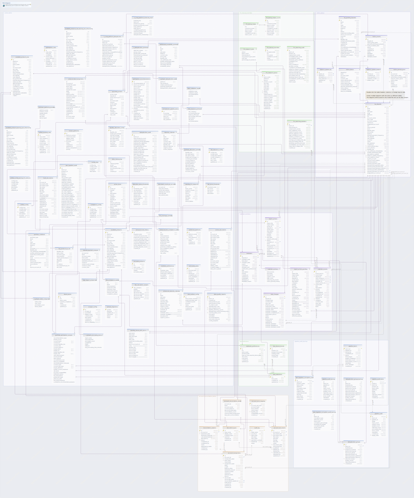

#Main Diagram
Generated using [DbSchema](https://dbschema.com)


### Main Diagram



## Tables

1. [Default.account_documents](#table%20default.account\_documents) 
2. [Default.account_term_mapping](#table%20default.account\_term\_mapping) 
3. [Default.account_transactions](#table%20default.account\_transactions) 
4. [Default.action_items](#table%20default.action\_items) 
5. [Default.allocation_status_thresholds](#table%20default.allocation\_status\_thresholds) 
6. [Default.annual_income_history](#table%20default.annual\_income\_history) 
7. [Default.audit_log](#table%20default.audit\_log) 
8. [Default.available_products](#table%20default.available\_products) 
9. [Default.available_products_backup_pre_refactoring](#table%20default.available\_products\_backup\_pre\_refactoring) 
10. [Default.available_products_raw](#table%20default.available\_products\_raw) 
11. [Default.available_products_raw_backup_pre_refactoring](#table%20default.available\_products\_raw\_backup\_pre\_refactoring) 
12. [Default.balance_update_log](#table%20default.balance\_update\_log) 
13. [Default.balance_update_sessions](#table%20default.balance\_update\_sessions) 
14. [Default.boe_institutions](#table%20default.boe\_institutions) 
15. [Default.boe_shared_brands](#table%20default.boe\_shared\_brands) 
16. [Default.calendar_events](#table%20default.calendar\_events) 
17. [Default.compliance_config](#table%20default.compliance\_config) 
18. [Default.data_cleanup_log](#table%20default.data\_cleanup\_log) 
19. [Default.data_quality_reports](#table%20default.data\_quality\_reports) 
20. [Default.deduplication_audit](#table%20default.deduplication\_audit) 
21. [Default.deduplication_groups](#table%20default.deduplication\_groups) 
22. [Default.deduplication_groups_backup](#table%20default.deduplication\_groups\_backup) 
23. [Default.document_types](#table%20default.document\_types) 
24. [Default.excluded_products](#table%20default.excluded\_products) 
25. [Default.frn_lookup_helper_cache](#table%20default.frn\_lookup\_helper\_cache) 
26. [Default.frn_manual_overrides](#table%20default.frn\_manual\_overrides) 
27. [Default.frn_matching_audit](#table%20default.frn\_matching\_audit) 
28. [Default.frn_matching_statistics](#table%20default.frn\_matching\_statistics) 
29. [Default.frn_research_queue](#table%20default.frn\_research\_queue) 
30. [Default.institution_preferences](#table%20default.institution\_preferences) 
31. [Default.json_ingestion_audit](#table%20default.json\_ingestion\_audit) 
32. [Default.json_ingestion_corruption_audit](#table%20default.json\_ingestion\_corruption\_audit) 
33. [Default.json_ingestion_corruption_audit_backup](#table%20default.json\_ingestion\_corruption\_audit\_backup) 
34. [Default.known_platforms](#table%20default.known\_platforms) 
35. [Default.liquidity_allocation_config](#table%20default.liquidity\_allocation\_config) 
36. [Default.my_deposits](#table%20default.my\_deposits) 
37. [Default.my_pending_deposits](#table%20default.my\_pending\_deposits) 
38. [Default.notice_events](#table%20default.notice\_events) 
39. [Default.notice_periods_given](#table%20default.notice\_periods\_given) 
40. [Default.optimization_recommendations](#table%20default.optimization\_recommendations) 
41. [Default.optimization_rules](#table%20default.optimization\_rules) 
42. [Default.orchestrator_pipeline_status](#table%20default.orchestrator\_pipeline\_status) 
43. [Default.pipeline_audit](#table%20default.pipeline\_audit) 
44. [Default.pipeline_audit_backup](#table%20default.pipeline\_audit\_backup) 
45. [Default.pipeline_audit_items](#table%20default.pipeline\_audit\_items) 
46. [Default.pipeline_batch](#table%20default.pipeline\_batch) 
47. [Default.preferred_platforms](#table%20default.preferred\_platforms) 
48. [Default.processing_state](#table%20default.processing\_state) 
49. [Default.rate_changes](#table%20default.rate\_changes) 
50. [Default.rate_outlook_config](#table%20default.rate\_outlook\_config) 
51. [Default.reconciliation_sessions](#table%20default.reconciliation\_sessions) 
52. [Default.reminder_preferences](#table%20default.reminder\_preferences) 
53. [Default.reminders](#table%20default.reminders) 
54. [Default.report_actions](#table%20default.report\_actions) 
55. [Default.risk_calculation_weights](#table%20default.risk\_calculation\_weights) 
56. [Default.risk_score_thresholds](#table%20default.risk\_score\_thresholds) 
57. [Default.risk_tolerance_config](#table%20default.risk\_tolerance\_config) 
58. [Default.schema_migrations](#table%20default.schema\_migrations) 
59. [Default.scraper_config](#table%20default.scraper\_config) 
60. [Default.sharia_banks](#table%20default.sharia\_banks) 
61. [Default.unified_business_rules](#table%20default.unified\_business\_rules) 
62. [Default.unified_config](#table%20default.unified\_config) 
63. [Default.unified_config_backup_frn_refactor](#table%20default.unified\_config\_backup\_frn\_refactor) 

## Views

1. [Default.account_reconciliation_status](#view%20default.account\_reconciliation\_status) 
2. [Default.active_documents](#view%20default.active\_documents) 
3. [Default.calendar_summary](#view%20default.calendar\_summary) 
4. [Default.config_view](#view%20default.config\_view) 
5. [Default.data_validation_report](#view%20default.data\_validation\_report) 
6. [Default.document_counts_by_account](#view%20default.document\_counts\_by\_account) 
7. [Default.enhanced_fscs_compliance_status](#view%20default.enhanced\_fscs\_compliance\_status) 
8. [Default.enhanced_maturity_calendar](#view%20default.enhanced\_maturity\_calendar) 
9. [Default.frn_coverage_summary](#view%20default.frn\_coverage\_summary) 
10. [Default.frn_lookup_helper](#view%20default.frn\_lookup\_helper) 
11. [Default.frn_research_stats](#view%20default.frn\_research\_stats) 
12. [Default.fscs_compliance_status](#view%20default.fscs\_compliance\_status) 
13. [Default.high_impact_unmatched](#view%20default.high\_impact\_unmatched) 
14. [Default.interest_payment_analysis](#view%20default.interest\_payment\_analysis) 
15. [Default.maturity_calendar](#view%20default.maturity\_calendar) 
16. [Default.notice_status](#view%20default.notice\_status) 
17. [Default.pending_frn_research](#view%20default.pending\_frn\_research) 
18. [Default.pending_moves_with_source](#view%20default.pending\_moves\_with\_source) 
19. [Default.portfolio_allocation_summary](#view%20default.portfolio\_allocation\_summary) 
20. [Default.portfolio_combined](#view%20default.portfolio\_combined) 
21. [Default.portfolio_optimization_analysis](#view%20default.portfolio\_optimization\_analysis) 
22. [Default.report_actions_pending](#view%20default.report\_actions\_pending) 
23. [Default.risk_exposure_summary](#view%20default.risk\_exposure\_summary) 
24. [Default.top_products_by_tier](#view%20default.top\_products\_by\_tier) 
25. [Default.trash_documents](#view%20default.trash\_documents) 
26. [Default.unknown_platforms_summary](#view%20default.unknown\_platforms\_summary) 
27. [Default.unreconciled_transactions](#view%20default.unreconciled\_transactions) 
28. [Default.upcoming_actions](#view%20default.upcoming\_actions) 
29. [Default.v_cross_platform_deduplication](#view%20default.v\_cross\_platform\_deduplication) 
30. [Default.v_cross_platform_removals_only](#view%20default.v\_cross\_platform\_removals\_only) 
31. [Default.v_deduplication_summary](#view%20default.v\_deduplication\_summary) 
32. [Default.v_phase1_deduplication_stats](#view%20default.v\_phase1\_deduplication\_stats) 
33. [Default.v_phase1_processing_status](#view%20default.v\_phase1\_processing\_status) 
34. [Default.v_phase1_table_comparison](#view%20default.v\_phase1\_table\_comparison) 
35. [Default.withdrawal_availability_summary](#view%20default.withdrawal\_availability\_summary) 


### Table Default.account_documents 
|Idx |Name |Data Type |
|---|---|---|
| * &#128273;  | id| INTEGER AUTOINCREMENT |
| * &#128270; &#11016; | account\_id| INTEGER  |
| * | document\_title| TEXT  |
| * &#128270; &#11016; | document\_type| TEXT  |
| * | file\_name| TEXT  |
| * | file\_path| TEXT  |
|  | file\_size| INTEGER  |
|  | file\_hash| TEXT  |
|  | notes| TEXT  |
| &#128270; | document\_date| DATE  |
|  | extracted\_text| TEXT  |
| &#128270; | is\_deleted| NUMERIC  DEFAULT 0 |
| &#128270; | deleted\_at| DATETIME  |
|  | deleted\_by| TEXT  |
| &#128270; | uploaded\_at| DATETIME  DEFAULT CURRENT_TIMESTAMP |
|  | uploaded\_by| TEXT  |
|  | updated\_at| DATETIME  DEFAULT CURRENT_TIMESTAMP |


##### Indexes 
|Type |Name |On |
|---|---|---|
| &#128273;  | pk\_account\_documents | ON id|
| &#128270;  | idx\_account\_documents\_account\_id | ON account\_id|
| &#128270;  | idx\_account\_documents\_type | ON document\_type|
| &#128270;  | idx\_account\_documents\_deleted | ON is\_deleted, deleted\_at|
| &#128270;  | idx\_account\_documents\_date | ON document\_date|
| &#128270;  | idx\_account\_documents\_uploaded | ON uploaded\_at|

##### Foreign Keys
|Type |Name |On |
|---|---|---|
|  | Fk | ( account\_id ) ref [Default.my\_deposits](#my\_deposits) (id) |
|  | Fk | ( document\_type ) ref [Default.document\_types](#document\_types) (type\_name) |


##### Constraints
|Name |Definition |
|---|---|
| CK_account_documents | file\_size &gt; 0 |
| CK_account_documents_001 | length(file\_hash) = 64 |
| CK_account_documents_002 | document\_title != '' |
| CK_account_documents_003 | file\_name != '' |
| CK_account_documents_004 | file\_path != '' |


##### Triggers
|Name |Definition |
|---|---|
### Trigger audit_document_update 
  
 ```
CREATE TRIGGER audit\_document\_update
AFTER UPDATE ON account\_documents
FOR EACH ROW
WHEN OLD.document\_title != NEW.document\_title
  OR OLD.notes != NEW.notes
  OR OLD.document\_type != NEW.document\_type
  OR OLD.is\_deleted != NEW.is\_deleted
BEGIN
    INSERT INTO audit\_log (table\_name, record\_id, field\_name, old\_value, new\_value, operation\_context)
    VALUES ('account\_documents', NEW.id,
            CASE
                WHEN OLD.is\_deleted = 0 AND NEW.is\_deleted = 1 THEN 'document\_deleted'
                WHEN OLD.is\_deleted = 1 AND NEW.is\_deleted = 0 THEN 'document\_restored'
                WHEN OLD.document\_title != NEW.document\_title THEN 'title\_updated'
                WHEN OLD.document\_type != NEW.document\_type THEN 'type\_updated'
                WHEN OLD.notes != NEW.notes THEN 'notes\_updated'
                ELSE 'document\_updated'
            END,
            CASE
                WHEN OLD.is\_deleted = 0 AND NEW.is\_deleted = 1 THEN OLD.document\_title
                WHEN OLD.is\_deleted = 1 AND NEW.is\_deleted = 0 THEN 'RESTORED'
                WHEN OLD.document\_title != NEW.document\_title THEN OLD.document\_title
                WHEN OLD.document\_type != NEW.document\_type THEN OLD.document\_type
                WHEN OLD.notes != NEW.notes THEN COALESCE(OLD.notes, '')
                ELSE OLD.document\_title
            END,
            CASE
                WHEN OLD.is\_deleted = 0 AND NEW.is\_deleted = 1 THEN 'DELETED'
                WHEN OLD.is\_deleted = 1 AND NEW.is\_deleted = 0 THEN NEW.document\_title
                WHEN OLD.document\_title != NEW.document\_title THEN NEW.document\_title
                WHEN OLD.document\_type != NEW.document\_type THEN NEW.document\_type
                WHEN OLD.notes != NEW.notes THEN COALESCE(NEW.notes, '')
                ELSE NEW.document\_title
            END,
            CASE
                WHEN OLD.is\_deleted = 0 AND NEW.is\_deleted = 1 THEN 'Document moved to trash'
                WHEN OLD.is\_deleted = 1 AND NEW.is\_deleted = 0 THEN 'Document restored from trash'
                WHEN OLD.document\_title != NEW.document\_title THEN 'Document title changed'
                WHEN OLD.document\_type != NEW.document\_type THEN 'Document type changed'
                WHEN OLD.notes != NEW.notes THEN 'Document notes changed'
                ELSE 'Document metadata updated'
            END);
END
``` 
### Trigger audit_document_upload 
  
 ```
CREATE TRIGGER audit\_document\_upload
AFTER INSERT ON account\_documents
FOR EACH ROW
BEGIN
    INSERT INTO audit\_log (table\_name, record\_id, field\_name, new\_value, operation\_context)
    VALUES ('account\_documents', NEW.id, 'document\_uploaded', NEW.document\_title,
            'Document uploaded: ' || NEW.document\_type || ' - ' || NEW.document\_title);
END
``` 


### Table Default.account_term_mapping 
|Idx |Name |Data Type |
|---|---|---|
| * &#128273;  | id| INTEGER AUTOINCREMENT |
| * &#128270; | account\_sub\_type| TEXT  |
| * | account\_type| TEXT  |
|  | term\_months| INTEGER  |
|  | notice\_days| INTEGER  |
| * &#128270; | liquidity\_tier| TEXT  |
| * | compatibility\_score| REAL  DEFAULT 1.0 |
|  | created\_at| DATETIME  DEFAULT (datetime('now')) |


##### Indexes 
|Type |Name |On |
|---|---|---|
| &#128273;  | pk\_account\_term\_mapping | ON id|
| &#128270;  | idx\_account\_term\_mapping\_subtype | ON account\_sub\_type|
| &#128270;  | idx\_account\_term\_mapping\_tier | ON liquidity\_tier|


### Table Default.account_transactions 
|Idx |Name |Data Type |
|---|---|---|
| * &#128273;  | id| INTEGER AUTOINCREMENT |
| * &#128270; &#11016; | account\_id| INTEGER  |
| * &#128270; | transaction\_date| DATE  |
| &#128270; | bank\_date| DATE  |
|  | value\_date| DATE  |
| * &#128270; | transaction\_type| TEXT  |
|  | debit| DECIMAL(15)  |
|  | credit| DECIMAL(15)  |
|  | balance\_after| DECIMAL(15)  |
|  | estimated\_amount| DECIMAL(15)  |
|  | variance\_notes| TEXT  |
|  | reference| TEXT  |
|  | optional\_notes| TEXT  |
|  | source| TEXT  DEFAULT 'manual' |
| &#128270; | reconciled| NUMERIC  DEFAULT 0 |
|  | reconciled\_date| DATE  |
| &#11016; | reconciliation\_session\_id| INTEGER  |
| &#11016; | audit\_log\_id| INTEGER  |
|  | created\_at| ENUM  DEFAULT CURRENT_TIMESTAMP |
|  | updated\_at| ENUM  DEFAULT CURRENT_TIMESTAMP |
|  | created\_by| TEXT  |


##### Indexes 
|Type |Name |On |
|---|---|---|
| &#128273;  | pk\_account\_transactions | ON id|
| &#128270;  | idx\_account\_transactions\_account | ON account\_id|
| &#128270;  | idx\_account\_transactions\_date | ON transaction\_date|
| &#128270;  | idx\_account\_transactions\_bank\_date | ON bank\_date|
| &#128270;  | idx\_account\_transactions\_reconciled | ON reconciled|
| &#128270;  | idx\_account\_transactions\_type | ON transaction\_type|

##### Foreign Keys
|Type |Name |On |
|---|---|---|
|  | Fk | ( account\_id ) ref [Default.my\_deposits](#my\_deposits) (id) |
|  | Fk | ( reconciliation\_session\_id ) ref [Default.reconciliation\_sessions](#reconciliation\_sessions) (id) |
|  | Fk | ( audit\_log\_id ) ref [Default.audit\_log](#audit\_log) (id) |


##### Constraints
|Name |Definition |
|---|---|
| Cns_account_transactions_transaction_type | transaction\_type IN (
        'account\_opened',    
        'deposit',          
        'withdrawal',       
        'interest',         
        'fee',             
        'adjustment',       
        'account\_closed') |
| Cns_account_transactions_source | source IN ('manual', 'import', 'audit\_log', 'system') |
| CK_account_transactions | debit IS NOT NULL AND credit IS NULL) OR (debit IS NULL AND credit IS NOT NULL |


##### Triggers
|Name |Definition |
|---|---|
### Trigger update_transaction_timestamp 
  
 ```
CREATE TRIGGER update\_transaction\_timestamp 
AFTER UPDATE ON account\_transactions
BEGIN
    UPDATE account\_transactions 
    SET updated\_at = CURRENT\_TIMESTAMP 
    WHERE id = NEW.id;
END
``` 


### Table Default.action_items 
|Idx |Name |Data Type |
|---|---|---|
| * &#128273;  | id| INTEGER AUTOINCREMENT |
| * &#128269; | action\_id| TEXT  |
| * &#128270; | module| TEXT  |
| * | title| TEXT  |
|  | description| TEXT  |
| &#128270; | priority| TEXT  |
| * | category| TEXT  |
|  | timeline| TEXT  |
|  | deposit\_id| INTEGER  |
|  | bank| TEXT  |
|  | amount\_affected| REAL  |
|  | expected\_benefit| REAL  |
|  | source\_data| ENUM  |
| &#128270; | status| TEXT  DEFAULT 'pending' |
|  | pending\_deposit\_id| INTEGER  |
|  | completed\_date| ENUM  |
|  | dismissed\_date| ENUM  |
|  | dismissed\_reason| TEXT  |
| &#128270; | created\_at| ENUM  DEFAULT CURRENT_TIMESTAMP |
|  | updated\_at| ENUM  DEFAULT CURRENT_TIMESTAMP |


##### Indexes 
|Type |Name |On |
|---|---|---|
| &#128273;  | pk\_action\_items | ON id|
| &#128269;  | unq\_action\_items\_action\_id | ON action\_id|
| &#128270;  | idx\_action\_items\_module | ON module|
| &#128270;  | idx\_action\_items\_status | ON status|
| &#128270;  | idx\_action\_items\_priority | ON priority|
| &#128270;  | idx\_action\_items\_created | ON created\_at|

##### Triggers
|Name |Definition |
|---|---|
### Trigger update_action_items_timestamp 
  
 ```
CREATE TRIGGER update\_action\_items\_timestamp
AFTER UPDATE ON action\_items
BEGIN
  UPDATE action\_items SET updated\_at = CURRENT\_TIMESTAMP WHERE id = NEW.id;
END
``` 


### Table Default.allocation_status_thresholds 
|Idx |Name |Data Type |
|---|---|---|
| * &#128273;  | id| INTEGER AUTOINCREMENT |
| * &#128269; | threshold\_name| TEXT  |
| * &#128270; | min\_deviation| REAL  |
| &#128270; | max\_deviation| REAL  |
| * | status\_indicator| TEXT  |
| * | status\_color| TEXT  |
| * | priority\_level| INTEGER  |
| * | action\_urgency| TEXT  |
| * | description| TEXT  |
| &#128270; | is\_active| INTEGER  DEFAULT 1 |
|  | created\_at| DATETIME  DEFAULT (datetime('now')) |
|  | updated\_at| DATETIME  DEFAULT (datetime('now')) |


##### Indexes 
|Type |Name |On |
|---|---|---|
| &#128273;  | pk\_allocation\_status\_thresholds | ON id|
| &#128269;  | unq\_allocation\_status\_thresholds\_threshold\_name | ON threshold\_name|
| &#128270;  | idx\_allocation\_thresholds\_active | ON is\_active|
| &#128270;  | idx\_allocation\_thresholds\_deviation | ON min\_deviation, max\_deviation|


### Table Default.annual_income_history 
|Idx |Name |Data Type |
|---|---|---|
| * &#128273;  | id| INTEGER AUTOINCREMENT |
| * | snapshot\_date| DATE  |
| * | current\_annual\_income| REAL  |
| * | projected\_annual\_income| REAL  |
| * | current\_portfolio\_value| REAL  |
| * | projected\_portfolio\_value| REAL  |
| * | current\_weighted\_rate| REAL  |
| * | projected\_weighted\_rate| REAL  |
| * | active\_deposit\_count| INTEGER  |
| * | pending\_deposit\_count| INTEGER  |
|  | created\_at| ENUM  DEFAULT CURRENT_TIMESTAMP |


##### Indexes 
|Type |Name |On |
|---|---|---|
| &#128273;  | pk\_annual\_income\_history | ON id|


### Table Default.audit_log 
|Idx |Name |Data Type |
|---|---|---|
| * &#128273;  &#11019; | id| INTEGER AUTOINCREMENT |
| * &#128270; | table\_name| TEXT  |
| * &#128270; | record\_id| INTEGER  |
| * &#128270; | field\_name| TEXT  |
|  | old\_value| TEXT  |
|  | new\_value| TEXT  |
| * &#128270; | operation\_context| TEXT  |
| &#128270; | timestamp| DATETIME  DEFAULT CURRENT_TIMESTAMP |
|  | notes| TEXT  |


##### Indexes 
|Type |Name |On |
|---|---|---|
| &#128273;  | pk\_audit\_log | ON id|
| &#128270;  | idx\_audit\_field\_type | ON field\_name, timestamp|
| &#128270;  | idx\_audit\_record | ON table\_name, record\_id|
| &#128270;  | idx\_audit\_operation | ON operation\_context|
| &#128270;  | idx\_audit\_composite | ON table\_name, record\_id, field\_name|

##### Constraints
|Name |Definition |
|---|---|
| Cns_audit_log_table_name | table\_name IN (
        'my\_deposits', 
        'my\_pending\_deposits',
        'notice\_events',
        'rate\_changes', 
        'reminders',
        'report\_actions',
        'action\_items',              
        'optimization\_conflicts') |


### Table Default.available_products 
|Idx |Name |Data Type |
|---|---|---|
| * &#128273;  | id| INTEGER AUTOINCREMENT |
| * &#128270; | platform| TEXT  |
| &#128270; | source| TEXT  |
| * &#128270; | bank\_name| TEXT  |
|  | frn| TEXT  |
| * | account\_type| TEXT  |
| * &#128270; | aer\_rate| REAL  |
|  | gross\_rate| REAL  |
|  | term\_months| INTEGER  |
|  | notice\_period\_days| INTEGER  |
|  | min\_deposit| INTEGER  |
|  | max\_deposit| INTEGER  |
|  | fscs\_protected| NUMERIC  DEFAULT TRUE |
|  | interest\_payment\_frequency| TEXT  |
|  | apply\_by\_date| DATE  |
|  | special\_features| TEXT  |
| * &#128270; | scrape\_date| DATE  |
|  | confidence\_score| REAL  DEFAULT 1.0 |
|  | fuzzy\_match\_notes| TEXT  |
|  | created\_at| DATETIME  DEFAULT CURRENT_TIMESTAMP |
| &#128270; | business\_key| TEXT  |
|  | deduplication\_metadata| TEXT  |
|  | raw\_platform| TEXT  |


##### Indexes 
|Type |Name |On |
|---|---|---|
| &#128273;  | pk\_available\_products | ON id|
| &#128270;  | idx\_available\_products\_platform | ON platform|
| &#128270;  | idx\_available\_products\_bank\_name | ON bank\_name|
| &#128270;  | idx\_available\_products\_aer\_rate | ON aer\_rate|
| &#128270;  | idx\_available\_products\_scrape\_date | ON scrape\_date|
| &#128270;  | idx\_available\_products\_source | ON source|
| &#128270;  | idx\_available\_products\_business\_key | ON business\_key|

##### Constraints
|Name |Definition |
|---|---|
| Cns_available_products_account_type | account\_type IN ('easy\_access', 'notice', 'fixed\_term', 'limited\_access', 'cash\_isa') |


##### Triggers
|Name |Definition |
|---|---|
### Trigger set_fscs_protected_on_insert 
  
 ```
CREATE TRIGGER set\_fscs\_protected\_on\_insert
AFTER INSERT ON available\_products
FOR EACH ROW
WHEN NEW.frn IS NULL AND NEW.fscs\_protected = 1
BEGIN
  UPDATE available\_products SET fscs\_protected = 0 WHERE id = NEW.id;
END
``` 
### Trigger update_fscs_protected_on_frn_change 
  
 ```
CREATE TRIGGER update\_fscs\_protected\_on\_frn\_change
AFTER UPDATE OF frn ON available\_products
FOR EACH ROW
WHEN NEW.frn IS NULL AND NEW.fscs\_protected = 1
BEGIN
  UPDATE available\_products SET fscs\_protected = 0 WHERE id = NEW.id;
END
``` 


### Table Default.available_products_backup_pre_refactoring 
|Idx |Name |Data Type |
|---|---|---|
|  | id| INT  |
|  | platform| TEXT  |
|  | source| TEXT  |
|  | bank\_name| TEXT  |
|  | frn| TEXT  |
|  | account\_type| TEXT  |
|  | aer\_rate| REAL  |
|  | gross\_rate| REAL  |
|  | term\_months| INT  |
|  | notice\_period\_days| INT  |
|  | min\_deposit| INT  |
|  | max\_deposit| INT  |
|  | fscs\_protected| ENUM  |
|  | interest\_payment\_frequency| TEXT  |
|  | apply\_by\_date| ENUM  |
|  | special\_features| TEXT  |
|  | scrape\_date| ENUM  |
|  | confidence\_score| REAL  |
|  | fuzzy\_match\_notes| TEXT  |
|  | created\_at| ENUM  |
|  | business\_key| TEXT  |
|  | deduplication\_metadata| TEXT  |
|  | raw\_platform| TEXT  |


### Table Default.available_products_raw 
|Idx |Name |Data Type |
|---|---|---|
| * &#128273;  | id| INTEGER AUTOINCREMENT |
|  | platform| TEXT  |
|  | source| TEXT  |
|  | bank\_name| TEXT  |
|  | frn| TEXT  |
|  | account\_type| TEXT  |
|  | aer\_rate| REAL  |
|  | gross\_rate| REAL  |
|  | term\_months| INT  |
|  | notice\_period\_days| INT  |
|  | min\_deposit| INT  |
|  | max\_deposit| INT  |
|  | fscs\_protected| ENUM  |
|  | interest\_payment\_frequency| TEXT  |
|  | apply\_by\_date| ENUM  |
|  | special\_features| TEXT  |
|  | scrape\_date| ENUM  |
|  | confidence\_score| REAL  |
|  | fuzzy\_match\_notes| TEXT  |
|  | created\_at| ENUM  |
| &#128270; | business\_key| TEXT  |
|  | deduplication\_metadata| TEXT  |
|  | raw\_platform| TEXT  |
| &#128270; | processed\_at| ENUM  |
| &#128270; |  dedup\_status| ENUM  |
| &#128270; | method| ENUM  |


##### Indexes 
|Type |Name |On |
|---|---|---|
| &#128273;  | pk\_available\_products\_raw | ON id|
| &#128270;  | idx\_raw\_products\_processing | ON processed\_at,  dedup\_status|
| &#128270;  | idx\_raw\_products\_business\_key | ON business\_key|
| &#128270;  | idx\_raw\_products\_method | ON method|


### Table Default.available_products_raw_backup_pre_refactoring 
|Idx |Name |Data Type |
|---|---|---|
|  | id| INT  |
|  | platform| TEXT  |
|  | source| TEXT  |
|  | bank\_name| TEXT  |
|  | frn| TEXT  |
|  | account\_type| TEXT  |
|  | aer\_rate| REAL  |
|  | gross\_rate| REAL  |
|  | term\_months| INT  |
|  | notice\_period\_days| INT  |
|  | min\_deposit| INT  |
|  | max\_deposit| INT  |
|  | fscs\_protected| ENUM  |
|  | interest\_payment\_frequency| TEXT  |
|  | apply\_by\_date| ENUM  |
|  | special\_features| TEXT  |
|  | scrape\_date| ENUM  |
|  | confidence\_score| REAL  |
|  | fuzzy\_match\_notes| TEXT  |
|  | created\_at| ENUM  |
|  | business\_key| TEXT  |
|  | deduplication\_metadata| TEXT  |
|  | raw\_platform| TEXT  |


### Table Default.balance_update_log 
|Idx |Name |Data Type |
|---|---|---|
| * &#128273;  | id| INTEGER AUTOINCREMENT |
| * &#128270; &#11016; | session\_id| INTEGER  |
| * &#128270; &#11016; | deposit\_id| INTEGER  |
|  | old\_balance| DECIMAL(10)  |
|  | new\_balance| DECIMAL(10)  |
|  | updated\_at| ENUM  DEFAULT CURRENT_TIMESTAMP |
|  | status| TEXT  DEFAULT 'updated' |


##### Indexes 
|Type |Name |On |
|---|---|---|
| &#128273;  | pk\_balance\_update\_log | ON id|
| &#128270;  | idx\_balance\_log\_session | ON session\_id|
| &#128270;  | idx\_balance\_log\_deposit | ON deposit\_id|

##### Foreign Keys
|Type |Name |On |
|---|---|---|
|  | FK_balance_update_log balance_update_sessions | ( session\_id ) ref [Default.balance\_update\_sessions](#balance\_update\_sessions) (id) |
|  | FK_balance_update_log my_deposits | ( deposit\_id ) ref [Default.my\_deposits](#my\_deposits) (id) |


##### Constraints
|Name |Definition |
|---|---|
| Cns_balance_update_log_status | status IN ('updated', 'skipped', 'pending') |


### Table Default.balance_update_sessions 
|Idx |Name |Data Type |
|---|---|---|
| * &#128273;  &#11019; | id| INTEGER AUTOINCREMENT |
|  | started\_at| ENUM  DEFAULT CURRENT_TIMESTAMP |
|  | completed\_at| ENUM  |
| * | total\_deposits| INTEGER  |
|  | updated\_count| INTEGER  DEFAULT 0 |
| &#128270; | session\_type| TEXT  DEFAULT 'manual' |


##### Indexes 
|Type |Name |On |
|---|---|---|
| &#128273;  | pk\_balance\_update\_sessions | ON id|
| &#128270;  | idx\_balance\_sessions\_type | ON session\_type|

##### Constraints
|Name |Definition |
|---|---|
| Cns_balance_update_sessions_session_type | session\_type IN ('manual', 'scheduled', 'partial') |


### Table Default.boe_institutions 
|Idx |Name |Data Type |
|---|---|---|
| * &#128273;  &#11019; | frn| TEXT  |
| * | firm\_name| TEXT  |
|  | created\_at| DATETIME  DEFAULT CURRENT_TIMESTAMP |
|  | updated\_at| DATETIME  DEFAULT CURRENT_TIMESTAMP |


##### Indexes 
|Type |Name |On |
|---|---|---|
| &#128273;  | pk\_boe\_institutions | ON frn|


### Table Default.boe_shared_brands 
|Idx |Name |Data Type |
|---|---|---|
| * &#128273;  | id| INTEGER AUTOINCREMENT |
| * &#11016; | primary\_frn| TEXT  |
| * | primary\_firm\_name| TEXT  |
| * | trading\_name| TEXT  |
| * | brand\_type| TEXT  |
|  | created\_at| DATETIME  DEFAULT CURRENT_TIMESTAMP |


##### Indexes 
|Type |Name |On |
|---|---|---|
| &#128273;  | pk\_boe\_shared\_brands | ON id|

##### Foreign Keys
|Type |Name |On |
|---|---|---|
|  | FK_boe_shared_brands boe_institutions | ( primary\_frn ) ref [Default.boe\_institutions](#boe\_institutions) (frn) |


##### Constraints
|Name |Definition |
|---|---|
| Cns_boe_shared_brands_brand_type | brand\_type IN ('primary', 'trading\_name', 'subsidiary', 'brand') |


### Table Default.calendar_events 
|Idx |Name |Data Type |
|---|---|---|
| * &#128273;  | id| INTEGER AUTOINCREMENT |
| * | event\_source| TEXT  |
| * &#128270; | event\_type| TEXT  |
| &#128270; &#11016; | deposit\_id| INTEGER  |
| &#11016; | rate\_change\_id| INTEGER  |
| &#11016; | notice\_event\_id| INTEGER  |
| &#11016; | reminder\_id| INTEGER  |
| &#11016; | report\_action\_id| INTEGER  |
| * &#128270; | event\_date| DATE  |
| * | title| TEXT  |
|  | description| TEXT  |
| &#128270; | priority| TEXT  DEFAULT 'medium' |
|  | amount| REAL  |
|  | is\_completed| NUMERIC  DEFAULT 0 |
|  | completed\_at| DATETIME  |
|  | created\_at| DATETIME  DEFAULT CURRENT_TIMESTAMP |
|  | updated\_at| DATETIME  DEFAULT CURRENT_TIMESTAMP |
| &#128270; | module| TEXT  |
| &#128270; | category| TEXT  |
|  | current\_rate| REAL  |
|  | new\_rate| REAL  |
|  | metadata| ENUM  |
|  | bank| TEXT  |


##### Indexes 
|Type |Name |On |
|---|---|---|
| &#128273;  | pk\_calendar\_events | ON id|
| &#128270;  | idx\_calendar\_events\_date | ON event\_date|
| &#128270;  | idx\_calendar\_events\_type | ON event\_type|
| &#128270;  | idx\_calendar\_events\_deposit | ON deposit\_id|
| &#128270;  | idx\_calendar\_events\_priority | ON priority|
| &#128270;  | idx\_calendar\_events\_module | ON module|
| &#128270;  | idx\_calendar\_events\_category | ON category|

##### Foreign Keys
|Type |Name |On |
|---|---|---|
|  | FK_calendar_events my_deposits | ( deposit\_id ) ref [Default.my\_deposits](#my\_deposits) (id) |
|  | FK_calendar_events rate_changes | ( rate\_change\_id ) ref [Default.rate\_changes](#rate\_changes) (id) |
|  | FK_calendar_events notice_events | ( notice\_event\_id ) ref [Default.notice\_events](#notice\_events) (id) |
|  | FK_calendar_events reminders | ( reminder\_id ) ref [Default.reminders](#reminders) (id) |
|  | FK_calendar_events report_actions | ( report\_action\_id ) ref [Default.report\_actions](#report\_actions) (id) |


##### Constraints
|Name |Definition |
|---|---|
| Cns_calendar_events_event_source | event\_source IN ('deposit', 'notice', 'rate\_change', 'custom', 'report') |
| Cns_calendar_events_event_type | event\_type IN ('maturity', 'rate\_change', 'notice\_given', 'funds\_available', 'custom\_reminder', 'report\_action') |
| Cns_calendar_events_priority | priority IN ('low', 'medium', 'high', 'urgent') |


### Table Default.compliance_config 
|Idx |Name |Data Type |
|---|---|---|
| * &#128273;  | id| INTEGER AUTOINCREMENT |
| * &#128269; | config\_key| TEXT  |
| * | config\_value| TEXT  |
| * | config\_type| TEXT  |
|  | description| TEXT  |
|  | created\_at| DATETIME  DEFAULT CURRENT_TIMESTAMP |
|  | updated\_at| DATETIME  DEFAULT CURRENT_TIMESTAMP |


##### Indexes 
|Type |Name |On |
|---|---|---|
| &#128273;  | pk\_compliance\_config | ON id|
| &#128269;  | unq\_compliance\_config\_config\_key | ON config\_key|

##### Constraints
|Name |Definition |
|---|---|
| Cns_compliance_config_config_type | config\_type IN ('number', 'string', 'boolean') |


### Table Default.data_cleanup_log 
|Idx |Name |Data Type |
|---|---|---|
| * &#128273;  | id| INTEGER AUTOINCREMENT |
| * | cleanup\_phase| TEXT  |
| * | action| TEXT  |
| * | table\_name| TEXT  |
|  | records\_affected| INTEGER  |
|  | notes| TEXT  |
|  | created\_at| DATETIME  DEFAULT CURRENT_TIMESTAMP |


##### Indexes 
|Type |Name |On |
|---|---|---|
| &#128273;  | pk\_data\_cleanup\_log | ON id|


### Table Default.data_quality_reports 
|Idx |Name |Data Type |
|---|---|---|
| * &#128273;  | id| INTEGER AUTOINCREMENT |
| * &#128269; | batch\_id| TEXT  |
| &#128270; | created\_at| ENUM  DEFAULT CURRENT_TIMESTAMP |
| * | total\_products\_raw| INTEGER  |
| * | total\_products\_final| INTEGER  |
| * | frn\_match\_rate| REAL  |
| * | deduplication\_rate| REAL  |
| * &#128270; | data\_integrity\_score| REAL  |
| * &#128270; | pipeline\_efficiency\_score| REAL  |
| * | deduplication\_effectiveness\_score| REAL  |
| * &#128270; | overall\_quality\_score| REAL  |
| * | full\_report| TEXT  |
|  | anomalies| TEXT  |
|  | recommendations| TEXT  |
| * | execution\_time\_ms| INTEGER  |
|  | config\_snapshot| TEXT  |


##### Indexes 
|Type |Name |On |
|---|---|---|
| &#128273;  | pk\_data\_quality\_reports | ON id|
| &#128269;  | unq\_data\_quality\_reports\_batch\_id | ON batch\_id|
| &#128270;  | idx\_quality\_reports\_created\_at | ON created\_at|
| &#128270;  | idx\_quality\_reports\_quality\_score | ON overall\_quality\_score|
| &#128270;  | idx\_quality\_reports\_batch\_date | ON batch\_id, created\_at|
| &#128270;  | idx\_quality\_reports\_scores | ON data\_integrity\_score, pipeline\_efficiency\_score, overall\_quality\_score|

##### Constraints
|Name |Definition |
|---|---|
| fk_batch_id | batch\_id IS NOT NULL |


### Table Default.deduplication_audit 
|Idx |Name |Data Type |
|---|---|---|
| * &#128273;  | id| INTEGER AUTOINCREMENT |
| * | batch\_id| TEXT  |
| * | input\_products\_count| INTEGER  |
|  | unique\_business\_keys| INTEGER  |
|  | duplicate\_groups\_identified| INTEGER  |
|  | business\_key\_algorithm| TEXT  |
|  | business\_key\_fields| TEXT  |
|  | key\_generation\_errors| INTEGER  DEFAULT 0 |
|  | quality\_algorithm| TEXT  |
|  | quality\_score\_distribution| TEXT  |
| * | products\_selected| INTEGER  |
| * | products\_rejected| INTEGER  |
|  | selection\_criteria| TEXT  |
|  | fscs\_validation\_performed| NUMERIC  DEFAULT 0 |
|  | banks\_preserved| INTEGER  |
|  | platforms\_preserved| INTEGER  |
|  | direct\_platform\_products| INTEGER  |
|  | fscs\_compliance\_status| TEXT  |
|  | fscs\_violations| TEXT  |
|  | processing\_time\_ms| INTEGER  |
|  | business\_key\_generation\_time\_ms| INTEGER  |
|  | quality\_scoring\_time\_ms| INTEGER  |
|  | selection\_time\_ms| INTEGER  |
|  | created\_at| DATETIME  DEFAULT CURRENT_TIMESTAMP |


##### Indexes 
|Type |Name |On |
|---|---|---|
| &#128273;  | pk\_deduplication\_audit | ON id|


### Table Default.deduplication_groups 
|Idx |Name |Data Type |
|---|---|---|
| * &#128273;  | id| INTEGER AUTOINCREMENT |
| * &#128270; &#11016; | batch\_id| TEXT  |
| * | business\_key| TEXT  |
| * &#128270; | products\_in\_group| INTEGER  |
|  | platforms\_in\_group| TEXT  |
|  | sources\_in\_group| TEXT  |
|  | selected\_product\_id| TEXT  |
|  | selected\_product\_platform| TEXT  |
|  | selected\_product\_source| TEXT  |
| &#128270; | selection\_reason| TEXT  |
|  | quality\_scores| TEXT  |
|  | rejected\_products| TEXT  |
| &#128270; | created\_at| DATETIME  DEFAULT CURRENT_TIMESTAMP |


##### Indexes 
|Type |Name |On |
|---|---|---|
| &#128273;  | pk\_deduplication\_groups | ON id|
| &#128270;  | idx\_dedup\_groups\_batch\_id | ON batch\_id|
| &#128270;  | idx\_dedup\_groups\_selection\_reason | ON selection\_reason|
| &#128270;  | idx\_dedup\_groups\_products\_count | ON products\_in\_group|
| &#128270;  | idx\_dedup\_groups\_created\_at | ON created\_at|

##### Foreign Keys
|Type |Name |On |
|---|---|---|
|  | FK_deduplication_groups pipeline_batch | ( batch\_id ) ref [Default.pipeline\_batch](#pipeline\_batch) (batch\_id) |


### Table Default.deduplication_groups_backup 
|Idx |Name |Data Type |
|---|---|---|
|  | id| INT  |
|  | batch\_id| TEXT  |
|  | business\_key| TEXT  |
|  | products\_in\_group| INT  |
|  | platforms\_in\_group| TEXT  |
|  | sources\_in\_group| TEXT  |
|  | selected\_product\_id| TEXT  |
|  | selected\_product\_platform| TEXT  |
|  | selected\_product\_source| TEXT  |
|  | selection\_reason| TEXT  |
|  | quality\_scores| TEXT  |
|  | rejected\_products| TEXT  |
|  | created\_at| ENUM  |


### Table Default.document_types 
|Idx |Name |Data Type |
|---|---|---|
| * &#128273;  | id| INTEGER AUTOINCREMENT |
| * &#128269; &#11019; | type\_name| TEXT  |
| &#128270; | display\_order| INTEGER  DEFAULT 100 |
|  | is\_system\_type| NUMERIC  DEFAULT 0 |
| &#128270; | is\_active| NUMERIC  DEFAULT 1 |
|  | created\_at| DATETIME  DEFAULT CURRENT_TIMESTAMP |
|  | updated\_at| DATETIME  DEFAULT CURRENT_TIMESTAMP |


##### Indexes 
|Type |Name |On |
|---|---|---|
| &#128273;  | pk\_document\_types | ON id|
| &#128269;  | unq\_document\_types\_type\_name | ON type\_name|
| &#128270;  | idx\_document\_types\_order | ON display\_order, type\_name|
| &#128270;  | idx\_document\_types\_active | ON is\_active, display\_order|

##### Triggers
|Name |Definition |
|---|---|
### Trigger audit_document_type_changes 
  
 ```
CREATE TRIGGER audit\_document\_type\_changes
AFTER INSERT ON document\_types
FOR EACH ROW
BEGIN
    INSERT INTO audit\_log (table\_name, record\_id, field\_name, new\_value, operation\_context)
    VALUES ('document\_types', NEW.id, 'type\_created', NEW.type\_name,
            'Document type created: ' || NEW.type\_name);
END
``` 


### Table Default.excluded_products 
|Idx |Name |Data Type |
|---|---|---|
| * &#128273;  | id| INTEGER AUTOINCREMENT |
| &#128270; | frn| TEXT  |
| &#128270; | bank\_name| TEXT  |
| &#128270; | account\_type| TEXT  |
|  | reason| TEXT  |
|  | excluded\_date| ENUM  DEFAULT CURRENT_TIMESTAMP |


##### Indexes 
|Type |Name |On |
|---|---|---|
| &#128273;  | pk\_excluded\_products | ON id|
| &#128270;  | idx\_excluded\_frn | ON frn|
| &#128270;  | idx\_excluded\_bank | ON bank\_name|
| &#128270;  | idx\_excluded\_type | ON account\_type|
| &#128270;  | idx\_excluded\_composite | ON frn, bank\_name, account\_type|


### Table Default.frn_lookup_helper_cache 
|Idx |Name |Data Type |
|---|---|---|
| * &#128273;  | id| INTEGER AUTOINCREMENT |
| * &#128270; | frn| TEXT  |
| * | canonical\_name| TEXT  |
| * &#128270; | search\_name| TEXT  |
| * | match\_type| TEXT  |
| * | confidence\_score| REAL  |
| * | priority\_rank| INTEGER  |
| * &#128270; | match\_rank| INTEGER  DEFAULT 1 |
|  | source\_table| TEXT  |
|  | created\_at| ENUM  DEFAULT CURRENT_TIMESTAMP |


##### Indexes 
|Type |Name |On |
|---|---|---|
| &#128273;  | pk\_frn\_lookup\_helper\_cache | ON id|
| &#128270;  | idx\_lookup\_cache\_search | ON search\_name, match\_rank|
| &#128270;  | idx\_lookup\_cache\_frn | ON frn|


### Table Default.frn_manual_overrides 
|Idx |Name |Data Type |
|---|---|---|
| * &#128273;  | id| INTEGER AUTOINCREMENT |
| * &#128269; | scraped\_name| TEXT  |
|  | frn| TEXT  |
|  | firm\_name| TEXT  |
|  | confidence\_score| REAL  DEFAULT 1.0 |
|  | notes| TEXT  |
|  | created\_at| DATETIME  DEFAULT CURRENT_TIMESTAMP |


##### Indexes 
|Type |Name |On |
|---|---|---|
| &#128273;  | pk\_frn\_manual\_overrides | ON id|
| &#128269;  | unq\_frn\_manual\_overrides\_scraped\_name | ON scraped\_name|


### Table Default.frn_matching_audit 
|Idx |Name |Data Type |
|---|---|---|
| * &#128273;  | id| INTEGER AUTOINCREMENT |
| * | batch\_id| TEXT  |
|  | product\_id| TEXT  |
| * | original\_bank\_name| TEXT  |
|  | normalized\_bank\_name| TEXT  |
|  | normalization\_steps| TEXT  |
|  | database\_query\_method| TEXT  |
|  | candidate\_frns| TEXT  |
|  | final\_frn| TEXT  |
|  | final\_confidence| DECIMAL(3)  |
|  | decision\_routing| TEXT  |
|  | confidence\_threshold\_used| TEXT  |
|  | added\_to\_research\_queue| NUMERIC  DEFAULT 0 |
|  | research\_queue\_priority| TEXT  |
|  | manual\_override\_frn| TEXT  |
|  | manual\_override\_timestamp| DATETIME  |
|  | processing\_time\_ms| INTEGER  |
|  | database\_query\_time\_ms| INTEGER  |
|  | normalization\_quality\_score| DECIMAL(3)  |
|  | created\_at| DATETIME  DEFAULT CURRENT_TIMESTAMP |
|  | match\_type| TEXT  |


##### Indexes 
|Type |Name |On |
|---|---|---|
| &#128273;  | pk\_frn\_matching\_audit | ON id|


### Table Default.frn_matching_statistics 
|Idx |Name |Data Type |
|---|---|---|
| * &#128273;  | id| INTEGER AUTOINCREMENT |
| * &#128270; &#11016; | batch\_id| TEXT  |
| * | total\_products| INTEGER  |
|  | unique\_bank\_names| INTEGER  |
|  | auto\_assigned\_count| INTEGER  DEFAULT 0 |
|  | research\_queue\_count| INTEGER  DEFAULT 0 |
|  | default\_assigned\_count| INTEGER  DEFAULT 0 |
|  | high\_confidence\_count| INTEGER  DEFAULT 0 |
|  | medium\_confidence\_count| INTEGER  DEFAULT 0 |
|  | low\_confidence\_count| INTEGER  DEFAULT 0 |
|  | average\_processing\_time\_ms| DECIMAL(8)  |
|  | total\_processing\_time\_ms| INTEGER  |
|  | database\_queries\_executed| INTEGER  |
|  | normalization\_success\_rate| DECIMAL(5)  |
|  | fuzzy\_match\_usage\_rate| DECIMAL(5)  |
|  | created\_at| DATETIME  DEFAULT CURRENT_TIMESTAMP |


##### Indexes 
|Type |Name |On |
|---|---|---|
| &#128273;  | pk\_frn\_matching\_statistics | ON id|
| &#128270;  | idx\_frn\_stats\_batch | ON batch\_id|

##### Foreign Keys
|Type |Name |On |
|---|---|---|
|  | FK_frn_matching_statistics pipeline_audit | ( batch\_id ) ref [Default.pipeline\_audit](#pipeline\_audit) (batch\_id) |


### Table Default.frn_research_queue 
|Idx |Name |Data Type |
|---|---|---|
| * &#128273;  | id| INTEGER AUTOINCREMENT |
| * &#128270; | bank\_name| TEXT  |
|  | platform| TEXT  |
|  | source| TEXT  |
| &#128270; | product\_count| INTEGER  DEFAULT 1 |
|  | min\_rate| REAL  |
|  | max\_rate| REAL  |
|  | avg\_rate| REAL  |
|  | first\_seen| DATETIME  DEFAULT CURRENT_TIMESTAMP |
|  | last\_seen| DATETIME  DEFAULT CURRENT_TIMESTAMP |
| &#128270; | status| TEXT  DEFAULT 'pending' |
| &#128270; | priority| INTEGER  DEFAULT 0 |
|  | researched\_frn| TEXT  |
|  | researched\_firm\_name| TEXT  |
|  | research\_notes| TEXT  |
|  | researched\_by| TEXT  |
|  | research\_date| DATETIME  |
|  | ignored\_reason| TEXT  |
|  | ignored\_by| TEXT  |
|  | ignored\_date| DATETIME  |
|  | created\_at| DATETIME  DEFAULT CURRENT_TIMESTAMP |
|  | updated\_at| DATETIME  DEFAULT CURRENT_TIMESTAMP |


##### Indexes 
|Type |Name |On |
|---|---|---|
| &#128273;  | pk\_frn\_research\_queue | ON id|
| &#128270;  | idx\_frn\_research\_queue\_status | ON status|
| &#128270;  | idx\_frn\_research\_queue\_priority | ON priority, product\_count|
| &#128270;  | idx\_frn\_research\_queue\_bank\_name | ON bank\_name|

##### Constraints
|Name |Definition |
|---|---|
| Cns_frn_research_queue_status | status IN ('pending', 'researching', 'ignored', 'cannot\_resolve') |


##### Triggers
|Name |Definition |
|---|---|
### Trigger promote_researched_frn 
  
 ```
CREATE TRIGGER promote\_researched\_frn
AFTER UPDATE OF researched\_frn ON frn\_research\_queue
FOR EACH ROW
WHEN NEW.researched\_frn IS NOT NULL
  AND OLD.researched\_frn IS NULL
  AND NEW.researched\_frn != ''
  AND NEW.status IN ('researching', 'pending')
BEGIN
  SELECT CASE
    WHEN LENGTH(NEW.researched\_frn) NOT BETWEEN 6 AND 7 THEN
      RAISE(ABORT, 'Invalid FRN format: FRN must be exactly 6 or 7 digits long.')
    WHEN NEW.researched\_frn NOT GLOB '[0-9][0-9][0-9][0-9][0-9][0-9]'
      AND NEW.researched\_frn NOT GLOB '[0-9][0-9][0-9][0-9][0-9][0-9][0-9]' THEN
      RAISE(ABORT, 'Invalid FRN format: FRN must contain only digits.')
  END;
  INSERT OR REPLACE INTO frn\_manual\_overrides (
    scraped\_name,
    frn,
    firm\_name,
    confidence\_score,
    notes
  ) VALUES (
    NEW.bank\_name,
    NEW.researched\_frn,
    COALESCE(NEW.researched\_firm\_name, NEW.bank\_name),
    1.0,
    'Manually researched: ' || COALESCE(NEW.research\_notes, 'FRN verified') ||
      CASE
        WHEN NEW.researched\_by IS NOT NULL THEN ' by ' || NEW.researched\_by
        ELSE ''
      END ||
      ' [' || DATE('now') || ']'
  );
  DELETE FROM frn\_research\_queue WHERE id = NEW.id;
END
``` 


### Table Default.institution_preferences 
|Idx |Name |Data Type |
|---|---|---|
| * &#128273;  | id| INTEGER AUTOINCREMENT |
| * &#11016; | frn| TEXT  |
| * | bank\_name| TEXT  |
| * | personal\_limit| INTEGER  DEFAULT 85000 |
|  | easy\_access\_required\_above\_fscs| NUMERIC  DEFAULT TRUE |
|  | risk\_notes| TEXT  |
|  | trust\_level| TEXT  DEFAULT 'medium' |
|  | created\_at| DATETIME  DEFAULT CURRENT_TIMESTAMP |
|  | updated\_at| DATETIME  DEFAULT CURRENT_TIMESTAMP |


##### Indexes 
|Type |Name |On |
|---|---|---|
| &#128273;  | pk\_institution\_preferences | ON id|

##### Foreign Keys
|Type |Name |On |
|---|---|---|
|  | FK_institution_preferences boe_institutions | ( frn ) ref [Default.boe\_institutions](#boe\_institutions) (frn) |


##### Constraints
|Name |Definition |
|---|---|
| Cns_institution_preferences_trust_level | trust\_level IN ('high', 'medium', 'low') |


### Table Default.json_ingestion_audit 
|Idx |Name |Data Type |
|---|---|---|
| * &#128273;  | id| INTEGER AUTOINCREMENT |
| * | batch\_id| TEXT  |
|  | product\_id| TEXT  |
| * | source| TEXT  |
| * | platform| TEXT  |
|  | method| TEXT  |
|  | raw\_product\_json| TEXT  |
| * | validation\_status| TEXT  |
|  | validation\_details| TEXT  |
|  | rejection\_reasons| TEXT  |
|  | normalization\_applied| TEXT  |
|  | original\_bank\_name| TEXT  |
|  | normalized\_bank\_name| TEXT  |
|  | original\_platform| TEXT  |
|  | normalized\_platform| TEXT  |
|  | aer\_rate\_original| DECIMAL(5)  |
|  | aer\_rate\_validated| NUMERIC  |
|  | term\_months\_original| INTEGER  |
|  | term\_months\_validated| NUMERIC  |
|  | notice\_days\_original| INTEGER  |
|  | notice\_days\_validated| NUMERIC  |
|  | business\_rules\_fired| TEXT  |
|  | business\_rules\_passed| NUMERIC  |
|  | platform\_source\_consistent| NUMERIC  |
|  | platform\_source\_audit\_notes| TEXT  |
|  | source\_reliability\_score| DECIMAL(3)  |
|  | data\_completeness\_score| DECIMAL(3)  |
|  | corruption\_indicator\_count| INTEGER  DEFAULT 0 |
|  | corruption\_severity| TEXT  |
|  | processing\_time\_ms| INTEGER  |
|  | processing\_stage\_times| TEXT  |
|  | created\_at| DATETIME  DEFAULT CURRENT_TIMESTAMP |


##### Indexes 
|Type |Name |On |
|---|---|---|
| &#128273;  | pk\_json\_ingestion\_audit | ON id|


### Table Default.json_ingestion_corruption_audit 
|Idx |Name |Data Type |
|---|---|---|
| * &#128273;  | id| INTEGER AUTOINCREMENT |
| * &#128270; &#11016; | batch\_id| TEXT  |
|  | product\_index| INTEGER  |
|  | bank\_name| TEXT  |
|  | platform| TEXT  |
|  | corruption\_type| TEXT  |
|  | field\_name| TEXT  |
|  | original\_value| TEXT  |
|  | expected\_format| TEXT  |
|  | severity| TEXT  |
|  | auto\_fixed| NUMERIC  DEFAULT 0 |
|  | fixed\_value| TEXT  |
|  | created\_at| DATETIME  DEFAULT CURRENT_TIMESTAMP |


##### Indexes 
|Type |Name |On |
|---|---|---|
| &#128273;  | pk\_json\_ingestion\_corruption\_audit | ON id|
| &#128270;  | idx\_corruption\_audit\_batch\_id | ON batch\_id|

##### Foreign Keys
|Type |Name |On |
|---|---|---|
|  | FK_json_ingestion_corruption_audit pipeline_batch | ( batch\_id ) ref [Default.pipeline\_batch](#pipeline\_batch) (batch\_id) |


##### Constraints
|Name |Definition |
|---|---|
| Cns_json_ingestion_corruption_audit_severity | severity IN ('low', 'medium', 'high', 'critical') |


### Table Default.json_ingestion_corruption_audit_backup 
|Idx |Name |Data Type |
|---|---|---|
|  | id| INT  |
|  | batch\_id| TEXT  |
|  | corruption\_type| TEXT  |
|  | affected\_count| INT  |
|  | total\_count| INT  |
|  | corruption\_percentage| ENUM  |
|  | threshold\_exceeded| ENUM  |
|  | corruption\_details| TEXT  |
|  | action\_taken| TEXT  |
|  | created\_at| ENUM  |


### Table Default.known_platforms 
|Idx |Name |Data Type |
|---|---|---|
| * &#128273;  | id| INTEGER AUTOINCREMENT |
| * &#128270; | platform\_variant| TEXT  |
| * &#128270; | canonical\_name| TEXT  |
| * | display\_name| TEXT  |
|  | platform\_type| TEXT  |
| &#128270; | is\_active| NUMERIC  DEFAULT TRUE |
|  | notes| TEXT  |
|  | created\_at| DATETIME  DEFAULT CURRENT_TIMESTAMP |
|  | updated\_at| DATETIME  DEFAULT CURRENT_TIMESTAMP |
|  | show\_in\_dropdown| NUMERIC  DEFAULT TRUE |
|  | priority| INTEGER  DEFAULT 100 |


##### Indexes 
|Type |Name |On |
|---|---|---|
| &#128273;  | pk\_known\_platforms | ON id|
| &#128270;  | idx\_known\_platforms\_variant | ON platform\_variant|
| &#128270;  | idx\_known\_platforms\_active | ON is\_active|
| &#128270;  | idx\_known\_platforms\_canonical | ON canonical\_name|


### Table Default.liquidity_allocation_config 
|Idx |Name |Data Type |
|---|---|---|
| * &#128273;  | id| INTEGER AUTOINCREMENT |
| * | liquidity\_tier| TEXT  |
| * | target\_percentage| REAL  |
|  | min\_percentage| REAL  |
|  | max\_percentage| REAL  |
| * | tier\_description| TEXT  |
|  | tier\_short\_name| TEXT  |
| * | tier\_order| INTEGER  |
|  | is\_active| INTEGER  DEFAULT 1 |
|  | created\_at| DATETIME  DEFAULT (datetime('now')) |
|  | updated\_at| DATETIME  DEFAULT (datetime('now')) |


##### Indexes 
|Type |Name |On |
|---|---|---|
| &#128273;  | pk\_liquidity\_allocation\_config | ON id|


### Table Default.my_deposits 
|Idx |Name |Data Type |
|---|---|---|
| * &#128273;  &#11019; | id| INTEGER AUTOINCREMENT |
| * | bank| TEXT  |
| * | type| TEXT  |
| * | sub\_type| TEXT  |
|  | is\_isa| NUMERIC  DEFAULT FALSE |
|  | platform| TEXT  |
|  | frn| TEXT  |
|  | account\_name| TEXT  |
|  | sort\_code| TEXT  |
|  | account\_number| TEXT  |
|  | reference| TEXT  |
|  | designated\_account| TEXT  |
|  | aer| REAL  |
|  | notice\_period| TEXT  |
|  | term| TEXT  |
|  | deposit\_date| DATE  |
|  | term\_ends| DATE  |
|  | balance| REAL  |
|  | interest\_payment\_frequency| TEXT  |
|  | min\_deposit| REAL  |
|  | max\_deposit| REAL  |
|  | is\_active| NUMERIC  DEFAULT TRUE |
|  | notes| TEXT  |
|  | last\_updated| DATETIME  DEFAULT CURRENT_TIMESTAMP |
|  | created\_at| DATETIME  DEFAULT CURRENT_TIMESTAMP |
| &#128270; | notice\_period\_days| INTEGER  |
| &#128270; | term\_months| INTEGER  |
| &#128270; | liquidity\_tier| TEXT  |
| &#128270; | can\_withdraw\_immediately| INTEGER  DEFAULT 1 |
|  | earliest\_withdrawal\_date| DATE  |
|  | last\_balance\_update| ENUM  |
| &#128270; | balance\_update\_frequency| TEXT  DEFAULT 'monthly' |
| &#128270; | next\_balance\_check| ENUM  |
|  | is\_joint\_account| NUMERIC  DEFAULT FALSE |
|  | num\_account\_holders| INTEGER  |
|  | minimum\_balance| REAL  DEFAULT 0 |
|  | interest\_payment\_type| TEXT  |
|  | interest\_next\_payment\_date| DATE  |
|  | interest\_fixed\_payment\_day| INTEGER  |
|  | interest\_fixed\_payment\_month| INTEGER  |
|  | interest\_payment\_destination| TEXT  DEFAULT 'Same_Account' |
| &#11016; | interest\_payment\_account\_id| INTEGER  |
| &#11016; | designated\_account\_id| INTEGER  |


##### Indexes 
|Type |Name |On |
|---|---|---|
| &#128273;  | pk\_my\_deposits | ON id|
| &#128270;  | idx\_my\_deposits\_notice\_days | ON notice\_period\_days|
| &#128270;  | idx\_my\_deposits\_term\_months | ON term\_months|
| &#128270;  | idx\_my\_deposits\_liquidity\_tier | ON liquidity\_tier|
| &#128270;  | idx\_my\_deposits\_withdrawal | ON can\_withdraw\_immediately|
| &#128270;  | idx\_deposits\_next\_check | ON next\_balance\_check|
| &#128270;  | idx\_deposits\_frequency | ON balance\_update\_frequency|

##### Foreign Keys
|Type |Name |On |
|---|---|---|
|  | Fk | ( interest\_payment\_account\_id ) ref [Default.my\_deposits](#my\_deposits) (id) |
|  | Fk | ( designated\_account\_id ) ref [Default.my\_deposits](#my\_deposits) (id) |


##### Constraints
|Name |Definition |
|---|---|
| Cns_my_deposits_type | type IN ('Current', 'Savings') |
| Cns_my_deposits_sub_type | sub\_type IN ('Easy Access', 'Notice', 'Term', 'n/a') |
| Cns_my_deposits_balance_update_frequency | balance\_update\_frequency IN ('weekly', 'bi-weekly', 'monthly', 'quarterly') |
| Cns_my_deposits_interest_payment_type | interest\_payment\_type IN ('Monthly', 'Annually', 'Fixed\_Date', 'At\_Maturity') |
| Cns_my_deposits_interest_fixed_payment_day | interest\_fixed\_payment\_day BETWEEN 1 AND 31 |
| Cns_my_deposits_interest_fixed_payment_month | interest\_fixed\_payment\_month BETWEEN 1 AND 12 |
| Cns_my_deposits_interest_payment_destination | interest\_payment\_destination IN ('Same\_Account', 'Other\_Account\_Same\_Bank', 'Designated\_Account') |


### Table Default.my_pending_deposits 
|Idx |Name |Data Type |
|---|---|---|
| * &#128273;  | id| INTEGER AUTOINCREMENT |
| * | bank| TEXT  |
|  | frn| TEXT  |
| * | type| TEXT  |
| * | sub\_type| TEXT  |
| * | balance| REAL  |
|  | aer| REAL  |
|  | status| TEXT  DEFAULT 'PENDING' |
|  | expected\_funding\_date| DATE  |
|  | source\_account\_id| INTEGER  |
|  | is\_active| NUMERIC  DEFAULT 1 |
|  | is\_isa| NUMERIC  DEFAULT 0 |
|  | liquidity\_tier| TEXT  |
|  | earliest\_withdrawal\_date| DATE  |
|  | created\_at| ENUM  DEFAULT CURRENT_TIMESTAMP |
|  | updated\_at| ENUM  DEFAULT CURRENT_TIMESTAMP |
|  | platform| TEXT  |
|  | can\_withdraw\_immediately| INTEGER  DEFAULT 1 |
|  | term\_months| INTEGER  |
|  | notice\_period\_days| INTEGER  |
| &#128270; &#11016; | destination\_account\_id| INTEGER  |
|  | is\_joint\_account| NUMERIC  DEFAULT FALSE |
|  | num\_account\_holders| INTEGER  |
|  | metadata| TEXT  |


##### Indexes 
|Type |Name |On |
|---|---|---|
| &#128273;  | pk\_my\_pending\_deposits | ON id|
| &#128270;  | idx\_pending\_destination | ON destination\_account\_id|

##### Foreign Keys
|Type |Name |On |
|---|---|---|
|  | Fk | ( destination\_account\_id ) ref [Default.my\_deposits](#my\_deposits) (id) |


##### Constraints
|Name |Definition |
|---|---|
| Cns_my_pending_deposits_status | status IN ('PENDING', 'APPROVED', 'FUNDED', 'CANCELLED') |


### Table Default.notice_events 
|Idx |Name |Data Type |
|---|---|---|
| * &#128273;  &#11019; | id| INTEGER AUTOINCREMENT |
| * &#11016; | deposit\_id| INTEGER  |
| * | notice\_given\_date| DATE  |
|  | planned\_withdrawal\_amount| REAL  |
| * &#128270; | funds\_available\_date| DATE  |
|  | status| TEXT  DEFAULT 'given' |
|  | created\_at| DATETIME  DEFAULT CURRENT_TIMESTAMP |
|  | updated\_at| DATETIME  DEFAULT CURRENT_TIMESTAMP |
|  | notes| TEXT  |
|  | dismissed| NUMERIC  DEFAULT 0 |
|  | dismissed\_at| ENUM  |
|  | dismissed\_reason| TEXT  |


##### Indexes 
|Type |Name |On |
|---|---|---|
| &#128273;  | pk\_notice\_events | ON id|
| &#128270;  | idx\_notice\_events\_available | ON funds\_available\_date|

##### Foreign Keys
|Type |Name |On |
|---|---|---|
|  | FK_notice_events my_deposits | ( deposit\_id ) ref [Default.my\_deposits](#my\_deposits) (id) |


##### Constraints
|Name |Definition |
|---|---|
| Cns_notice_events_status | status IN ('given', 'cancelled', 'completed') |


##### Triggers
|Name |Definition |
|---|---|
### Trigger tr_notice_event_to_calendar_insert 
  
 ```
CREATE TRIGGER tr\_notice\_event\_to\_calendar\_insert
AFTER INSERT ON notice\_events
BEGIN
    INSERT INTO calendar\_events (
        event\_source, event\_type, deposit\_id, notice\_event\_id,
        event\_date, title, description, priority,
        amount, created\_at, updated\_at
    )
    VALUES (
        'notice', 'funds\_available', NEW.deposit\_id, NEW.id,
        NEW.funds\_available\_date,
        'Funds Available - ' || COALESCE((SELECT bank FROM my\_deposits WHERE id = NEW.deposit\_id), 'Unknown Bank'),
        'Notice period ends, funds available for withdrawal',
        'medium',
        COALESCE(NEW.planned\_withdrawal\_amount, (SELECT balance FROM my\_deposits WHERE id = NEW.deposit\_id)),
        NEW.created\_at, NEW.updated\_at
    );
END
``` 


### Table Default.notice_periods_given 
|Idx |Name |Data Type |
|---|---|---|
| * &#128273;  | id| INTEGER AUTOINCREMENT |
| * &#128270; &#11016; | account\_id| INTEGER  |
| * | notice\_given\_date| DATE  |
| * &#128270; | withdrawal\_available\_date| DATE  |
| * | amount\_notice\_given| REAL  |
|  | notice\_type| TEXT  |
| &#128270; | status| TEXT  DEFAULT 'ACTIVE' |
|  | notes| TEXT  |
|  | created\_at| DATETIME  DEFAULT (datetime('now')) |
|  | updated\_at| DATETIME  DEFAULT (datetime('now')) |


##### Indexes 
|Type |Name |On |
|---|---|---|
| &#128273;  | pk\_notice\_periods\_given | ON id|
| &#128270;  | idx\_notice\_periods\_account | ON account\_id|
| &#128270;  | idx\_notice\_periods\_status | ON status|
| &#128270;  | idx\_notice\_periods\_available\_date | ON withdrawal\_available\_date|

##### Foreign Keys
|Type |Name |On |
|---|---|---|
|  | Fk | ( account\_id ) ref [Default.my\_deposits](#my\_deposits) (id) |


##### Constraints
|Name |Definition |
|---|---|
| Cns_notice_periods_given_notice_type | notice\_type IN ('FULL\_WITHDRAWAL', 'PARTIAL\_WITHDRAWAL') |
| Cns_notice_periods_given_status | status IN ('ACTIVE', 'COMPLETED', 'CANCELLED') |


### Table Default.optimization_recommendations 
|Idx |Name |Data Type |
|---|---|---|
| * &#128273;  | id| INTEGER AUTOINCREMENT |
| * &#128269; | recommendation\_id| TEXT  |
| * &#128270; | source\_account\_id| TEXT  |
| * | source\_bank| TEXT  |
|  | source\_frn| TEXT  |
| * | source\_amount| REAL  |
| * | source\_rate| REAL  |
| * | target\_bank| TEXT  |
|  | target\_frn| TEXT  |
|  | target\_product\_id| TEXT  |
| * | target\_rate| REAL  |
|  | target\_platform| TEXT  |
| * | marginal\_benefit| REAL  |
| * | annual\_benefit| REAL  |
|  | convenience\_bonus| REAL  DEFAULT 0 |
|  | bonus\_type| TEXT  |
|  | recommendation\_reason| TEXT  |
| &#128270; | priority| TEXT  |
|  | confidence\_score| REAL  |
| &#128270; | status| TEXT  DEFAULT 'PENDING' |
| &#128270; | created\_at| ENUM  DEFAULT CURRENT_TIMESTAMP |
|  | approved\_at| ENUM  |
|  | approved\_by| TEXT  |
|  | rejection\_reason| TEXT  |
|  | metadata| ENUM  |


##### Indexes 
|Type |Name |On |
|---|---|---|
| &#128273;  | pk\_optimization\_recommendations | ON id|
| &#128269;  | unq\_optimization\_recommendations\_recommendation\_id | ON recommendation\_id|
| &#128270;  | idx\_recommendations\_status | ON status|
| &#128270;  | idx\_recommendations\_created | ON created\_at|
| &#128270;  | idx\_recommendations\_source\_account | ON source\_account\_id|
| &#128270;  | idx\_recommendations\_priority | ON priority|

##### Constraints
|Name |Definition |
|---|---|
| Cns_optimization_recommendations_priority | priority IN ('HIGH', 'MEDIUM', 'LOW') |
| Cns_optimization_recommendations_status | status IN ('PENDING', 'APPROVED', 'REJECTED', 'EXECUTED') |


### Table Default.optimization_rules 
|Idx |Name |Data Type |
|---|---|---|
| * &#128273;  | id| INTEGER AUTOINCREMENT |
| * &#128269; | rule\_name| TEXT  |
| * | rule\_type| TEXT  |
| * | conditions| TEXT  |
| * &#128270; | event\_type| TEXT  |
|  | event\_params| TEXT  |
| &#128270; | priority| INTEGER  DEFAULT 100 |
| &#128270; | enabled| NUMERIC  DEFAULT TRUE |
|  | description| TEXT  |
|  | created\_at| ENUM  DEFAULT CURRENT_TIMESTAMP |
|  | updated\_at| ENUM  DEFAULT CURRENT_TIMESTAMP |


##### Indexes 
|Type |Name |On |
|---|---|---|
| &#128273;  | pk\_optimization\_rules | ON id|
| &#128269;  | unq\_optimization\_rules\_rule\_name | ON rule\_name|
| &#128270;  | idx\_optimization\_rules\_event\_type | ON event\_type|
| &#128270;  | idx\_optimization\_rules\_priority\_enabled | ON priority, enabled|


### Table Default.orchestrator_pipeline_status 
|Idx |Name |Data Type |
|---|---|---|
| * &#128273;  | id| INTEGER  |
|  | is\_running| NUMERIC  DEFAULT 0 |
|  | current\_stage| TEXT  |
|  | batch\_id| TEXT  |
|  | started\_at| DATETIME  |
|  | last\_updated| DATETIME  DEFAULT CURRENT_TIMESTAMP |


##### Indexes 
|Type |Name |On |
|---|---|---|
| &#128273;  | pk\_orchestrator\_pipeline\_status | ON id|


### Table Default.pipeline_audit 
|Idx |Name |Data Type |
|---|---|---|
| * &#128273;  &#11019; | id| INTEGER AUTOINCREMENT |
| * &#128270; &#11019; | batch\_id| TEXT  |
| * &#128270; | pipeline\_id| TEXT  |
| * | stage| TEXT  |
|  | input\_count| INTEGER  |
|  | output\_count| INTEGER  |
|  | passed\_count| INTEGER  |
|  | rejected\_count| INTEGER  |
|  | processing\_time| INTEGER  |
|  | error\_count| INTEGER  DEFAULT 0 |
|  | metadata| TEXT  |
|  | created\_at| DATETIME  DEFAULT CURRENT_TIMESTAMP |
| &#128270; | stage\_order| INTEGER  |


##### Indexes 
|Type |Name |On |
|---|---|---|
| &#128273;  | pk\_pipeline\_audit | ON id|
| &#128270;  | idx\_pipeline\_audit\_batch\_id | ON batch\_id|
| &#128270;  | idx\_pipeline\_audit\_pipeline\_id | ON pipeline\_id|
| &#128270;  | idx\_pipeline\_audit\_stage\_order | ON batch\_id, stage\_order|


### Table Default.pipeline_audit_backup 
|Idx |Name |Data Type |
|---|---|---|
|  | id| INT  |
|  | batch\_id| TEXT  |
|  | pipeline\_id| TEXT  |
|  | stage| TEXT  |
|  | input\_count| INT  |
|  | output\_count| INT  |
|  | passed\_count| INT  |
|  | rejected\_count| INT  |
|  | processing\_time| INT  |
|  | error\_count| INT  |
|  | metadata| TEXT  |
|  | created\_at| ENUM  |


### Table Default.pipeline_audit_items 
|Idx |Name |Data Type |
|---|---|---|
| * &#128273;  | id| INTEGER AUTOINCREMENT |
| &#128270; &#11016; | audit\_id| INTEGER  |
| * &#128270; | batch\_id| TEXT  |
|  | product\_id| TEXT  |
|  | bank\_name| TEXT  |
|  | platform| TEXT  |
|  | stage| TEXT  |
|  | status| TEXT  |
|  | rejection\_reason| TEXT  |
|  | metadata| TEXT  |
|  | created\_at| DATETIME  DEFAULT CURRENT_TIMESTAMP |


##### Indexes 
|Type |Name |On |
|---|---|---|
| &#128273;  | pk\_pipeline\_audit\_items | ON id|
| &#128270;  | idx\_pipeline\_audit\_items\_batch\_id | ON batch\_id|
| &#128270;  | idx\_pipeline\_audit\_items\_audit\_id | ON audit\_id|

##### Foreign Keys
|Type |Name |On |
|---|---|---|
|  | Fk | ( audit\_id ) ref [Default.pipeline\_audit](#pipeline\_audit) (id) |


##### Constraints
|Name |Definition |
|---|---|
| Cns_pipeline_audit_items_status | status IN ('passed', 'rejected', 'error') |


### Table Default.pipeline_batch 
|Idx |Name |Data Type |
|---|---|---|
| * &#128273;  &#11019; | batch\_id| TEXT  |
| * &#128270; | pipeline\_id| TEXT  |
| &#128270; | started\_at| DATETIME  DEFAULT CURRENT_TIMESTAMP |
|  | completed\_at| DATETIME  |
| &#128270; | status| TEXT  DEFAULT 'running' |
|  | total\_stages| INTEGER  DEFAULT 3 |
|  | stages\_completed| INTEGER  DEFAULT 0 |
|  | total\_input\_count| INTEGER  DEFAULT 0 |
|  | total\_output\_count| INTEGER  DEFAULT 0 |
|  | metadata| TEXT  |
|  | error\_message| TEXT  |
|  | created\_at| DATETIME  DEFAULT CURRENT_TIMESTAMP |


##### Indexes 
|Type |Name |On |
|---|---|---|
| &#128273;  | pk\_pipeline\_batch | ON batch\_id|
| &#128270;  | idx\_pipeline\_batch\_status | ON status|
| &#128270;  | idx\_pipeline\_batch\_pipeline\_id | ON pipeline\_id|
| &#128270;  | idx\_pipeline\_batch\_started\_at | ON started\_at|

##### Constraints
|Name |Definition |
|---|---|
| Cns_pipeline_batch_status | status IN ('running', 'completed', 'failed') |


### Table Default.preferred_platforms 
|Idx |Name |Data Type |
|---|---|---|
| * &#128273;  | id| INTEGER AUTOINCREMENT |
| * &#128269; | platform\_name| TEXT  |
| * &#128270; | priority| INTEGER  DEFAULT 100 |
| * | rate\_tolerance| REAL  DEFAULT 0.0 |
| &#128270; | is\_active| NUMERIC  DEFAULT TRUE |
|  | notes| TEXT  |
|  | created\_at| ENUM  DEFAULT CURRENT_TIMESTAMP |
|  | updated\_at| ENUM  DEFAULT CURRENT_TIMESTAMP |


##### Indexes 
|Type |Name |On |
|---|---|---|
| &#128273;  | pk\_preferred\_platforms | ON id|
| &#128269;  | unq\_preferred\_platforms\_platform\_name | ON platform\_name|
| &#128270;  | idx\_preferred\_platforms\_priority | ON priority|
| &#128270;  | idx\_preferred\_platforms\_active | ON is\_active|

##### Triggers
|Name |Definition |
|---|---|
### Trigger check_rate_tolerance_range 
  
 ```
CREATE TRIGGER check\_rate\_tolerance\_range
BEFORE UPDATE ON preferred\_platforms
WHEN NEW.rate\_tolerance &lt; 0 OR NEW.rate\_tolerance &gt; 1.0
BEGIN
    SELECT RAISE(ABORT, 'rate\_tolerance must be between 0.0 and 1.0 (0-100%)');
END
``` 
### Trigger check_rate_tolerance_range_insert 
  
 ```
CREATE TRIGGER check\_rate\_tolerance\_range\_insert  
BEFORE INSERT ON preferred\_platforms
WHEN NEW.rate\_tolerance &lt; 0 OR NEW.rate\_tolerance &gt; 1.0
BEGIN
    SELECT RAISE(ABORT, 'rate\_tolerance must be between 0.0 and 1.0 (0-100%)');
END
``` 
### Trigger update_preferred_platforms_timestamp 
  
 ```
CREATE TRIGGER update\_preferred\_platforms\_timestamp
AFTER UPDATE ON preferred\_platforms
BEGIN
    UPDATE preferred\_platforms SET updated\_at = CURRENT\_TIMESTAMP WHERE id = NEW.id;
END
``` 


### Table Default.processing_state 
|Idx |Name |Data Type |
|---|---|---|
| * &#128273;  | id| INTEGER AUTOINCREMENT |
| * &#128270; | process\_type| TEXT  |
| * &#128270; | status| TEXT  |
| &#128270; | started\_at| ENUM  |
|  | completed\_at| ENUM  |
|  | error\_message| TEXT  |
|  | metadata| TEXT  |
|  | created\_at| ENUM  DEFAULT CURRENT_TIMESTAMP |
|  | updated\_at| ENUM  DEFAULT CURRENT_TIMESTAMP |


##### Indexes 
|Type |Name |On |
|---|---|---|
| &#128273;  | pk\_processing\_state | ON id|
| &#128270;  | idx\_processing\_state\_type\_status | ON process\_type, status|
| &#128270;  | idx\_processing\_state\_started | ON started\_at|

##### Constraints
|Name |Definition |
|---|---|
| Cns_processing_state_status | status IN ('idle', 'running', 'completed', 'failed') |


### Table Default.rate_changes 
|Idx |Name |Data Type |
|---|---|---|
| * &#128273;  &#11019; | id| INTEGER AUTOINCREMENT |
| &#11016; | deposit\_id| INTEGER  |
| * | change\_type| TEXT  |
|  | current\_rate| REAL  |
|  | new\_rate| REAL  |
| * | effective\_date| DATE  |
|  | notification\_date| DATE  DEFAULT CURRENT_DATE |
|  | reminder\_days\_before| INTEGER  DEFAULT 7 |
|  | reminder\_date| DATE  |
|  | reminder\_completed| NUMERIC  DEFAULT 0 |
|  | reminder\_completed\_at| DATETIME  |
|  | notification\_source| TEXT  |
|  | notes| TEXT  |
|  | status| TEXT  DEFAULT 'pending' |
|  | action\_taken| NUMERIC  DEFAULT 0 |
|  | created\_at| DATETIME  DEFAULT CURRENT_TIMESTAMP |
|  | updated\_at| DATETIME  DEFAULT CURRENT_TIMESTAMP |
|  | reminder\_dismissed| NUMERIC  DEFAULT 0 |
|  | reminder\_dismissed\_at| ENUM  |
|  | reminder\_dismissed\_reason| TEXT  |


##### Indexes 
|Type |Name |On |
|---|---|---|
| &#128273;  | pk\_rate\_changes | ON id|

##### Foreign Keys
|Type |Name |On |
|---|---|---|
|  | FK_rate_changes my_deposits | ( deposit\_id ) ref [Default.my\_deposits](#my\_deposits) (id) |


##### Constraints
|Name |Definition |
|---|---|
| Cns_rate_changes_change_type | change\_type IN ('increase', 'decrease', 'notification') |
| Cns_rate_changes_status | status IN ('pending', 'confirmed', 'applied', 'cancelled') |


##### Triggers
|Name |Definition |
|---|---|
### Trigger calculate_reminder_date_insert 
  
 ```
CREATE TRIGGER calculate\_reminder\_date\_insert
AFTER INSERT ON rate\_changes
BEGIN
    UPDATE rate\_changes 
    SET reminder\_date = date(NEW.effective\_date, '-' || COALESCE(NEW.reminder\_days\_before, 7) || ' days')
    WHERE id = NEW.id;
END
``` 
### Trigger calculate_reminder_date_update 
  
 ```
CREATE TRIGGER calculate\_reminder\_date\_update
AFTER UPDATE ON rate\_changes
WHEN OLD.effective\_date &lt;&gt; NEW.effective\_date OR OLD.reminder\_days\_before &lt;&gt; NEW.reminder\_days\_before
BEGIN
    UPDATE rate\_changes 
    SET reminder\_date = date(NEW.effective\_date, '-' || COALESCE(NEW.reminder\_days\_before, 7) || ' days')
    WHERE id = NEW.id;
END
``` 


### Table Default.rate_outlook_config 
|Idx |Name |Data Type |
|---|---|---|
| * &#128273;  | id| INTEGER AUTOINCREMENT |
| * | time\_horizon\_months| INTEGER  |
| * | expected\_base\_rate| REAL  |
| * | confidence\_level| TEXT  |
| * | scenario| TEXT  |
|  | notes| TEXT  |
| * | effective\_date| DATE  |
|  | created\_at| DATETIME  DEFAULT (datetime('now')) |
|  | updated\_at| DATETIME  DEFAULT (datetime('now')) |


##### Indexes 
|Type |Name |On |
|---|---|---|
| &#128273;  | pk\_rate\_outlook\_config | ON id|

##### Constraints
|Name |Definition |
|---|---|
| Cns_rate_outlook_config_time_horizon_months | time\_horizon\_months &gt; 0 |
| Cns_rate_outlook_config_expected_base_rate | expected\_base\_rate &gt;= 0 |
| Cns_rate_outlook_config_confidence_level | confidence\_level IN ('HIGH', 'MEDIUM', 'LOW') |
| Cns_rate_outlook_config_scenario | scenario IN ('BASE', 'OPTIMISTIC', 'PESSIMISTIC') |


### Table Default.reconciliation_sessions 
|Idx |Name |Data Type |
|---|---|---|
| * &#128273;  &#11019; | id| INTEGER AUTOINCREMENT |
| * &#128270; &#11016; | account\_id| INTEGER  |
| * &#128270; | statement\_date| DATE  |
| * | statement\_balance| DECIMAL(15)  |
|  | calculated\_balance| DECIMAL(15)  |
|  | discrepancy| DECIMAL(15)  |
| &#128270; | status| TEXT  DEFAULT 'in_progress' |
|  | completed\_at| ENUM  |
|  | completed\_by| TEXT  |
|  | notes| TEXT  |
|  | adjustments\_made| TEXT  |
|  | created\_at| ENUM  DEFAULT CURRENT_TIMESTAMP |
|  | created\_by| TEXT  |


##### Indexes 
|Type |Name |On |
|---|---|---|
| &#128273;  | pk\_reconciliation\_sessions | ON id|
| &#128270;  | idx\_reconciliation\_account | ON account\_id|
| &#128270;  | idx\_reconciliation\_date | ON statement\_date|
| &#128270;  | idx\_reconciliation\_status | ON status|

##### Foreign Keys
|Type |Name |On |
|---|---|---|
|  | Fk | ( account\_id ) ref [Default.my\_deposits](#my\_deposits) (id) |


##### Constraints
|Name |Definition |
|---|---|
| Cns_reconciliation_sessions_status | status IN ('in\_progress', 'completed', 'discrepancy') |


### Table Default.reminder_preferences 
|Idx |Name |Data Type |
|---|---|---|
| * &#128273;  | id| INTEGER AUTOINCREMENT |
| * | reminder\_type| TEXT  |
|  | default\_lead\_days| INTEGER  DEFAULT 7 |
|  | notification\_method| TEXT  DEFAULT 'in_app' |
|  | is\_enabled| NUMERIC  DEFAULT 1 |
|  | created\_at| DATETIME  DEFAULT CURRENT_TIMESTAMP |
|  | updated\_at| DATETIME  DEFAULT CURRENT_TIMESTAMP |


##### Indexes 
|Type |Name |On |
|---|---|---|
| &#128273;  | pk\_reminder\_preferences | ON id|

##### Constraints
|Name |Definition |
|---|---|
| Cns_reminder_preferences_notification_method | notification\_method IN ('in\_app', 'system', 'email', 'all') |


### Table Default.reminders 
|Idx |Name |Data Type |
|---|---|---|
| * &#128273;  &#11019; | id| INTEGER AUTOINCREMENT |
| &#11016; | deposit\_id| INTEGER  |
| * &#128270; | reminder\_type| TEXT  |
|  | lead\_days| INTEGER  DEFAULT 7 |
| * &#128270; | reminder\_date| DATE  |
|  | is\_sent| NUMERIC  DEFAULT 0 |
|  | is\_snoozed| NUMERIC  DEFAULT 0 |
|  | snoozed\_until| DATETIME  |
|  | notification\_preferences| TEXT  DEFAULT 'in_app' |
| * | title| TEXT  |
|  | description| TEXT  |
|  | priority| TEXT  DEFAULT 'medium' |
|  | created\_at| DATETIME  DEFAULT CURRENT_TIMESTAMP |
|  | updated\_at| DATETIME  DEFAULT CURRENT_TIMESTAMP |
|  | is\_dismissed| NUMERIC  DEFAULT 0 |
|  | dismissed\_at| ENUM  |
|  | dismissed\_reason| TEXT  |


##### Indexes 
|Type |Name |On |
|---|---|---|
| &#128273;  | pk\_reminders | ON id|
| &#128270;  | idx\_reminders\_date | ON reminder\_date|
| &#128270;  | idx\_reminders\_type | ON reminder\_type|

##### Foreign Keys
|Type |Name |On |
|---|---|---|
|  | FK_reminders my_deposits | ( deposit\_id ) ref [Default.my\_deposits](#my\_deposits) (id) |


##### Constraints
|Name |Definition |
|---|---|
| Cns_reminders_reminder_type | reminder\_type IN ('maturity', 'rate\_change', 'notice\_availability', 'custom', 'report\_action', 'balance\_check') |
| Cns_reminders_priority | priority IN ('low', 'medium', 'high', 'urgent') |


##### Triggers
|Name |Definition |
|---|---|
### Trigger tr_reminder_to_calendar_insert 
  
 ```
CREATE TRIGGER tr\_reminder\_to\_calendar\_insert
AFTER INSERT ON reminders
BEGIN
    INSERT INTO calendar\_events (
        event\_source, 
        event\_type, 
        deposit\_id, 
        reminder\_id,
        event\_date, 
        title, 
        description, 
        priority,
        amount, 
        created\_at, 
        updated\_at
    )
    VALUES (
        'custom', 
        CASE NEW.reminder\_type
            WHEN 'custom' THEN 'custom\_reminder'
            WHEN 'rate\_change' THEN 'rate\_change'
            WHEN 'maturity' THEN 'maturity'
            WHEN 'notice\_availability' THEN 'funds\_available'
            WHEN 'report\_action' THEN 'report\_action'
            ELSE 'custom\_reminder'  
        END,
        NEW.deposit\_id, 
        NEW.id,
        NEW.reminder\_date, 
        NEW.title, 
        NEW.description, 
        NEW.priority,
        (SELECT balance FROM my\_deposits WHERE id = NEW.deposit\_id), 
        NEW.created\_at, 
        NEW.updated\_at
    );
END
``` 


### Table Default.report_actions 
|Idx |Name |Data Type |
|---|---|---|
| * &#128273;  &#11019; | id| INTEGER AUTOINCREMENT |
| * | report\_file| TEXT  |
|  | report\_date| DATE  |
|  | action\_id| TEXT  |
| &#11016; | deposit\_id| INTEGER  |
| * | action\_text| TEXT  |
|  | description| TEXT  |
|  | category| TEXT  |
|  | priority| TEXT  |
|  | timeline| TEXT  |
| &#128270; | due\_date| DATE  |
|  | amount\_affected| REAL  |
| &#128270; | status| TEXT  DEFAULT 'pending' |
| &#11016; | reminder\_id| INTEGER  |
|  | bank| TEXT  |
|  | source\_section| TEXT  |
|  | created\_at| DATETIME  DEFAULT CURRENT_TIMESTAMP |
|  | actioned\_at| DATETIME  |
|  | notes| TEXT  |
|  | dismissed| NUMERIC  DEFAULT 0 |
|  | dismissed\_at| ENUM  |
|  | dismissed\_reason| TEXT  |
|  | updated\_at| DATETIME  |


##### Indexes 
|Type |Name |On |
|---|---|---|
| &#128273;  | pk\_report\_actions | ON id|
| &#128270;  | idx\_report\_actions\_due | ON due\_date|
| &#128270;  | idx\_report\_actions\_status | ON status|

##### Foreign Keys
|Type |Name |On |
|---|---|---|
|  | FK_report_actions my_deposits | ( deposit\_id ) ref [Default.my\_deposits](#my\_deposits) (id) |
|  | FK_report_actions reminders | ( reminder\_id ) ref [Default.reminders](#reminders) (id) |


##### Constraints
|Name |Definition |
|---|---|
| Cns_report_actions_category | category IN ('MATURITY', 'RATE\_CHANGE', 'COMPLIANCE', 'NOTICE\_REQUIRED', 'REBALANCING', 'OPTIMIZATION', 'REVIEW') |
| Cns_report_actions_priority | priority IN ('URGENT', 'HIGH', 'MEDIUM', 'LOW') |
| Cns_report_actions_status | status IN ('pending', 'converted', 'completed', 'dismissed') |


##### Triggers
|Name |Definition |
|---|---|
### Trigger update_report_actions_timestamp 
  
 ```
CREATE TRIGGER update\_report\_actions\_timestamp AFTER UPDATE ON report\_actions BEGIN UPDATE report\_actions SET updated\_at = CURRENT\_TIMESTAMP WHERE id = NEW.id; END
``` 


### Table Default.risk_calculation_weights 
|Idx |Name |Data Type |
|---|---|---|
| * &#128273;  | risk\_category| TEXT  |
| * | weight| REAL  |
|  | description| TEXT  |
|  | risk\_score\_low| INTEGER  DEFAULT 2 |
|  | risk\_score\_medium| INTEGER  DEFAULT 5 |
|  | risk\_score\_high| INTEGER  DEFAULT 8 |
|  | risk\_score\_critical| INTEGER  DEFAULT 10 |
|  | updated\_at| DATETIME  DEFAULT (datetime('now')) |


##### Indexes 
|Type |Name |On |
|---|---|---|
| &#128273;  | pk\_risk\_calculation\_weights | ON risk\_category|

##### Constraints
|Name |Definition |
|---|---|
| Cns_risk_calculation_weights_weight | weight &gt;= 0 AND weight &lt;= 1 |


### Table Default.risk_score_thresholds 
|Idx |Name |Data Type |
|---|---|---|
| * &#128273;  | threshold\_name| TEXT  |
| * | min\_score| REAL  |
|  | max\_score| REAL  |
| * | risk\_level| TEXT  |
|  | description| TEXT  |


##### Indexes 
|Type |Name |On |
|---|---|---|
| &#128273;  | pk\_risk\_score\_thresholds | ON threshold\_name|


### Table Default.risk_tolerance_config 
|Idx |Name |Data Type |
|---|---|---|
| * &#128273;  | config\_key| TEXT  |
| * | config\_value| REAL  |
| * | config\_description| TEXT  |
| * | config\_category| TEXT  |
|  | min\_value| REAL  |
|  | max\_value| REAL  |
|  | updated\_at| DATETIME  DEFAULT (datetime('now')) |


##### Indexes 
|Type |Name |On |
|---|---|---|
| &#128273;  | pk\_risk\_tolerance\_config | ON config\_key|


### Table Default.schema_migrations 
|Idx |Name |Data Type |
|---|---|---|
| * &#128273;  | version| INTEGER  |
| * | filename| TEXT  |
|  | applied\_at| DATETIME  DEFAULT CURRENT_TIMESTAMP |
|  | checksum| TEXT  |
|  | status| TEXT  DEFAULT 'pending' |
|  | notes| TEXT  |


##### Indexes 
|Type |Name |On |
|---|---|---|
| &#128273;  | pk\_schema\_migrations | ON version|


### Table Default.scraper_config 
|Idx |Name |Data Type |
|---|---|---|
| * &#128273;  | id| INTEGER AUTOINCREMENT |
| * &#128269; | scraper\_id| TEXT  |
| * &#128270; | is\_enabled| NUMERIC  DEFAULT 1 |
| &#128270; | display\_order| INTEGER  |
|  | custom\_name| TEXT  |
|  | description| TEXT  |
|  | created\_at| DATETIME  DEFAULT CURRENT_TIMESTAMP |
|  | updated\_at| DATETIME  DEFAULT CURRENT_TIMESTAMP |
|  | source\_reliability| DECIMAL(3)  DEFAULT 0.80 |


##### Indexes 
|Type |Name |On |
|---|---|---|
| &#128273;  | pk\_scraper\_config | ON id|
| &#128269;  | unq\_scraper\_config\_scraper\_id | ON scraper\_id|
| &#128270;  | idx\_scraper\_config\_enabled | ON is\_enabled|
| &#128270;  | idx\_scraper\_config\_order | ON display\_order|

##### Triggers
|Name |Definition |
|---|---|
### Trigger update_scraper_config_timestamp 
  
 ```
CREATE TRIGGER update\_scraper\_config\_timestamp 
AFTER UPDATE ON scraper\_config
BEGIN
    UPDATE scraper\_config 
    SET updated\_at = CURRENT\_TIMESTAMP 
    WHERE id = NEW.id;
END
``` 


### Table Default.sharia_banks 
|Idx |Name |Data Type |
|---|---|---|
| * &#128273;  | id| INTEGER AUTOINCREMENT |
| * &#128270; | frn| TEXT  |
| * | bank\_name| TEXT  |
| &#128270; | is\_sharia\_compliant| NUMERIC  DEFAULT TRUE |
|  | notes| TEXT  |
|  | created\_at| ENUM  DEFAULT CURRENT_TIMESTAMP |
|  | updated\_at| ENUM  DEFAULT CURRENT_TIMESTAMP |


##### Indexes 
|Type |Name |On |
|---|---|---|
| &#128273;  | pk\_sharia\_banks | ON id|
| &#128270;  | idx\_sharia\_banks\_frn | ON frn|
| &#128270;  | idx\_sharia\_banks\_compliant | ON is\_sharia\_compliant|

##### Constraints
|Name |Definition |
|---|---|
| chk_frn_not_empty | length(frn) &gt; 0 |
| chk_bank_name_not_empty | length(bank\_name) &gt; 0 |


### Table Default.unified_business_rules 
|Idx |Name |Data Type |
|---|---|---|
| * &#128273;  | id| INTEGER AUTOINCREMENT |
| * &#128269; | rule\_name| TEXT  |
| * &#128270; | rule\_category| TEXT  |
| * | rule\_type| TEXT  |
| * | conditions| TEXT  |
| * | event\_type| TEXT  |
|  | event\_params| TEXT  |
| &#128270; | priority| INTEGER  DEFAULT 100 |
| &#128270; | enabled| NUMERIC  DEFAULT TRUE |
|  | description| TEXT  |
|  | created\_at| ENUM  DEFAULT CURRENT_TIMESTAMP |
|  | updated\_at| ENUM  DEFAULT CURRENT_TIMESTAMP |


##### Indexes 
|Type |Name |On |
|---|---|---|
| &#128273;  | pk\_unified\_business\_rules | ON id|
| &#128269;  | unq\_unified\_business\_rules\_rule\_name | ON rule\_name|
| &#128270;  | idx\_unified\_business\_rules\_category | ON rule\_category|
| &#128270;  | idx\_unified\_business\_rules\_enabled | ON enabled|
| &#128270;  | idx\_unified\_business\_rules\_priority | ON priority|


### Table Default.unified_config 
|Idx |Name |Data Type |
|---|---|---|
| * &#128273;  | config\_key| TEXT  |
| * | config\_value| TEXT  |
|  | config\_type| TEXT  |
| * &#128270; | category| TEXT  |
|  | description| TEXT  |
| &#128270; | is\_active| NUMERIC  DEFAULT 1 |
|  | updated\_at| ENUM  DEFAULT CURRENT_TIMESTAMP |


##### Indexes 
|Type |Name |On |
|---|---|---|
| &#128273;  | pk\_unified\_config | ON config\_key|
| &#128270;  | idx\_unified\_config\_category | ON category|
| &#128270;  | idx\_unified\_config\_active | ON is\_active|

##### Constraints
|Name |Definition |
|---|---|
| Cns_unified_config_config_type | config\_type IN ('number', 'string', 'boolean', 'json') |


### Table Default.unified_config_backup_frn_refactor 
|Idx |Name |Data Type |
|---|---|---|
|  | config\_key| TEXT  |
|  | config\_value| TEXT  |
|  | config\_type| TEXT  |
|  | category| TEXT  |
|  | description| TEXT  |
|  | is\_active| ENUM  |
|  | updated\_at| ENUM  |


## View account_reconciliation_status

Query account_reconciliation_status
```
CREATE VIEW ${nameWithSchemaName} AS
SELECT 
    md.id as account\_id,
    md.bank,
    md.account\_name,
    md.balance as current\_balance,
    MAX(rs.statement\_date) as last\_reconciled\_date,
    COUNT(DISTINCT rs.id) as reconciliation\_count,
    COUNT(CASE WHEN at.reconciled = 0 THEN 1 END) as unreconciled\_transactions,
    JULIANDAY('now') - JULIANDAY(MAX(rs.statement\_date)) as days\_since\_reconciliation
FROM my\_deposits md
LEFT JOIN reconciliation\_sessions rs ON md.id = rs.account\_id AND rs.status = 'completed'
LEFT JOIN account\_transactions at ON md.id = at.account\_id
WHERE md.is\_active = 1
GROUP BY md.id, md.bank, md.account\_name, md.balance
ORDER BY days\_since\_reconciliation DESC NULLS FIRST
```

|Idx |Name |Type |
|---|---|---|
|  | account\_id| INTEGER  |
|  | bank| TEXT  |
|  | account\_name| TEXT  |
|  | current\_balance| REAL  |
|  | last\_reconciled\_date|   |
|  | reconciliation\_count|   |
|  | unreconciled\_transactions|   |
|  | days\_since\_reconciliation|   |


## View active_documents

Query active_documents
```
CREATE VIEW ${nameWithSchemaName} AS
SELECT
    ad.*,
    md.bank,
    md.account\_name,
    md.type as account\_type,
    md.sub\_type,
    dt.display\_order,
    dt.is\_system\_type,
    julianday('now') - julianday(ad.uploaded\_at) as days\_since\_upload
FROM account\_documents ad
JOIN my\_deposits md ON ad.account\_id = md.id
JOIN document\_types dt ON ad.document\_type = dt.type\_name
WHERE ad.is\_deleted = 0 AND dt.is\_active = 1
ORDER BY ad.uploaded\_at DESC
```

|Idx |Name |Type |
|---|---|---|
|  | id| INTEGER  |
|  | account\_id| INTEGER  |
|  | document\_title| TEXT  |
|  | document\_type| TEXT  |
|  | file\_name| TEXT  |
|  | file\_path| TEXT  |
|  | file\_size| INTEGER  |
|  | file\_hash| TEXT  |
|  | notes| TEXT  |
|  | document\_date| DATE  |
|  | extracted\_text| TEXT  |
|  | is\_deleted| NUMERIC(2000000000,0)  |
|  | deleted\_at| DATETIME  |
|  | deleted\_by| TEXT  |
|  | uploaded\_at| DATETIME  |
|  | uploaded\_by| TEXT  |
|  | updated\_at| DATETIME  |
|  | bank| TEXT  |
|  | account\_name| TEXT  |
|  | account\_type| TEXT  |
|  | sub\_type| TEXT  |
|  | display\_order| INTEGER  |
|  | is\_system\_type| NUMERIC(2000000000,0)  |
|  | days\_since\_upload|   |


## View calendar_summary

Query calendar_summary
```
CREATE VIEW ${nameWithSchemaName} AS
SELECT 
    COUNT(*) as total\_events,
    COUNT(CASE WHEN action\_date BETWEEN date('now') AND date('now', '+7 days') THEN 1 END) as this\_week,
    COUNT(CASE WHEN action\_date BETWEEN date('now', '+8 days') AND date('now', '+30 days') THEN 1 END) as this\_month,
    COUNT(CASE WHEN priority = 'urgent' THEN 1 END) as urgent\_count,
    COUNT(CASE WHEN priority = 'high' THEN 1 END) as high\_count,
    SUM(CASE WHEN action\_type = 'maturity' AND action\_date BETWEEN date('now') AND date('now', '+30 days') THEN amount ELSE 0 END) as maturing\_this\_month,
    COUNT(CASE WHEN category = 'notice' AND action\_date BETWEEN date('now') AND date('now', '+30 days') THEN 1 END) as notice\_periods\_ending
FROM upcoming\_actions
```

|Idx |Name |Type |
|---|---|---|
|  | total\_events|   |
|  | this\_week|   |
|  | this\_month|   |
|  | urgent\_count|   |
|  | high\_count|   |
|  | maturing\_this\_month|   |
|  | notice\_periods\_ending|   |


## View config_view

Query config_view
```
CREATE VIEW ${nameWithSchemaName} AS
SELECT 
  config\_key,
  config\_value,
  config\_type,
  category,
  description
FROM unified\_config
WHERE is\_active = 1
```

|Idx |Name |Type |
|---|---|---|
|  | config\_key| TEXT  |
|  | config\_value| TEXT  |
|  | config\_type| TEXT  |
|  | category| TEXT  |
|  | description| TEXT  |


## View data_validation_report

Query data_validation_report
```
CREATE VIEW ${nameWithSchemaName} AS
SELECT 
    'portfolio\_allocation' as validation\_type,
    CASE 
        WHEN ABS(100 - SUM(current\_percentage)) &gt; 1 THEN 'ERROR: Allocation percentages do not sum to 100% (actual: ' || ROUND(SUM(current\_percentage), 1) || '%)'
        WHEN COUNT(*) = 0 THEN 'ERROR: No allocation data available'
        WHEN COUNT(CASE WHEN allocation\_status = 'OVER\_ALLOCATED' THEN 1 END) &gt; 0 THEN 'WARNING: ' || COUNT(CASE WHEN allocation\_status = 'OVER\_ALLOCATED' THEN 1 END) || ' tiers over-allocated'
        ELSE 'OK: Portfolio allocation data consistent'
    END as validation\_result,
    CASE 
        WHEN ABS(100 - SUM(current\_percentage)) &gt; 1 THEN 'Check my\_deposits liquidity\_tier classification'
        WHEN COUNT(*) = 0 THEN 'Verify my\_deposits has active records with liquidity\_tier'
        WHEN COUNT(CASE WHEN allocation\_status = 'OVER\_ALLOCATED' THEN 1 END) &gt; 0 THEN 'Review rebalancing recommendations'
        ELSE 'No action required'
    END as recommendation,
    CASE 
        WHEN ABS(100 - SUM(current\_percentage)) &gt; 1 OR COUNT(*) = 0 THEN 'CRITICAL'
        WHEN COUNT(CASE WHEN allocation\_status = 'OVER\_ALLOCATED' THEN 1 END) &gt; 0 THEN 'WARNING'
        ELSE 'OK'
    END as severity
FROM portfolio\_allocation\_summary

UNION ALL

SELECT 
    'withdrawal\_constraints',
    CASE 
        WHEN COUNT(*) = 0 THEN 'ERROR: No withdrawal availability data'
        WHEN SUM(CASE WHEN can\_withdraw\_now = 1 THEN balance ELSE 0 END) = 0 THEN 'WARNING: No funds immediately available'
        WHEN SUM(CASE WHEN can\_withdraw\_now = 1 THEN balance ELSE 0 END) / SUM(balance) &lt; 0.1 THEN 'WARNING: Less than 10% immediately available'
        ELSE 'OK: Withdrawal constraint data valid'
    END,
    CASE 
        WHEN COUNT(*) = 0 THEN 'Check withdrawal\_availability\_summary view'
        WHEN SUM(CASE WHEN can\_withdraw\_now = 1 THEN balance ELSE 0 END) = 0 THEN 'All funds locked - consider giving notice or waiting for maturities'
        WHEN SUM(CASE WHEN can\_withdraw\_now = 1 THEN balance ELSE 0 END) / SUM(balance) &lt; 0.1 THEN 'Consider increasing easy access allocation'
        ELSE 'No action required'
    END,
    CASE 
        WHEN COUNT(*) = 0 THEN 'CRITICAL'
        WHEN SUM(CASE WHEN can\_withdraw\_now = 1 THEN balance ELSE 0 END) = 0 THEN 'WARNING'
        WHEN SUM(CASE WHEN can\_withdraw\_now = 1 THEN balance ELSE 0 END) / SUM(balance) &lt; 0.1 THEN 'WARNING'
        ELSE 'OK'
    END
FROM withdrawal\_availability\_summary

UNION ALL

SELECT 
    'recommendations\_engine',
    CASE 
        WHEN COUNT(*) = 0 THEN 'ERROR: No recommendations generated'
        WHEN COUNT(CASE WHEN recommendation\_rationale IS NULL OR recommendation\_rationale = '' THEN 1 END) &gt; 0 THEN 
            'ERROR: ' || COUNT(CASE WHEN recommendation\_rationale IS NULL OR recommendation\_rationale = '' THEN 1 END) || ' recommendations lack rationale'
        WHEN COUNT(CASE WHEN annual\_benefit &lt; 0 THEN 1 END) &gt; 0 THEN 'WARNING: Some recommendations have negative benefits'
        ELSE 'OK: ' || COUNT(*) || ' recommendations generated with rationale'
    END,
    CASE 
        WHEN COUNT(*) = 0 THEN 'Check portfolio\_optimization\_analysis view and available\_products data'
        WHEN COUNT(CASE WHEN recommendation\_rationale IS NULL OR recommendation\_rationale = '' THEN 1 END) &gt; 0 THEN 'Fix rationale generation logic'
        WHEN COUNT(CASE WHEN annual\_benefit &lt; 0 THEN 1 END) &gt; 0 THEN 'Review rate improvement calculations'
        ELSE 'Recommendations engine working correctly'
    END,
    CASE 
        WHEN COUNT(*) = 0 OR COUNT(CASE WHEN recommendation\_rationale IS NULL OR recommendation\_rationale = '' THEN 1 END) &gt; 0 THEN 'CRITICAL'
        WHEN COUNT(CASE WHEN annual\_benefit &lt; 0 THEN 1 END) &gt; 0 THEN 'WARNING'
        ELSE 'OK'
    END
FROM portfolio\_optimization\_analysis

UNION ALL

SELECT 
    'data\_completeness',
    CASE 
        WHEN COUNT(CASE WHEN balance IS NULL OR balance &lt;= 0 THEN 1 END) &gt; 0 THEN 
            'ERROR: ' || COUNT(CASE WHEN balance IS NULL OR balance &lt;= 0 THEN 1 END) || ' accounts have invalid balances'
        WHEN COUNT(CASE WHEN liquidity\_tier IS NULL THEN 1 END) &gt; 0 THEN 
            'WARNING: ' || COUNT(CASE WHEN liquidity\_tier IS NULL THEN 1 END) || ' accounts lack liquidity tier classification'
        WHEN COUNT(CASE WHEN frn IS NULL THEN 1 END) &gt; 0 THEN 
            'WARNING: ' || COUNT(CASE WHEN frn IS NULL THEN 1 END) || ' accounts lack FRN data'
        ELSE 'OK: All active accounts have complete core data'
    END,
    CASE 
        WHEN COUNT(CASE WHEN balance IS NULL OR balance &lt;= 0 THEN 1 END) &gt; 0 THEN 'Fix account balances'
        WHEN COUNT(CASE WHEN liquidity\_tier IS NULL THEN 1 END) &gt; 0 THEN 'Complete liquidity tier classification'
        WHEN COUNT(CASE WHEN frn IS NULL THEN 1 END) &gt; 0 THEN 'Update FRN data for FSCS compliance'
        ELSE 'No action required'
    END,
    CASE 
        WHEN COUNT(CASE WHEN balance IS NULL OR balance &lt;= 0 THEN 1 END) &gt; 0 THEN 'CRITICAL'
        WHEN COUNT(CASE WHEN liquidity\_tier IS NULL THEN 1 END) &gt; 0 OR COUNT(CASE WHEN frn IS NULL THEN 1 END) &gt; 0 THEN 'WARNING'
        ELSE 'OK'
    END
FROM my\_deposits 
WHERE is\_active = 1
```

|Idx |Name |Type |
|---|---|---|
|  | validation\_type|   |
|  | validation\_result|   |
|  | recommendation|   |
|  | severity|   |


## View document_counts_by_account

Query document_counts_by_account
```
CREATE VIEW ${nameWithSchemaName} AS
SELECT
    account\_id,
    COUNT(*) as total\_documents,
    COUNT(CASE WHEN is\_deleted = 0 THEN 1 END) as active\_documents,
    COUNT(CASE WHEN is\_deleted = 1 THEN 1 END) as deleted\_documents,
    SUM(CASE WHEN is\_deleted = 0 THEN file\_size ELSE 0 END) as total\_file\_size,
    MAX(uploaded\_at) as last\_upload\_date
FROM account\_documents
GROUP BY account\_id
```

|Idx |Name |Type |
|---|---|---|
|  | account\_id| INTEGER  |
|  | total\_documents|   |
|  | active\_documents|   |
|  | deleted\_documents|   |
|  | total\_file\_size|   |
|  | last\_upload\_date|   |


## View enhanced_fscs_compliance_status

Query enhanced_fscs_compliance_status
```
CREATE VIEW ${nameWithSchemaName} AS
WITH config AS (
    SELECT 
        CAST((SELECT config\_value FROM compliance\_config WHERE config\_key = 'fscs\_standard\_limit') AS INTEGER) as standard\_limit,
        CAST((SELECT config\_value FROM compliance\_config WHERE config\_key = 'fscs\_tolerance\_threshold') AS INTEGER) as tolerance,
        CAST((SELECT config\_value FROM compliance\_config WHERE config\_key = 'fscs\_near\_limit\_threshold') AS INTEGER) as near\_limit,
        CAST((SELECT config\_value FROM compliance\_config WHERE config\_key = 'personal\_fscs\_max\_exposure') AS INTEGER) as personal\_max\_exposure,
        (SELECT config\_value FROM compliance\_config WHERE config\_key = 'personal\_fscs\_override\_enabled') = 'true' as personal\_override\_enabled,
        (SELECT config\_value FROM compliance\_config WHERE config\_key = 'override\_requires\_easy\_access') = 'true' as requires\_easy\_access
),
aggregated\_balances AS (
    SELECT 
        frn,
        bank,
        SUM(balance) as total\_exposure,
        COUNT(*) as account\_count,
        -- Check if all accounts above FSCS limit are easy access
        COUNT(CASE WHEN balance &gt; 85000 AND sub\_type != 'Easy Access' THEN 1 END) = 0 as all\_excess\_easy\_access
    FROM my\_deposits 
    WHERE is\_active = 1 AND balance IS NOT NULL AND frn IS NOT NULL
    GROUP BY frn, bank
),
personal\_limits AS (
    SELECT 
        ab.frn,
        ab.bank,
        ab.total\_exposure,
        ab.account\_count,
        ab.all\_excess\_easy\_access,
        COALESCE(ip.personal\_limit, config.standard\_limit) as effective\_limit,
        CASE 
            WHEN ip.personal\_limit IS NOT NULL AND ip.trust\_level = 'high' AND ip.personal\_limit &gt; config.standard\_limit THEN 'government\_backed'
            WHEN ip.personal\_limit IS NOT NULL THEN 'personal\_preference'
            ELSE 'standard\_fscs'
        END as protection\_type,
        COALESCE(ip.personal\_limit, config.standard\_limit) as regulatory\_limit,
        ip.easy\_access\_required\_above\_fscs,
        ip.trust\_level,
        ip.risk\_notes
    FROM aggregated\_balances ab
    CROSS JOIN config
    LEFT JOIN institution\_preferences ip ON ab.frn = ip.frn
    LEFT JOIN boe\_institutions boe ON ab.frn = boe.frn
),
compliance\_analysis AS (
    SELECT 
        frn,
        bank,
        total\_exposure,
        account\_count,
        effective\_limit,
        regulatory\_limit,
        protection\_type,
        trust\_level,
        risk\_notes,
        (total\_exposure - effective\_limit) as amount\_over\_limit,
        
        -- Personal override compliance (for amounts above standard FSCS)
        CASE 
            WHEN total\_exposure &lt;= config.standard\_limit THEN 'below\_fscs'
            WHEN protection\_type = 'government\_backed' THEN 'government\_protected'
            WHEN protection\_type = 'personal\_preference' AND total\_exposure &lt;= effective\_limit AND 
                 (easy\_access\_required\_above\_fscs = false OR all\_excess\_easy\_access = true) THEN 'personal\_override\_compliant'
            WHEN protection\_type = 'personal\_preference' AND total\_exposure &gt; effective\_limit THEN 'exceeds\_personal\_limit'
            WHEN protection\_type = 'personal\_preference' AND easy\_access\_required\_above\_fscs = true AND all\_excess\_easy\_access = false THEN 'violates\_easy\_access\_requirement'
            ELSE 'exceeds\_fscs\_without\_override'
        END as personal\_compliance\_status,
        
        -- Standard FSCS compliance with tolerance
        CASE 
            WHEN protection\_type = 'government\_backed' THEN 'GOVERNMENT\_PROTECTED'
            WHEN total\_exposure &lt;= config.near\_limit THEN 'COMPLIANT'
            WHEN total\_exposure &lt;= config.standard\_limit THEN 'NEAR\_LIMIT'
            WHEN total\_exposure &lt;= (config.standard\_limit + config.tolerance) THEN 'WARNING'
            ELSE 'CRITICAL'
        END as fscs\_compliance\_status

    FROM personal\_limits
    CROSS JOIN config
)

SELECT 
    frn,
    bank,
    total\_exposure,
    account\_count,
    effective\_limit,
    regulatory\_limit,
    protection\_type,
    trust\_level,
    amount\_over\_limit,
    personal\_compliance\_status,
    fscs\_compliance\_status,
    
    -- Final recommendation status combining both personal and regulatory compliance
    CASE 
        WHEN personal\_compliance\_status IN ('government\_protected', 'below\_fscs', 'personal\_override\_compliant') 
             AND fscs\_compliance\_status != 'CRITICAL' THEN 'COMPLIANT'
        WHEN personal\_compliance\_status = 'exceeds\_personal\_limit' THEN 'EXCEEDS\_PERSONAL\_LIMIT'
        WHEN personal\_compliance\_status = 'violates\_easy\_access\_requirement' THEN 'EASY\_ACCESS\_VIOLATION'
        WHEN fscs\_compliance\_status = 'CRITICAL' THEN 'CRITICAL\_VIOLATION'
        WHEN fscs\_compliance\_status = 'WARNING' THEN 'MINOR\_VIOLATION'
        ELSE fscs\_compliance\_status
    END as final\_status,
    
    -- Action priority (1 = urgent, 10 = no action needed)
    CASE 
        WHEN personal\_compliance\_status = 'exceeds\_personal\_limit' THEN 1
        WHEN fscs\_compliance\_status = 'CRITICAL' THEN 2
        WHEN personal\_compliance\_status = 'violates\_easy\_access\_requirement' THEN 3
        WHEN fscs\_compliance\_status = 'WARNING' THEN 4
        WHEN fscs\_compliance\_status = 'NEAR\_LIMIT' THEN 6
        ELSE 10
    END as action\_priority,
    
    risk\_notes

FROM compliance\_analysis
ORDER BY action\_priority ASC, total\_exposure DESC
```

|Idx |Name |Type |
|---|---|---|
|  | frn| TEXT  |
|  | bank| TEXT  |
|  | total\_exposure|   |
|  | account\_count|   |
|  | effective\_limit|   |
|  | regulatory\_limit|   |
|  | protection\_type|   |
|  | trust\_level| TEXT  |
|  | amount\_over\_limit|   |
|  | personal\_compliance\_status|   |
|  | fscs\_compliance\_status|   |
|  | final\_status|   |
|  | action\_priority|   |
|  | risk\_notes| TEXT  |


## View enhanced_maturity_calendar

Query enhanced_maturity_calendar
```
CREATE VIEW ${nameWithSchemaName} AS
SELECT 
    mc.*,
    r.id as reminder\_id,
    r.lead\_days,
    r.is\_sent as reminder\_sent,
    r.is\_snoozed as reminder\_snoozed,
    r.snoozed\_until,
    CASE 
        WHEN mc.days\_to\_maturity &lt;= 7 THEN 'urgent'
        WHEN mc.days\_to\_maturity &lt;= 30 THEN 'high' 
        WHEN mc.days\_to\_maturity &lt;= 90 THEN 'medium'
        ELSE 'low'
    END as urgency\_level
FROM maturity\_calendar mc
LEFT JOIN reminders r ON mc.id = r.deposit\_id AND r.reminder\_type = 'maturity'
WHERE mc.days\_to\_maturity IS NOT NULL
```

|Idx |Name |Type |
|---|---|---|
|  | id| INTEGER  |
|  | bank| TEXT  |
|  | sub\_type| TEXT  |
|  | balance| REAL  |
|  | current\_rate| REAL  |
|  | maturity\_date| DATE  |
|  | liquidity\_tier| TEXT  |
|  | days\_to\_maturity| INT  |
|  | urgency\_level|   |
|  | action\_required|   |
|  | reminder\_id| INTEGER  |
|  | lead\_days| INTEGER  |
|  | reminder\_sent| NUMERIC(2000000000,0)  |
|  | reminder\_snoozed| NUMERIC(2000000000,0)  |
|  | snoozed\_until| DATETIME  |
|  | urgency\_level:1|   |


## View frn_coverage_summary

Query frn_coverage_summary
```
CREATE VIEW ${nameWithSchemaName} AS
SELECT 
    'Total Banks in System' as category,
    COUNT(DISTINCT bank\_name) as count,
    0 as sort\_order
FROM available\_products
UNION ALL
SELECT 
    'Banks with FRNs' as category,
    COUNT(DISTINCT bank\_name) as count,
    1 as sort\_order
FROM available\_products 
WHERE frn IS NOT NULL
UNION ALL
SELECT 
    'Banks in Research Queue' as category,
    COUNT(*) as count,
    2 as sort\_order
FROM frn\_research\_temp
UNION ALL
SELECT 
    'Research Completed' as category,
    COUNT(*) as count,
    3 as sort\_order
FROM frn\_research\_temp 
WHERE research\_status = 'VERIFIED'
UNION ALL
SELECT 
    'Research Applied' as category,
    COUNT(*) as count,
    4 as sort\_order
FROM frn\_research\_temp 
WHERE applied\_date IS NOT NULL
ORDER BY sort\_order
```

|Idx |Name |Type |
|---|---|---|


## View frn_lookup_helper

Query frn_lookup_helper
```
CREATE VIEW ${nameWithSchemaName} AS
SELECT
    frn,
    canonical\_name,
    search\_name,
    match\_type,
    confidence\_score,
    match\_rank
FROM frn\_lookup\_helper\_cache
```

|Idx |Name |Type |
|---|---|---|
|  | frn| TEXT  |
|  | canonical\_name| TEXT  |
|  | search\_name| TEXT  |
|  | match\_type| TEXT  |
|  | confidence\_score| REAL  |
|  | match\_rank| INTEGER  |


## View frn_research_stats

Query frn_research_stats
```
CREATE VIEW ${nameWithSchemaName} AS
SELECT
    status,
    COUNT(*) as bank\_count,
    SUM(product\_count) as total\_products,
    ROUND(AVG(product\_count), 1) as avg\_products\_per\_bank,
    ROUND(AVG(COALESCE(avg\_rate, 0)), 2) as avg\_rate,
    ROUND(SUM(product\_count) * 100.0 / (
        SELECT SUM(product\_count) FROM frn\_research\_queue
    ), 1) as percentage\_of\_products
FROM frn\_research\_queue
GROUP BY status
ORDER BY bank\_count DESC
```

|Idx |Name |Type |
|---|---|---|
|  | status| TEXT  |
|  | bank\_count|   |
|  | total\_products|   |
|  | avg\_products\_per\_bank|   |
|  | avg\_rate|   |
|  | percentage\_of\_products|   |


## View fscs_compliance_status

Query fscs_compliance_status
```
CREATE VIEW ${nameWithSchemaName} AS
WITH config AS (
    SELECT 
        CAST((SELECT config\_value FROM compliance\_config WHERE config\_key = 'fscs\_standard\_limit') AS INTEGER) as standard\_limit,
        CAST((SELECT config\_value FROM compliance\_config WHERE config\_key = 'fscs\_tolerance\_threshold') AS INTEGER) as tolerance,
        CAST((SELECT config\_value FROM compliance\_config WHERE config\_key = 'fscs\_near\_limit\_threshold') AS INTEGER) as near\_limit
),
institution\_limits AS (
    SELECT 
        md.frn,
        md.bank,
        SUM(md.balance) as total\_exposure,
        -- Use institution\_preferences for special limits, fallback to standard
        COALESCE(ip.personal\_limit, 85000) as protection\_limit,
        -- Determine institution type from trust\_level and institution\_preferences
        CASE 
            WHEN ip.trust\_level = 'high' AND ip.personal\_limit &gt; 85000 THEN 'government'
            ELSE 'standard'
        END as institution\_type,
        CASE 
            WHEN ip.trust\_level = 'high' AND ip.personal\_limit &gt; 85000 THEN 'HM Treasury'
            ELSE 'FSCS'
        END as protection\_source
    FROM my\_deposits md
    LEFT JOIN boe\_institutions bi ON md.frn = bi.frn
    LEFT JOIN institution\_preferences ip ON md.frn = ip.frn
    WHERE md.is\_active = TRUE AND md.balance &gt; 0
    GROUP BY md.frn, md.bank, ip.personal\_limit, ip.trust\_level
)
SELECT 
    il.frn,
    il.bank,
    il.total\_exposure,
    il.protection\_limit,
    il.institution\_type,
    il.protection\_source,
    (il.total\_exposure - il.protection\_limit) as amount\_over\_limit,
    CASE 
        WHEN il.frn IS NULL THEN 'NO\_FRN'
        WHEN il.institution\_type = 'government' AND il.total\_exposure &lt;= il.protection\_limit THEN 'GOVERNMENT\_PROTECTED'
        WHEN il.total\_exposure &gt; (il.protection\_limit + c.tolerance) THEN 'CRITICAL'
        WHEN il.total\_exposure &gt; il.protection\_limit THEN 'WARNING'
        WHEN il.total\_exposure &gt; c.near\_limit THEN 'NEAR\_LIMIT'
        ELSE 'COMPLIANT'
    END as compliance\_status
FROM institution\_limits il
CROSS JOIN config c
ORDER BY il.total\_exposure DESC
```

|Idx |Name |Type |
|---|---|---|
|  | frn| TEXT  |
|  | bank| TEXT  |
|  | total\_exposure|   |
|  | protection\_limit|   |
|  | institution\_type|   |
|  | protection\_source|   |
|  | amount\_over\_limit|   |
|  | compliance\_status|   |


## View high_impact_unmatched

Query high_impact_unmatched
```
CREATE VIEW ${nameWithSchemaName} AS
SELECT 
    ap.bank\_name,
    COUNT(*) as product\_count,
    ROUND(AVG(ap.aer\_rate), 2) as avg\_rate,
    MAX(ap.aer\_rate) as max\_rate,
    ap.platform,
    MAX(ap.created\_at) as last\_seen,
    CASE 
        WHEN rt.research\_status IS NOT NULL THEN rt.research\_status
        WHEN rt.bank\_name IS NOT NULL THEN 'In Research Queue'
        ELSE 'Not in Queue'
    END as research\_status
FROM available\_products ap
LEFT JOIN frn\_research\_temp rt ON ap.bank\_name = rt.bank\_name
WHERE ap.frn IS NULL
GROUP BY ap.bank\_name, ap.platform
HAVING COUNT(*) &gt;= 3  -- Only banks with 3+ products
ORDER BY COUNT(*) DESC, MAX(ap.aer\_rate) DESC
```

|Idx |Name |Type |
|---|---|---|


## View interest_payment_analysis

Query interest_payment_analysis
```
CREATE VIEW ${nameWithSchemaName} AS
SELECT 
    at.account\_id,
    md.bank,
    md.account\_name,
    at.bank\_date,
    at.credit as actual\_amount,
    at.estimated\_amount,
    (at.credit - at.estimated\_amount) as variance,
    CASE 
        WHEN at.estimated\_amount &gt; 0 
        THEN ROUND(((at.credit - at.estimated\_amount) / at.estimated\_amount) * 100, 2)
        ELSE NULL
    END as variance\_percentage,
    at.variance\_notes,
    md.aer as current\_rate
FROM account\_transactions at
JOIN my\_deposits md ON at.account\_id = md.id
WHERE at.transaction\_type = 'interest'
    AND at.credit IS NOT NULL
ORDER BY at.bank\_date DESC
```

|Idx |Name |Type |
|---|---|---|
|  | account\_id| INTEGER  |
|  | bank| TEXT  |
|  | account\_name| TEXT  |
|  | bank\_date| DATE  |
|  | actual\_amount| DECIMAL(17)  |
|  | estimated\_amount| DECIMAL(17)  |
|  | variance|   |
|  | variance\_percentage|   |
|  | variance\_notes| TEXT  |
|  | current\_rate| REAL  |


## View maturity_calendar

Query maturity_calendar
```
CREATE VIEW ${nameWithSchemaName} AS
SELECT 
    md.id,
    md.bank,
    md.sub\_type,
    md.balance,
    md.aer as current\_rate,
    md.term\_ends as maturity\_date,
    md.liquidity\_tier,
    CAST(julianday(md.term\_ends) - julianday(DATE('now')) AS INTEGER) as days\_to\_maturity,
    CASE 
        WHEN CAST(julianday(md.term\_ends) - julianday(DATE('now')) AS INTEGER) &lt;= 30 THEN 'URGENT'
        WHEN CAST(julianday(md.term\_ends) - julianday(DATE('now')) AS INTEGER) &lt;= 90 THEN 'UPCOMING'
        ELSE 'FUTURE'
    END as urgency\_level,
    CASE 
        WHEN CAST(julianday(md.term\_ends) - julianday(DATE('now')) AS INTEGER) &lt;= 0 THEN 'MATURED - Action Required'
        WHEN CAST(julianday(md.term\_ends) - julianday(DATE('now')) AS INTEGER) &lt;= 7 THEN 'Matures This Week'
        WHEN CAST(julianday(md.term\_ends) - julianday(DATE('now')) AS INTEGER) &lt;= 30 THEN 'Matures This Month'
        WHEN CAST(julianday(md.term\_ends) - julianday(DATE('now')) AS INTEGER) &lt;= 90 THEN 'Matures This Quarter'
        ELSE 'Future Maturity'
    END as action\_required
FROM my\_deposits md
WHERE md.is\_active = 1 
    AND md.sub\_type = 'Term' 
    AND md.term\_ends IS NOT NULL
ORDER BY md.term\_ends ASC
```

|Idx |Name |Type |
|---|---|---|
|  | id| INTEGER  |
|  | bank| TEXT  |
|  | sub\_type| TEXT  |
|  | balance| REAL  |
|  | current\_rate| REAL  |
|  | maturity\_date| DATE  |
|  | liquidity\_tier| TEXT  |
|  | days\_to\_maturity| INT  |
|  | urgency\_level|   |
|  | action\_required|   |


## View notice_status

Query notice_status
```
CREATE VIEW ${nameWithSchemaName} AS
SELECT 
    d.id as deposit\_id,
    d.bank,
    d.type || ' - ' || COALESCE(d.sub\_type, '') as account\_type,
    d.balance,
    d.aer as current\_rate,
    d.notice\_period\_days,
    ne.id as notice\_event\_id,
    ne.notice\_given\_date,
    ne.funds\_available\_date,
    ne.planned\_withdrawal\_amount,
    ne.status as ${nameWithSchemaName},
    CASE 
        WHEN ne.id IS NULL THEN 'no\_notice\_given'
        WHEN ne.status = 'given' AND ne.funds\_available\_date &gt; date('now') THEN 'notice\_active'
        WHEN ne.status = 'given' AND ne.funds\_available\_date &lt;= date('now') THEN 'funds\_available'
        ELSE ne.status
    END as availability\_status,
    CASE 
        WHEN ne.id IS NOT NULL THEN CAST(julianday(ne.funds\_available\_date) - julianday('now') AS INTEGER)
        ELSE d.notice\_period\_days
    END as days\_to\_availability
FROM my\_deposits d
LEFT JOIN notice\_events ne ON d.id = ne.deposit\_id AND ne.status = 'given'
WHERE d.is\_active = 1 
    AND d.notice\_period\_days IS NOT NULL
    AND d.notice\_period\_days &gt; 0
```

|Idx |Name |Type |
|---|---|---|
|  | deposit\_id| INTEGER  |
|  | bank| TEXT  |
|  | account\_type|   |
|  | balance| REAL  |
|  | current\_rate| REAL  |
|  | notice\_period\_days| INTEGER  |
|  | notice\_event\_id| INTEGER  |
|  | notice\_given\_date| DATE  |
|  | funds\_available\_date| DATE  |
|  | planned\_withdrawal\_amount| REAL  |
|  | notice\_status| TEXT  |
|  | availability\_status|   |
|  | days\_to\_availability|   |


## View pending_frn_research

Query pending_frn_research
```
CREATE VIEW ${nameWithSchemaName} AS
SELECT
    id,
    bank\_name,
    product\_count,
    platform,
    source,
    avg\_rate,
    priority,
    last\_seen,
    status,
    CASE
        WHEN status = 'pending' THEN 'Needs Research'
        WHEN status = 'researching' THEN 'In Progress'
        WHEN status = 'ignored' THEN 'Ignored (' || COALESCE(ignored\_reason, 'No reason') || ')'
        WHEN status = 'cannot\_resolve' THEN 'No FRN Available'
        ELSE status
    END as status\_display
FROM frn\_research\_queue
WHERE status IN ('pending', 'researching')
ORDER BY priority DESC, product\_count DESC, avg\_rate DESC
```

|Idx |Name |Type |
|---|---|---|
|  | id| INTEGER  |
|  | bank\_name| TEXT  |
|  | product\_count| INTEGER  |
|  | platform| TEXT  |
|  | source| TEXT  |
|  | avg\_rate| REAL  |
|  | priority| INTEGER  |
|  | last\_seen| DATETIME  |
|  | status| TEXT  |
|  | status\_display|   |


## View pending_moves_with_source

Query pending_moves_with_source
```
CREATE VIEW ${nameWithSchemaName} AS
SELECT 
    pd.bank as dest\_bank,
    pd.type as dest\_type,
    pd.sub\_type as dest\_sub\_type,
    pd.balance,
    pd.aer as dest\_rate,
    pd.expected\_funding\_date,
    pd.status,
    pd.source\_account\_id,
    pd.is\_isa,
    pd.liquidity\_tier,
    md.bank as source\_bank,
    md.type as source\_type,
    md.sub\_type as source\_sub\_type,
    md.aer as source\_rate,
    md.balance as source\_balance,
    md.is\_isa as source\_is\_isa
FROM my\_pending\_deposits pd
LEFT JOIN my\_deposits md ON pd.source\_account\_id = md.id
WHERE pd.is\_active = 1
```

|Idx |Name |Type |
|---|---|---|
|  | dest\_bank| TEXT  |
|  | dest\_type| TEXT  |
|  | dest\_sub\_type| TEXT  |
|  | balance| REAL  |
|  | dest\_rate| REAL  |
|  | expected\_funding\_date| DATE  |
|  | status| TEXT  |
|  | source\_account\_id| INTEGER  |
|  | is\_isa| NUMERIC(2000000000,0)  |
|  | liquidity\_tier| TEXT  |
|  | source\_bank| TEXT  |
|  | source\_type| TEXT  |
|  | source\_sub\_type| TEXT  |
|  | source\_rate| REAL  |
|  | source\_balance| REAL  |
|  | source\_is\_isa| NUMERIC(2000000000,0)  |


## View portfolio_allocation_summary

Query portfolio_allocation_summary
```
CREATE VIEW ${nameWithSchemaName} AS
WITH current\_allocation AS (
    SELECT 
        md.liquidity\_tier,
        SUM(md.balance) as current\_balance,
        COUNT(*) as account\_count,
        ROUND(SUM(md.balance) * 100.0 / (SELECT SUM(balance) FROM my\_deposits WHERE is\_active = 1), 2) as current\_percentage
    FROM my\_deposits md
    WHERE md.is\_active = 1 AND md.balance IS NOT NULL AND md.liquidity\_tier IS NOT NULL
    GROUP BY md.liquidity\_tier
),
target\_allocation AS (
    SELECT 
        liquidity\_tier,
        target\_percentage,
        min\_percentage,
        max\_percentage,
        tier\_description,
        tier\_short\_name,
        tier\_order
    FROM liquidity\_allocation\_config
    WHERE is\_active = 1
)
SELECT 
    ta.liquidity\_tier,
    ta.tier\_description,
    ta.tier\_short\_name,
    ta.target\_percentage,
    COALESCE(ca.current\_percentage, 0) as current\_percentage,
    COALESCE(ca.current\_balance, 0) as current\_balance,
    COALESCE(ca.current\_balance, 0) as available\_balance,
    0 as locked\_balance,
    ta.target\_percentage - COALESCE(ca.current\_percentage, 0) as allocation\_gap,
    CASE 
        WHEN ta.target\_percentage - COALESCE(ca.current\_percentage, 0) &gt; 3 THEN 'UNDER\_ALLOCATED'
        WHEN ta.target\_percentage - COALESCE(ca.current\_percentage, 0) &lt; -3 THEN 'OVER\_ALLOCATED'
        ELSE 'WITHIN\_TARGET'
    END as allocation\_status,
    (ta.target\_percentage / 100.0) * (SELECT SUM(balance) FROM my\_deposits WHERE is\_active = 1) as target\_balance,
    ((ta.target\_percentage - COALESCE(ca.current\_percentage, 0)) / 100.0) * (SELECT SUM(balance) FROM my\_deposits WHERE is\_active = 1) as rebalancing\_amount,
    COALESCE(ca.account\_count, 0) as account\_count
FROM target\_allocation ta
LEFT JOIN current\_allocation ca ON ta.liquidity\_tier = ca.liquidity\_tier
ORDER BY ta.tier\_order
```

|Idx |Name |Type |
|---|---|---|
|  | liquidity\_tier| TEXT  |
|  | tier\_description| TEXT  |
|  | tier\_short\_name| TEXT  |
|  | target\_percentage| REAL  |
|  | current\_percentage|   |
|  | current\_balance|   |
|  | available\_balance|   |
|  | locked\_balance|   |
|  | allocation\_gap|   |
|  | allocation\_status|   |
|  | target\_balance|   |
|  | rebalancing\_amount|   |
|  | account\_count|   |


## View portfolio_combined

Query portfolio_combined
```
CREATE VIEW ${nameWithSchemaName} AS
SELECT 
    'CURRENT' as portfolio\_type,
    bank, frn, type, sub\_type, balance, aer,
    is\_active, liquidity\_tier, can\_withdraw\_immediately,
    earliest\_withdrawal\_date, NULL as expected\_funding\_date,
    NULL as status, is\_isa,
    platform, term\_ends, notice\_period\_days, term\_months,
    id, NULL as source\_account\_id
FROM my\_deposits
WHERE is\_active = 1

UNION ALL

SELECT 
    'PENDING' as portfolio\_type,
    bank, frn, type, sub\_type, balance, aer,
    is\_active, liquidity\_tier, can\_withdraw\_immediately,
    earliest\_withdrawal\_date, expected\_funding\_date,
    status, is\_isa,
    'Direct' as platform,
    NULL as term\_ends,
    NULL as notice\_period\_days,
    CASE 
        WHEN liquidity\_tier LIKE '%\_12m' THEN 12
        WHEN liquidity\_tier LIKE '%\_24m' THEN 24
        WHEN liquidity\_tier LIKE '%\_36m' THEN 36
        WHEN liquidity\_tier LIKE '%\_6m' THEN 6
        WHEN liquidity\_tier LIKE '%\_18m' THEN 18
        ELSE NULL
    END as term\_months,
    NULL as id, source\_account\_id
FROM my\_pending\_deposits
WHERE status IN ('PENDING', 'APPROVED', 'FUNDED')
  AND is\_active = 1
```

|Idx |Name |Type |
|---|---|---|
|  | portfolio\_type|   |
|  | bank| TEXT  |
|  | frn| TEXT  |
|  | type| TEXT  |
|  | sub\_type| TEXT  |
|  | balance| REAL  |
|  | aer| REAL  |
|  | is\_active| NUMERIC(2000000000,0)  |
|  | liquidity\_tier| TEXT  |
|  | can\_withdraw\_immediately| INTEGER  |
|  | earliest\_withdrawal\_date| DATE  |
|  | expected\_funding\_date| NUM  |
|  | status| TEXT  |
|  | is\_isa| NUMERIC(2000000000,0)  |
|  | platform| TEXT  |
|  | term\_ends| DATE  |
|  | notice\_period\_days| INTEGER  |
|  | term\_months| INTEGER  |
|  | id| INTEGER  |
|  | source\_account\_id| INT  |


## View portfolio_optimization_analysis

Query portfolio_optimization_analysis
```
CREATE VIEW ${nameWithSchemaName} AS
WITH config AS (
    SELECT 
        CAST((SELECT config\_value FROM compliance\_config WHERE config\_key = 'meaningful\_rate\_threshold') AS REAL) as min\_rate\_improvement,
        CAST((SELECT config\_value FROM compliance\_config WHERE config\_key = 'fscs\_standard\_limit') AS INTEGER) as standard\_limit
),
current\_portfolio AS (
    SELECT 
        bank,
        frn,
        type,
        sub\_type,
        SUM(balance) as current\_balance,
        AVG(aer) as current\_rate,
        -- Calculate weighted average rate for institutions with multiple accounts
        SUM(balance * aer) / SUM(balance) as weighted\_rate,
        -- Add real availability data from my\_deposits
        MIN(can\_withdraw\_immediately) as can\_withdraw\_immediately,  -- Conservative: 0 if any account locked
        MAX(earliest\_withdrawal\_date) as earliest\_withdrawal\_date,  -- Latest date needed for all funds
        MAX(liquidity\_tier) as liquidity\_tier  -- Most restrictive tier for the group
    FROM my\_deposits 
    WHERE is\_active = 1 AND balance IS NOT NULL AND aer IS NOT NULL
    GROUP BY bank, frn, type, sub\_type
),
-- Calculate current FSCS exposure by FRN
current\_fscs\_exposure AS (
    SELECT 
        frn,
        SUM(balance) as current\_exposure
    FROM my\_deposits 
    WHERE is\_active = 1 AND balance IS NOT NULL AND frn IS NOT NULL
    GROUP BY frn
),
available\_alternatives AS (
    SELECT 
        ap.*,
        boe.firm\_name,
        -- Check FSCS compliance for potential moves
        CASE 
            WHEN ap.frn IS NULL THEN 'unknown\_protection'
            WHEN EXISTS (
                SELECT 1 FROM my\_deposits md 
                WHERE md.frn = ap.frn AND md.is\_active = 1
            ) THEN 'existing\_institution'
            ELSE 'new\_institution'
        END as institution\_status,
        -- Get current exposure to this FRN
        COALESCE(cfe.current\_exposure, 0) as current\_exposure,
        -- Get FSCS compliance information - build directly since fscs\_compliance\_status only covers current deposits
        CASE 
            WHEN ap.frn IS NULL THEN 'UNKNOWN'
            WHEN ap.frn = '845350' THEN 'GOVERNMENT\_PROTECTED'  -- NS&I is government-backed
            WHEN COALESCE(cfe.current\_exposure, 0) &gt; config.standard\_limit THEN 'CRITICAL'
            WHEN COALESCE(cfe.current\_exposure, 0) &gt; (config.standard\_limit - 1000) THEN 'WARNING'
            ELSE 'COMPLIANT'
        END as fscs\_final\_status,
        CASE 
            WHEN ap.frn = '845350' THEN 'government'  -- NS&I
            ELSE 'standard'
        END as protection\_type,
        CASE 
            WHEN ap.frn = '845350' THEN 2000000  -- NS&I unlimited (set high value)
            ELSE config.standard\_limit
        END as effective\_limit,
        COALESCE(cfe.current\_exposure, 0) as fscs\_total\_exposure
    FROM available\_products ap
    LEFT JOIN boe\_institutions boe ON ap.frn = boe.frn
    LEFT JOIN current\_fscs\_exposure cfe ON ap.frn = cfe.frn
    CROSS JOIN config
    WHERE ap.aer\_rate IS NOT NULL
),
optimization\_opportunities AS (
    SELECT 
        cp.bank as current\_bank,
        cp.frn as current\_frn,
        cp.type as current\_type,
        cp.sub\_type as current\_sub\_type,
        cp.liquidity\_tier as current\_liquidity\_tier,  -- Use real liquidity tier from my\_deposits
        cp.current\_balance,
        cp.weighted\_rate as current\_rate,
        cp.can\_withdraw\_immediately,
        cp.earliest\_withdrawal\_date,
        
        aa.platform as target\_platform,
        aa.bank\_name as target\_bank,
        aa.frn as target\_frn,
        aa.account\_type as target\_type,
        aa.aer\_rate as target\_rate,
        CASE 
            WHEN aa.account\_type = 'fixed\_term' THEN 'fixed\_12m'
            WHEN aa.account\_type = 'easy\_access' THEN 'easy\_access'
            WHEN aa.account\_type = 'notice' THEN 'notice\_1\_30'
            ELSE aa.account\_type
        END as target\_liquidity\_tier,
        aa.institution\_status,
        aa.current\_exposure as target\_current\_exposure,
        aa.fscs\_final\_status,
        aa.protection\_type,
        aa.effective\_limit,
        aa.fscs\_total\_exposure,
        
        -- Calculate safe amount that can be moved (respecting FSCS limits)
        CASE 
            WHEN aa.frn IS NULL THEN 0  -- Can't recommend unknown FRN
            WHEN aa.frn = cp.frn THEN cp.current\_balance  -- Same institution, can move full amount
            WHEN aa.protection\_type = 'government' THEN cp.current\_balance  -- Unlimited protection for government institutions
            WHEN aa.fscs\_final\_status = 'CRITICAL' THEN 0  -- Already violating limits
            WHEN aa.effective\_limit IS NULL THEN 0  -- No effective limit available, conservative approach
            WHEN (aa.effective\_limit - COALESCE(aa.fscs\_total\_exposure, aa.current\_exposure, 0)) &lt;= 0 THEN 0  -- Already at effective limit
            WHEN cp.current\_balance &lt;= (aa.effective\_limit - COALESCE(aa.fscs\_total\_exposure, aa.current\_exposure, 0)) THEN cp.current\_balance
            ELSE (aa.effective\_limit - COALESCE(aa.fscs\_total\_exposure, aa.current\_exposure, 0))  -- Respect effective limit
        END as safe\_amount,
        
        -- Calculate potential improvement
        (aa.aer\_rate - cp.weighted\_rate) as rate\_improvement,
        
        -- Risk assessment
        CASE 
            WHEN aa.frn IS NULL THEN 'HIGH - No FRN verification'
            WHEN aa.institution\_status = 'existing\_institution' THEN 'LOW - Existing institution'
            WHEN aa.confidence\_score &lt; 0.8 THEN 'MEDIUM - Low confidence FRN match'
            ELSE 'LOW - New verified institution'
        END as risk\_level,
        
        -- Account compatibility - allow all moves, let liquidity tier allocation handle constraints
        'COMPATIBLE' as account\_compatibility
        
    FROM current\_portfolio cp
    CROSS JOIN available\_alternatives aa
    CROSS JOIN config
    WHERE 
        -- Only suggest moves that offer meaningful improvement
        (aa.aer\_rate - cp.weighted\_rate) &gt;= config.min\_rate\_improvement
        -- Exclude same institution moves (unless different product type)
        AND NOT (cp.frn = aa.frn AND cp.sub\_type = aa.account\_type)
),
-- Calculate annual benefit based on safe amount only
final\_opportunities AS (
    SELECT 
        *,
        (safe\_amount * rate\_improvement / 100.0) as annual\_benefit,
        -- Priority scoring (1 = highest priority) - considers allocation gaps, benefit, and availability
        CASE 
            -- Priority 1: High benefit moves FROM over-allocated TO under-allocated tiers
            WHEN (safe\_amount * rate\_improvement / 100.0) &gt; 500 
                AND risk\_level LIKE 'LOW%' 
                AND can\_withdraw\_immediately = 1
                AND current\_liquidity\_tier = 'easy\_access'  -- FROM over-allocated tier
                AND target\_liquidity\_tier IN ('fixed\_12m', 'fixed\_24m', 'fixed\_36m', 'notice\_31\_60')  -- TO under-allocated tiers
                THEN 1
            -- Priority 2: Medium benefit moves FROM over-allocated TO under-allocated tiers  
            WHEN (safe\_amount * rate\_improvement / 100.0) &gt; 200
                AND risk\_level LIKE 'LOW%'
                AND current\_liquidity\_tier = 'easy\_access'
                AND target\_liquidity\_tier IN ('fixed\_12m', 'fixed\_24m', 'fixed\_36m', 'notice\_31\_60')
                THEN 2
            -- Priority 3: Any beneficial move FROM over-allocated tier
            WHEN (safe\_amount * rate\_improvement / 100.0) &gt; 100
                AND current\_liquidity\_tier = 'easy\_access'
                THEN 3
            -- Priority 4: High benefit moves within same tier (rate optimization)
            WHEN (safe\_amount * rate\_improvement / 100.0) &gt; 1000 AND risk\_level LIKE 'LOW%' AND can\_withdraw\_immediately = 1 THEN 4
            -- Priority 5: Medium benefit same-tier moves
            WHEN (safe\_amount * rate\_improvement / 100.0) &gt; 500 AND risk\_level LIKE 'LOW%' AND can\_withdraw\_immediately = 1 THEN 5
            -- Priority 6: Lower priority moves
            ELSE 6
        END as priority\_score
    FROM optimization\_opportunities
    WHERE 
        safe\_amount &gt; 0  -- Only show opportunities with safe amount &gt; 0
),
ranked\_opportunities AS (
    SELECT 
        *,
        -- Rank opportunities by allocation priority, then benefit and risk
        ROW\_NUMBER() OVER (
            PARTITION BY current\_bank, current\_type, current\_sub\_type 
            ORDER BY 
                priority\_score ASC,  -- Lower priority score = higher priority
                CASE risk\_level 
                    WHEN 'LOW - Existing institution' THEN 1
                    WHEN 'LOW - New verified institution' THEN 2 
                    WHEN 'MEDIUM - Low confidence FRN match' THEN 3 
                    WHEN 'HIGH - No FRN verification' THEN 4 
                END,
                annual\_benefit DESC,
                rate\_improvement DESC
        ) as opportunity\_rank,
        -- Calculate cumulative recommended exposure to each target institution
        -- Order by priority to ensure high-priority recommendations get allocated first
        SUM(safe\_amount) OVER (
            PARTITION BY target\_frn 
            ORDER BY 
                priority\_score ASC,  -- Higher priority recommendations first
                CASE risk\_level 
                    WHEN 'LOW - Existing institution' THEN 1
                    WHEN 'LOW - New verified institution' THEN 2 
                    WHEN 'MEDIUM - Low confidence FRN match' THEN 3 
                    WHEN 'HIGH - No FRN verification' THEN 4 
                END,
                annual\_benefit DESC,
                rate\_improvement DESC
            ROWS UNBOUNDED PRECEDING
        ) as cumulative\_recommended\_exposure
    FROM final\_opportunities
),
fscs\_compliant\_opportunities AS (
    SELECT 
        *,
        -- Recalculate safe\_amount considering cumulative exposure
        CASE 
            WHEN target\_frn IS NULL THEN 0  -- Can't recommend unknown FRN
            WHEN target\_frn = current\_frn THEN safe\_amount  -- Same institution, keep original amount
            WHEN protection\_type = 'government' THEN safe\_amount  -- Unlimited protection for government institutions
            WHEN fscs\_final\_status = 'CRITICAL' THEN 0  -- Already violating limits
            WHEN effective\_limit IS NULL THEN 0  -- No effective limit available
            WHEN current\_bank = 'NS&I' THEN safe\_amount  -- NS&I is government-backed source, allow transfers up to original safe\_amount
            WHEN (fscs\_total\_exposure + cumulative\_recommended\_exposure) &gt; effective\_limit THEN 0  -- Would exceed limit with cumulative recommendations
            ELSE safe\_amount  -- Safe to recommend
        END as fscs\_safe\_amount
    FROM ranked\_opportunities
)

SELECT 
    'OPTIMIZE\_WITHIN\_TIER' as recommendation\_type,  -- Add missing field
    priority\_score,
    current\_bank,
    current\_frn,
    current\_liquidity\_tier,
    current\_rate,
    current\_balance,
    target\_bank,
    target\_frn,
    target\_liquidity\_tier,
    target\_rate,
    rate\_improvement,
    (fscs\_safe\_amount * rate\_improvement / 100.0) as annual\_benefit,  -- Recalculate benefit with safe amount
    fscs\_safe\_amount as safe\_amount,  -- Use FSCS-compliant safe amount
    can\_withdraw\_immediately as can\_withdraw\_now,  -- Use real availability data
    CASE 
        WHEN can\_withdraw\_immediately = 1 THEN 0
        WHEN earliest\_withdrawal\_date IS NOT NULL THEN 
            CAST((julianday(earliest\_withdrawal\_date) - julianday('now')) AS INTEGER)
        ELSE 999
    END as days\_to\_availability,  -- Calculate real days until available
    '' as recommendation\_rationale,  -- Add missing field
    -- Additional fields for compatibility
    current\_type,
    current\_sub\_type,
    target\_platform,
    target\_current\_exposure,
    risk\_level,
    account\_compatibility,
    institution\_status,
    fscs\_final\_status,
    protection\_type,
    effective\_limit,
    fscs\_total\_exposure,
    cumulative\_recommended\_exposure

FROM fscs\_compliant\_opportunities
WHERE opportunity\_rank &lt;= 10  -- Top 10 opportunities per current account type
AND (fscs\_safe\_amount &gt; 0 OR current\_bank = 'NS&I')  -- Allow NS&I opportunities even if FSCS calc is wrong
ORDER BY priority\_score ASC, annual\_benefit DESC
```

|Idx |Name |Type |
|---|---|---|
|  | recommendation\_type|   |
|  | priority\_score|   |
|  | current\_bank| TEXT  |
|  | current\_frn| TEXT  |
|  | current\_liquidity\_tier|   |
|  | current\_rate|   |
|  | current\_balance|   |
|  | target\_bank| TEXT  |
|  | target\_frn| TEXT  |
|  | target\_liquidity\_tier|   |
|  | target\_rate| REAL  |
|  | rate\_improvement|   |
|  | annual\_benefit|   |
|  | safe\_amount|   |
|  | can\_withdraw\_now|   |
|  | days\_to\_availability|   |
|  | recommendation\_rationale|   |
|  | current\_type| TEXT  |
|  | current\_sub\_type| TEXT  |
|  | target\_platform| TEXT  |
|  | target\_current\_exposure|   |
|  | risk\_level|   |
|  | account\_compatibility|   |
|  | institution\_status|   |
|  | fscs\_final\_status|   |
|  | protection\_type|   |
|  | effective\_limit|   |
|  | fscs\_total\_exposure|   |
|  | cumulative\_recommended\_exposure|   |


## View report_actions_pending

Query report_actions_pending
```
CREATE VIEW ${nameWithSchemaName} AS
SELECT 
    ra.*,
    d.bank as deposit\_bank,
    d.type || ' - ' || COALESCE(d.sub\_type, '') as account\_type,
    d.balance as current\_balance,
    d.aer as current\_rate,
    CASE 
        WHEN ra.due\_date IS NOT NULL THEN CAST(julianday(ra.due\_date) - julianday('now') AS INTEGER)
        ELSE NULL
    END as days\_until\_due,
    CASE 
        WHEN ra.due\_date IS NOT NULL AND julianday(ra.due\_date) - julianday('now') &lt;= 7 THEN 'urgent'
        WHEN ra.due\_date IS NOT NULL AND julianday(ra.due\_date) - julianday('now') &lt;= 30 THEN 'high'
        ELSE LOWER(ra.priority)
    END as effective\_priority
FROM report\_actions ra
LEFT JOIN my\_deposits d ON ra.deposit\_id = d.id
WHERE ra.status = 'pending'
ORDER BY 
    CASE ra.priority 
        WHEN 'URGENT' THEN 1 
        WHEN 'HIGH' THEN 2 
        WHEN 'MEDIUM' THEN 3 
        WHEN 'LOW' THEN 4 
        ELSE 5 
    END,
    ra.due\_date ASC NULLS LAST,
    ra.created\_at DESC
```

|Idx |Name |Type |
|---|---|---|
|  | id| INTEGER  |
|  | report\_file| TEXT  |
|  | report\_date| DATE  |
|  | action\_id| TEXT  |
|  | deposit\_id| INTEGER  |
|  | action\_text| TEXT  |
|  | description| TEXT  |
|  | category| TEXT  |
|  | priority| TEXT  |
|  | timeline| TEXT  |
|  | due\_date| DATE  |
|  | amount\_affected| REAL  |
|  | status| TEXT  |
|  | reminder\_id| INTEGER  |
|  | bank| TEXT  |
|  | source\_section| TEXT  |
|  | created\_at| DATETIME  |
|  | actioned\_at| DATETIME  |
|  | notes| TEXT  |
|  | dismissed| NUMERIC(2000000000,0)  |
|  | dismissed\_at| TIMESTAMP  |
|  | dismissed\_reason| TEXT  |
|  | updated\_at| DATETIME  |
|  | deposit\_bank| TEXT  |
|  | account\_type|   |
|  | current\_balance| REAL  |
|  | current\_rate| REAL  |
|  | days\_until\_due|   |
|  | effective\_priority|   |


## View risk_exposure_summary

Query risk_exposure_summary
```
CREATE VIEW ${nameWithSchemaName} AS
SELECT 
    'LIQUIDITY' as risk\_category,
    COUNT(*) as accounts\_affected,
    SUM(balance) as balance\_affected,
    ROUND(SUM(balance) / (SELECT SUM(balance) FROM my\_deposits WHERE is\_active = 1) * 100, 1) as percentage\_affected,
    'Accounts with withdrawal restrictions' as description,
    CASE 
        WHEN SUM(balance) / (SELECT SUM(balance) FROM my\_deposits WHERE is\_active = 1) &gt; 0.7 THEN 'HIGH'
        WHEN SUM(balance) / (SELECT SUM(balance) FROM my\_deposits WHERE is\_active = 1) &gt; 0.5 THEN 'MEDIUM'
        ELSE 'LOW'
    END as risk\_level,
    'Consider increasing easy access allocation if over 70%' as recommendation
FROM withdrawal\_availability\_summary 
WHERE can\_withdraw\_now = 0

UNION ALL

SELECT 
    'RATE\_VOLATILITY',
    COUNT(*),
    SUM(balance),
    ROUND(SUM(balance) / (SELECT SUM(balance) FROM my\_deposits WHERE is\_active = 1) * 100, 1),
    'Variable rate accounts subject to rate changes',
    CASE 
        WHEN SUM(balance) / (SELECT SUM(balance) FROM my\_deposits WHERE is\_active = 1) &gt; 0.4 THEN 'HIGH'
        WHEN SUM(balance) / (SELECT SUM(balance) FROM my\_deposits WHERE is\_active = 1) &gt; 0.2 THEN 'MEDIUM'
        ELSE 'LOW'
    END,
    'Consider fixing rates if variable exposure exceeds 40%'
FROM withdrawal\_availability\_summary 
WHERE liquidity\_tier = 'easy\_access'

UNION ALL

SELECT 
    'MATURITY\_RISK',
    COUNT(*),
    SUM(balance),
    ROUND(SUM(balance) / (SELECT SUM(balance) FROM my\_deposits WHERE is\_active = 1) * 100, 1),
    'Fixed terms requiring rollover decisions in next 12 months',
    CASE 
        WHEN COUNT(*) &gt; 5 THEN 'HIGH'
        WHEN COUNT(*) &gt; 2 THEN 'MEDIUM'
        ELSE 'LOW'
    END,
    'Stagger maturity dates to reduce rollover risk'
FROM maturity\_calendar 
WHERE days\_to\_maturity &lt;= 365

UNION ALL

SELECT 
    'CONCENTRATION\_RISK',
    COUNT(DISTINCT frn),
    SUM(balance),
    ROUND(SUM(balance) / (SELECT SUM(balance) FROM my\_deposits WHERE is\_active = 1) * 100, 1),
    'Institution diversification analysis',
    CASE 
        WHEN COUNT(DISTINCT frn) &lt; 5 THEN 'HIGH'
        WHEN COUNT(DISTINCT frn) &lt; 8 THEN 'MEDIUM'
        ELSE 'LOW'
    END,
    'Diversify across more institutions if fewer than 8'
FROM withdrawal\_availability\_summary 
WHERE frn IS NOT NULL

UNION ALL

SELECT 
    'FSCS\_EXPOSURE',
    COUNT(*) as institutions\_over\_limit,
    SUM(CASE WHEN current\_exposure &gt; 85000 THEN current\_exposure - 85000 ELSE 0 END) as excess\_exposure,
    ROUND(SUM(CASE WHEN current\_exposure &gt; 85000 THEN current\_exposure - 85000 ELSE 0 END) / (SELECT SUM(balance) FROM my\_deposits WHERE is\_active = 1) * 100, 1),
    'Institutions with exposure above FSCS limit',
    CASE 
        WHEN COUNT(*) &gt; 0 THEN 'HIGH'
        ELSE 'LOW'
    END,
    'Rebalance funds to stay within FSCS limits'
FROM (
    SELECT frn, SUM(balance) as current\_exposure
    FROM my\_deposits 
    WHERE is\_active = 1 AND frn IS NOT NULL
    GROUP BY frn
    HAVING SUM(balance) &gt; 85000
)
```

|Idx |Name |Type |
|---|---|---|
|  | risk\_category|   |
|  | accounts\_affected|   |
|  | balance\_affected|   |
|  | percentage\_affected|   |
|  | description|   |
|  | risk\_level|   |
|  | recommendation|   |


## View top_products_by_tier

Query top_products_by_tier
```
CREATE VIEW ${nameWithSchemaName} AS
SELECT * FROM (
    SELECT 
        CASE 
            WHEN account\_type = 'easy\_access' THEN 'easy\_access'
            WHEN account\_type = 'fixed\_term' AND term\_months &lt;= 12 THEN 'fixed\_12m'
            WHEN account\_type = 'fixed\_term' AND term\_months &gt; 12 AND term\_months &lt;= 24 THEN 'fixed\_24m'
            WHEN account\_type = 'fixed\_term' AND term\_months &gt; 24 THEN 'fixed\_36m'
            WHEN account\_type = 'notice' AND notice\_period\_days &lt;= 30 THEN 'notice\_1\_30'
            WHEN account\_type = 'notice' AND notice\_period\_days &gt; 30 AND notice\_period\_days &lt;= 60 THEN 'notice\_31\_60'
            WHEN account\_type = 'notice' AND notice\_period\_days &gt; 60 AND notice\_period\_days &lt;= 90 THEN 'notice\_61\_90'
            WHEN account\_type = 'notice' AND notice\_period\_days &gt; 90 THEN 'notice\_90+'
            ELSE account\_type 
        END as liquidity\_tier,
        bank\_name,
        account\_type,
        term\_months,
        notice\_period\_days,
        aer\_rate,
        platform,
        frn,
        CASE 
            WHEN frn = '845350' THEN 'Government Protected'
            WHEN frn IN (SELECT frn FROM portfolio\_combined WHERE frn IS NOT NULL) THEN 'Existing FRN'
            ELSE 'New FRN'
        END as frn\_status,
        (85000 - COALESCE(( 
            SELECT SUM(balance) FROM portfolio\_combined 
            WHERE frn = ap.frn AND frn IS NOT NULL
        ), 0)) as fscs\_headroom\_by\_frn,
        ROW\_NUMBER() OVER (
            PARTITION BY CASE 
                WHEN account\_type = 'easy\_access' THEN 'easy\_access'
                WHEN account\_type = 'fixed\_term' AND term\_months &lt;= 12 THEN 'fixed\_12m'
                WHEN account\_type = 'fixed\_term' AND term\_months &gt; 12 AND term\_months &lt;= 24 THEN 'fixed\_24m'
                WHEN account\_type = 'fixed\_term' AND term\_months &gt; 24 THEN 'fixed\_36m'
                WHEN account\_type = 'notice' AND notice\_period\_days &lt;= 30 THEN 'notice\_1\_30'
                WHEN account\_type = 'notice' AND notice\_period\_days &gt; 30 AND notice\_period\_days &lt;= 60 THEN 'notice\_31\_60'
                WHEN account\_type = 'notice' AND notice\_period\_days &gt; 60 AND notice\_period\_days &lt;= 90 THEN 'notice\_61\_90'
                WHEN account\_type = 'notice' AND notice\_period\_days &gt; 90 THEN 'notice\_90+'
                ELSE account\_type 
            END 
            ORDER BY aer\_rate DESC
        ) as tier\_rank
    FROM available\_products ap
    WHERE aer\_rate IS NOT NULL AND aer\_rate &gt; 3.0
) 
WHERE tier\_rank &lt;= 6 
  AND liquidity\_tier IN ('easy\_access', 'fixed\_12m', 'fixed\_24m', 'fixed\_36m', 'notice\_1\_30', 'notice\_31\_60', 'notice\_61\_90', 'notice\_90+')
```

|Idx |Name |Type |
|---|---|---|
|  | liquidity\_tier|   |
|  | bank\_name| TEXT  |
|  | account\_type| TEXT  |
|  | term\_months| INTEGER  |
|  | notice\_period\_days| INTEGER  |
|  | aer\_rate| REAL  |
|  | platform| TEXT  |
|  | frn| TEXT  |
|  | frn\_status|   |
|  | fscs\_headroom\_by\_frn|   |
|  | tier\_rank|   |


## View trash_documents

Query trash_documents
```
CREATE VIEW ${nameWithSchemaName} AS
SELECT
    ad.*,
    md.bank,
    md.account\_name,
    md.type as account\_type,
    md.sub\_type,
    dt.display\_order,
    julianday('now') - julianday(ad.deleted\_at) as days\_in\_trash,
    30 - (julianday('now') - julianday(ad.deleted\_at)) as days\_remaining
FROM account\_documents ad
JOIN my\_deposits md ON ad.account\_id = md.id
JOIN document\_types dt ON ad.document\_type = dt.type\_name
WHERE ad.is\_deleted = 1
ORDER BY ad.deleted\_at ASC
```

|Idx |Name |Type |
|---|---|---|
|  | id| INTEGER  |
|  | account\_id| INTEGER  |
|  | document\_title| TEXT  |
|  | document\_type| TEXT  |
|  | file\_name| TEXT  |
|  | file\_path| TEXT  |
|  | file\_size| INTEGER  |
|  | file\_hash| TEXT  |
|  | notes| TEXT  |
|  | document\_date| DATE  |
|  | extracted\_text| TEXT  |
|  | is\_deleted| NUMERIC(2000000000,0)  |
|  | deleted\_at| DATETIME  |
|  | deleted\_by| TEXT  |
|  | uploaded\_at| DATETIME  |
|  | uploaded\_by| TEXT  |
|  | updated\_at| DATETIME  |
|  | bank| TEXT  |
|  | account\_name| TEXT  |
|  | account\_type| TEXT  |
|  | sub\_type| TEXT  |
|  | display\_order| INTEGER  |
|  | days\_in\_trash|   |
|  | days\_remaining|   |


## View unknown_platforms_summary

Query unknown_platforms_summary
```
CREATE VIEW ${nameWithSchemaName} AS
SELECT 
  ap.raw\_platform as platform\_name,
  COUNT(*) as product\_count,
  GROUP\_CONCAT(DISTINCT ap.bank\_name) as sample\_banks,
  MIN(ap.scrape\_date) as first\_seen,
  MAX(ap.scrape\_date) as last\_seen,
  MAX(ap.created\_at) as last\_scraped
FROM available\_products ap
WHERE ap.platform = 'unknown\_platform'
  AND ap.raw\_platform IS NOT NULL
GROUP BY ap.raw\_platform
ORDER BY product\_count DESC
```

|Idx |Name |Type |
|---|---|---|
|  | platform\_name| TEXT  |
|  | product\_count|   |
|  | sample\_banks|   |
|  | first\_seen|   |
|  | last\_seen|   |
|  | last\_scraped|   |


## View unreconciled_transactions

Query unreconciled_transactions
```
CREATE VIEW ${nameWithSchemaName} AS
SELECT 
    at.*,
    md.bank,
    md.account\_name,
    md.type || ' - ' || md.sub\_type as account\_type
FROM account\_transactions at
JOIN my\_deposits md ON at.account\_id = md.id
WHERE at.reconciled = 0
ORDER BY at.account\_id, at.bank\_date DESC
```

|Idx |Name |Type |
|---|---|---|
|  | id| INTEGER  |
|  | account\_id| INTEGER  |
|  | transaction\_date| DATE  |
|  | bank\_date| DATE  |
|  | value\_date| DATE  |
|  | transaction\_type| TEXT  |
|  | debit| DECIMAL(17)  |
|  | credit| DECIMAL(17)  |
|  | balance\_after| DECIMAL(17)  |
|  | estimated\_amount| DECIMAL(17)  |
|  | variance\_notes| TEXT  |
|  | reference| TEXT  |
|  | optional\_notes| TEXT  |
|  | source| TEXT  |
|  | reconciled| NUMERIC(2000000000,0)  |
|  | reconciled\_date| DATE  |
|  | reconciliation\_session\_id| INTEGER  |
|  | audit\_log\_id| INTEGER  |
|  | created\_at| TIMESTAMP  |
|  | updated\_at| TIMESTAMP  |
|  | created\_by| TEXT  |
|  | bank| TEXT  |
|  | account\_name| TEXT  |
|  | account\_type|   |


## View upcoming_actions

Query upcoming_actions
```
CREATE VIEW ${nameWithSchemaName} AS
SELECT 
    'maturity' as action\_type,
    d.id as deposit\_id,
    d.id as event\_source\_id,
    d.bank,
    d.type || ' - ' || COALESCE(d.sub\_type, '') as account\_type,
    d.balance as amount,
    d.term\_ends as action\_date,
    CAST(julianday(d.term\_ends) - julianday('now') AS INTEGER) as days\_until,
    'Deposit Maturity' as title,
    'Term deposit matures on ' || d.term\_ends as description,
    CASE 
        WHEN julianday(d.term\_ends) - julianday('now') &lt;= 7 THEN 'urgent'
        WHEN julianday(d.term\_ends) - julianday('now') &lt;= 30 THEN 'high'
        WHEN julianday(d.term\_ends) - julianday('now') &lt;= 90 THEN 'medium'
        ELSE 'low'
    END as priority,
    'maturity' as category,
    d.aer as current\_rate,
    NULL as new\_rate
FROM my\_deposits d
WHERE d.is\_active = 1 
    AND d.term\_ends IS NOT NULL 
    AND d.term\_ends &gt;= date('now')

UNION ALL

SELECT 
    'rate\_change\_reminder' as action\_type,
    rc.deposit\_id,
    rc.id as event\_source\_id,
    d.bank,
    d.type || ' - ' || COALESCE(d.sub\_type, '') as account\_type,
    d.balance as amount,
    rc.reminder\_date as action\_date,
    CAST(julianday(rc.reminder\_date) - julianday('now') AS INTEGER) as days\_until,
    '⚠️ Review Rate Change - ' || d.bank as title,
    CASE rc.change\_type
        WHEN 'increase' THEN 'Rate increasing from ' || COALESCE(rc.current\_rate, 'current') || '% to ' || COALESCE(rc.new\_rate, 'TBD') || '% on ' || rc.effective\_date
        WHEN 'decrease' THEN 'Rate decreasing from ' || COALESCE(rc.current\_rate, 'current') || '% to ' || COALESCE(rc.new\_rate, 'TBD') || '% on ' || rc.effective\_date
        ELSE 'Rate change notification - review needed. Effective: ' || rc.effective\_date
    END as description,
    CASE 
        WHEN rc.reminder\_completed = 1 THEN 'low'
        WHEN julianday('now') &gt; julianday(rc.reminder\_date) AND julianday('now') &lt; julianday(rc.effective\_date) THEN 'urgent'
        WHEN rc.change\_type = 'decrease' THEN 'high'
        ELSE 'medium'
    END as priority,
    'rate\_change\_reminder' as category,
    rc.current\_rate,
    rc.new\_rate
FROM rate\_changes rc
JOIN my\_deposits d ON rc.deposit\_id = d.id
WHERE rc.status IN ('pending', 'confirmed') 
    AND rc.reminder\_date IS NOT NULL
    AND (rc.reminder\_completed = 0 OR julianday('now') &lt;= julianday(rc.effective\_date))
    AND COALESCE(rc.reminder\_dismissed, 0) = 0

UNION ALL

SELECT 
    'rate\_change\_effective' as action\_type,
    rc.deposit\_id,
    rc.id as event\_source\_id,
    d.bank,
    d.type || ' - ' || COALESCE(d.sub\_type, '') as account\_type,
    d.balance as amount,
    rc.effective\_date as action\_date,
    CAST(julianday(rc.effective\_date) - julianday('now') AS INTEGER) as days\_until,
    '💰 Rate Change Takes Effect - ' || d.bank as title,
    CASE rc.change\_type
        WHEN 'increase' THEN 'New rate: ' || COALESCE(rc.new\_rate, 'TBD') || '% (was ' || COALESCE(rc.current\_rate, 'unknown') || '%)'
        WHEN 'decrease' THEN 'New rate: ' || COALESCE(rc.new\_rate, 'TBD') || '% (was ' || COALESCE(rc.current\_rate, 'unknown') || '%)'
        ELSE 'Rate change becomes effective'
    END as description,
    CASE rc.status
        WHEN 'applied' THEN 'low'
        WHEN 'cancelled' THEN 'low'
        ELSE 'medium'
    END as priority,
    'rate\_change\_effective' as category,
    rc.current\_rate,
    rc.new\_rate
FROM rate\_changes rc
JOIN my\_deposits d ON rc.deposit\_id = d.id
WHERE rc.status IN ('pending', 'confirmed', 'applied')
    AND rc.effective\_date &gt;= date('now', '-7 days')

UNION ALL

SELECT 
    'notice\_available' as action\_type,
    ne.deposit\_id,
    ne.id as event\_source\_id,
    d.bank,
    d.type || ' - ' || COALESCE(d.sub\_type, '') as account\_type,
    COALESCE(ne.planned\_withdrawal\_amount, d.balance) as amount,
    ne.funds\_available\_date as action\_date,
    CAST(julianday(ne.funds\_available\_date) - julianday('now') AS INTEGER) as days\_until,
    'Funds Available' as title,
    'Notice period ends - funds available for withdrawal' as description,
    CASE 
        WHEN julianday(ne.funds\_available\_date) - julianday('now') &lt;= 0 THEN 'urgent'
        WHEN julianday(ne.funds\_available\_date) - julianday('now') &lt;= 7 THEN 'high'
        ELSE 'medium'
    END as priority,
    'notice' as category,
    d.aer as current\_rate,
    NULL as new\_rate
FROM notice\_events ne
JOIN my\_deposits d ON ne.deposit\_id = d.id
WHERE ne.status = 'given' 
    AND ne.funds\_available\_date &gt;= date('now')
    AND COALESCE(ne.dismissed, 0) = 0

UNION ALL

SELECT 
    'custom\_reminder' as action\_type,
    r.deposit\_id,
    r.id as event\_source\_id,
    COALESCE(d.bank, 'General') as bank,
    CASE 
        WHEN d.id IS NOT NULL THEN d.type || ' - ' || COALESCE(d.sub\_type, '')
        ELSE 'Custom Reminder'
    END as account\_type,
    d.balance as amount,
    r.reminder\_date as action\_date,
    CAST(julianday(r.reminder\_date) - julianday('now') AS INTEGER) as days\_until,
    r.title,
    r.description,
    r.priority,
    'reminder' as category,
    d.aer as current\_rate,
    NULL as new\_rate
FROM reminders r
LEFT JOIN my\_deposits d ON r.deposit\_id = d.id
WHERE r.reminder\_date &gt;= date('now')
    AND r.is\_sent = 0
    AND COALESCE(r.is\_dismissed, 0) = 0

UNION ALL

SELECT 
    'report\_action' as action\_type,
    ra.deposit\_id,
    ra.id as event\_source\_id,
    ra.bank,
    'Report Action' as account\_type,
    ra.amount\_affected as amount,
    ra.due\_date as action\_date,
    CAST(julianday(ra.due\_date) - julianday('now') AS INTEGER) as days\_until,
    ra.action\_text as title,
    ra.description,
    ra.priority,
    ra.category,
    NULL as current\_rate,
    NULL as new\_rate
FROM report\_actions ra
WHERE ra.status = 'pending' 
    AND ra.due\_date &gt;= date('now')
    AND COALESCE(ra.dismissed, 0) = 0

ORDER BY days\_until ASC, priority DESC
```

|Idx |Name |Type |
|---|---|---|
|  | action\_type|   |
|  | deposit\_id| INTEGER  |
|  | event\_source\_id| INTEGER  |
|  | bank| BLOB  |
|  | account\_type|   |
|  | amount| BLOB  |
|  | action\_date| DATE  |
|  | days\_until| NUM  |
|  | title| TEXT  |
|  | description| TEXT  |
|  | priority| TEXT  |
|  | category| TEXT  |
|  | current\_rate| REAL  |
|  | new\_rate| REAL  |


## View v_cross_platform_deduplication

Query v_cross_platform_deduplication
```
CREATE VIEW ${nameWithSchemaName} AS
SELECT
    -- Basic identification
    dg.id,
    dg.business\_key,
    dg.batch\_id,
    dg.products\_in\_group,

    -- Selection details (what was kept)
    dg.selected\_product\_id,
    dg.selected\_product\_platform,
    dg.selected\_product\_source,
    dg.selection\_reason,

    -- Removal flag (simple boolean for easy querying)
    CASE
        WHEN dg.selection\_reason = 'platform\_separation' THEN 1
        WHEN dg.selection\_reason = 'fscs\_bank\_separation' THEN 1
        WHEN dg.products\_in\_group &gt; 1 THEN 1
        ELSE 0
    END as removed\_by\_cross\_platform\_dedup,

    -- Details about what was removed
    dg.rejected\_products,
    dg.platforms\_in\_group,
    dg.sources\_in\_group,
    dg.quality\_scores,

    -- Computed removal statistics
    (dg.products\_in\_group - 1) as products\_removed\_count,

    -- Platform analysis
    CASE
        WHEN JSON\_VALID(dg.platforms\_in\_group) THEN JSON\_ARRAY\_LENGTH(dg.platforms\_in\_group)
        ELSE 0
    END as unique\_platforms\_count,

    CASE
        WHEN JSON\_VALID(dg.sources\_in\_group) THEN JSON\_ARRAY\_LENGTH(dg.sources\_in\_group)
        ELSE 0
    END as unique\_sources\_count,

    -- Removal reason categories
    CASE
        WHEN dg.selection\_reason = 'platform\_separation' THEN 'Platform-based removal'
        WHEN dg.selection\_reason = 'fscs\_bank\_separation' THEN 'FSCS compliance removal'
        WHEN dg.selection\_reason = 'single\_product' THEN 'No removal (single product)'
        ELSE 'Other removal reason'
    END as removal\_category,

    -- Audit metadata
    dg.created\_at as deduplication\_timestamp

FROM deduplication\_groups dg
WHERE dg.products\_in\_group &gt;= 1  -- Include all groups for comprehensive view
ORDER BY dg.created\_at DESC
```

|Idx |Name |Type |
|---|---|---|
|  | id| INTEGER  |
|  | business\_key| TEXT  |
|  | batch\_id| TEXT  |
|  | products\_in\_group| INTEGER  |
|  | selected\_product\_id| TEXT  |
|  | selected\_product\_platform| TEXT  |
|  | selected\_product\_source| TEXT  |
|  | selection\_reason| TEXT  |
|  | removed\_by\_cross\_platform\_dedup|   |
|  | rejected\_products| TEXT  |
|  | platforms\_in\_group| TEXT  |
|  | sources\_in\_group| TEXT  |
|  | quality\_scores| TEXT  |
|  | products\_removed\_count|   |
|  | unique\_platforms\_count|   |
|  | unique\_sources\_count|   |
|  | removal\_category|   |
|  | deduplication\_timestamp| DATETIME  |


## View v_cross_platform_removals_only

Query v_cross_platform_removals_only
```
CREATE VIEW ${nameWithSchemaName} AS
SELECT
    business\_key,
    batch\_id,
    products\_in\_group,
    products\_removed\_count,
    selected\_product\_platform as kept\_platform,
    selected\_product\_source as kept\_source,
    platforms\_in\_group as competing\_platforms,
    rejected\_products as removed\_product\_ids,
    selection\_reason as removal\_reason,
    deduplication\_timestamp
FROM v\_cross\_platform\_deduplication
WHERE removed\_by\_cross\_platform\_dedup = 1
ORDER BY products\_removed\_count DESC, deduplication\_timestamp DESC
```

|Idx |Name |Type |
|---|---|---|
|  | business\_key| TEXT  |
|  | batch\_id| TEXT  |
|  | products\_in\_group| INTEGER  |
|  | products\_removed\_count|   |
|  | kept\_platform| TEXT  |
|  | kept\_source| TEXT  |
|  | competing\_platforms| TEXT  |
|  | removed\_product\_ids| TEXT  |
|  | removal\_reason| TEXT  |
|  | deduplication\_timestamp| DATETIME  |


## View v_deduplication_summary

Query v_deduplication_summary
```
CREATE VIEW ${nameWithSchemaName} AS
SELECT
    -- Selection reason breakdown
    dg.selection\_reason,

    -- Group statistics
    COUNT(*) as group\_count,
    SUM(CASE WHEN dg.products\_in\_group &gt; 1 THEN 1 ELSE 0 END) as groups\_with\_removals,
    SUM(dg.products\_in\_group - 1) as total\_products\_removed,

    -- Group size analysis
    ROUND(AVG(CAST(dg.products\_in\_group as FLOAT)), 2) as avg\_group\_size,
    MIN(dg.products\_in\_group) as min\_group\_size,
    MAX(dg.products\_in\_group) as max\_group\_size,

    -- Processing statistics
    COUNT(DISTINCT dg.batch\_id) as batch\_count,
    MIN(dg.created\_at) as first\_occurrence,
    MAX(dg.created\_at) as last\_occurrence,

    -- Removal rate calculation
    ROUND(100.0 * SUM(dg.products\_in\_group - 1) / SUM(dg.products\_in\_group), 2) as removal\_percentage

FROM deduplication\_groups dg
GROUP BY dg.selection\_reason
ORDER BY total\_products\_removed DESC
```

|Idx |Name |Type |
|---|---|---|
|  | selection\_reason| TEXT  |
|  | group\_count|   |
|  | groups\_with\_removals|   |
|  | total\_products\_removed|   |
|  | avg\_group\_size|   |
|  | min\_group\_size|   |
|  | max\_group\_size|   |
|  | batch\_count|   |
|  | first\_occurrence|   |
|  | last\_occurrence|   |
|  | removal\_percentage|   |


## View v_phase1_deduplication_stats

Query v_phase1_deduplication_stats
```
CREATE VIEW ${nameWithSchemaName} AS
        SELECT
          platform,
          COUNT(*) as raw\_products,
          COUNT(DISTINCT business\_key) as unique\_business\_keys,
          COUNT(*) - COUNT(DISTINCT business\_key) as potential\_duplicates,
          ROUND(
            (COUNT(*) - COUNT(DISTINCT business\_key)) * 100.0 / COUNT(*),
            2
          ) as deduplication\_rate\_percent
        FROM available\_products\_raw
        WHERE processed\_at IS NOT NULL AND business\_key IS NOT NULL
        GROUP BY platform
        ORDER BY deduplication\_rate\_percent DESC
```

|Idx |Name |Type |
|---|---|---|
|  | platform| TEXT  |
|  | raw\_products|   |
|  | unique\_business\_keys|   |
|  | potential\_duplicates|   |
|  | deduplication\_rate\_percent|   |


## View v_phase1_processing_status

Query v_phase1_processing_status
```
CREATE VIEW ${nameWithSchemaName} AS
        SELECT
          DATE(imported\_at) as import\_date,
          COUNT(*) as total\_imported,
          COUNT(processed\_at) as processed\_count,
          COUNT(CASE WHEN dedup\_status = 'completed' THEN 1 END) as completed,
          COUNT(CASE WHEN dedup\_status = 'failed' THEN 1 END) as failed,
          COUNT(CASE WHEN dedup\_status = 'fallback' THEN 1 END) as fallback,
          ROUND(AVG(CASE
            WHEN processed\_at IS NOT NULL AND imported\_at IS NOT NULL
            THEN (julianday(processed\_at) - julianday(imported\_at)) * 24 * 60
            ELSE NULL
          END), 2) as avg\_processing\_time\_minutes
        FROM available\_products\_raw
        WHERE imported\_at &gt;= date('now', '-7 days')
        GROUP BY DATE(imported\_at)
        ORDER BY import\_date DESC
```

|Idx |Name |Type |
|---|---|---|
|  | import\_date|   |
|  | total\_imported|   |
|  | processed\_count|   |
|  | completed|   |
|  | failed|   |
|  | fallback|   |
|  | avg\_processing\_time\_minutes|   |


## View v_phase1_table_comparison

Query v_phase1_table_comparison
```
CREATE VIEW ${nameWithSchemaName} AS
        SELECT
          'Raw Table' as table\_name,
          COUNT(*) as row\_count,
          COUNT(processed\_at) as processed\_count,
          MAX(imported\_at) as latest\_import
        FROM available\_products\_raw
        UNION ALL
        SELECT
          'Clean Table' as table\_name,
          COUNT(*) as row\_count,
          COUNT(*) as processed\_count,
          MAX(created\_at) as latest\_import
        FROM available\_products
```

|Idx |Name |Type |
|---|---|---|
|  | table\_name|   |
|  | row\_count|   |
|  | processed\_count|   |
|  | latest\_import|   |


## View withdrawal_availability_summary

Query withdrawal_availability_summary
```
CREATE VIEW ${nameWithSchemaName} AS
SELECT 
    md.id,
    md.bank,
    md.frn,
    md.sub\_type,
    md.balance,
    md.aer as current\_rate,
    md.term\_ends,
    md.liquidity\_tier,
    
    -- Withdrawal availability analysis
    CASE 
        WHEN md.sub\_type = 'Easy Access' THEN 1
        WHEN md.sub\_type = 'Notice' THEN 0  -- Will enhance in Phase 4 with notice period tracking
        WHEN md.sub\_type = 'Term' AND md.term\_ends &lt;= DATE('now') THEN 1
        ELSE 0
    END as can\_withdraw\_now,
    
    -- Earliest withdrawal date
    CASE 
        WHEN md.sub\_type = 'Easy Access' THEN DATE('now')
        WHEN md.sub\_type = 'Notice' THEN 
            DATE('now', '+' || COALESCE(md.notice\_period\_days, 90) || ' days')
        WHEN md.sub\_type = 'Term' THEN md.term\_ends
        ELSE DATE('now')
    END as earliest\_withdrawal\_date,
    
    -- Days to availability
    CASE 
        WHEN md.sub\_type = 'Easy Access' THEN 0
        WHEN md.sub\_type = 'Notice' THEN COALESCE(md.notice\_period\_days, 90)
        WHEN md.sub\_type = 'Term' THEN 
            CAST(julianday(md.term\_ends) - julianday(DATE('now')) AS INTEGER)
        ELSE 0
    END as days\_to\_availability,
    
    -- Maturity flags
    CASE 
        WHEN md.sub\_type = 'Term' AND md.term\_ends BETWEEN DATE('now') AND DATE('now', '+90 days') THEN 1
        ELSE 0
    END as upcoming\_maturity,
    
    -- Availability status
    CASE 
        WHEN md.sub\_type = 'Easy Access' THEN 'AVAILABLE\_NOW'
        WHEN md.sub\_type = 'Notice' THEN 'NOTICE\_REQUIRED'
        WHEN md.sub\_type = 'Term' AND md.term\_ends &lt;= DATE('now') THEN 'MATURED'
        WHEN md.sub\_type = 'Term' AND md.term\_ends BETWEEN DATE('now') AND DATE('now', '+30 days') THEN 'MATURITY\_URGENT'
        WHEN md.sub\_type = 'Term' AND md.term\_ends BETWEEN DATE('now') AND DATE('now', '+90 days') THEN 'MATURITY\_UPCOMING'
        WHEN md.sub\_type = 'Term' THEN 'LOCKED\_UNTIL\_MATURITY'
        ELSE 'UNKNOWN'
    END as availability\_status
    
FROM my\_deposits md
WHERE md.is\_active = 1 AND md.balance IS NOT NULL
ORDER BY 
    upcoming\_maturity DESC,
    can\_withdraw\_now DESC,
    days\_to\_availability ASC
```

|Idx |Name |Type |
|---|---|---|
|  | id| INTEGER  |
|  | bank| TEXT  |
|  | frn| TEXT  |
|  | sub\_type| TEXT  |
|  | balance| REAL  |
|  | current\_rate| REAL  |
|  | term\_ends| DATE  |
|  | liquidity\_tier| TEXT  |
|  | can\_withdraw\_now|   |
|  | earliest\_withdrawal\_date|   |
|  | days\_to\_availability|   |
|  | upcoming\_maturity|   |
|  | availability\_status|   |


