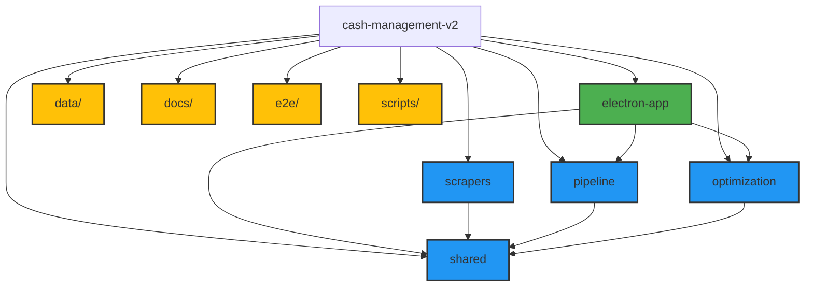
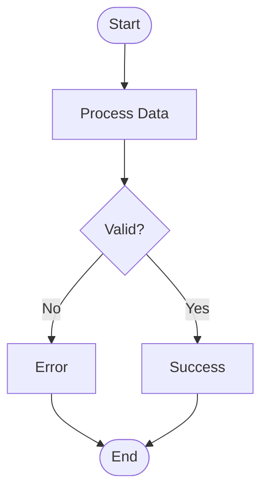
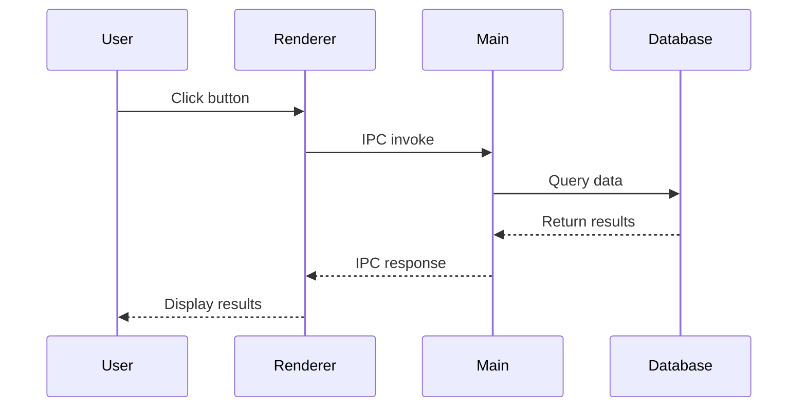
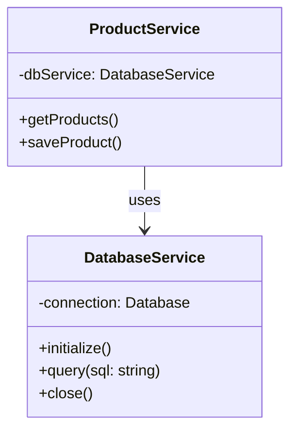
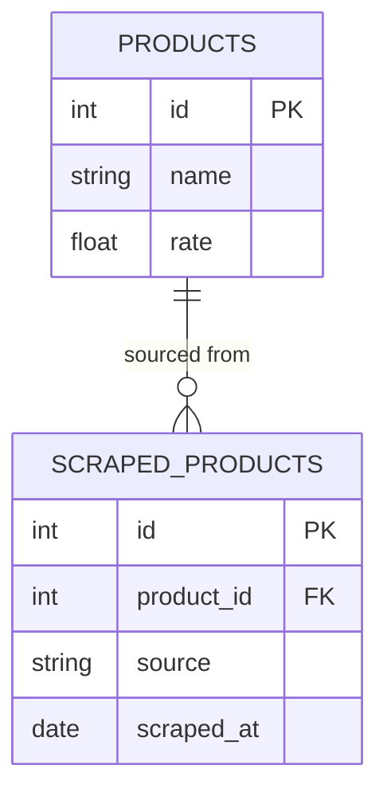

# AI-Powered Documentation Setup Guide

## Cash Management V2 Monorepo

**Last Updated:** October 13, 2025
**Estimated Time:** 10.5-15.5 hours total
**Cost:** $0 (all tools are free)

---

## Table of Contents

1. [Overview](#overview)
2. [Tooling Requirements](#tooling-requirements)
3. [Prerequisites](#prerequisites)
4. [Phase 0: Tooling Setup (30 mins)](#phase-0-tooling-setup)
5. [Phase 1: Root Documentation (2-3 hours)](#phase-1-root-documentation)
6. [Phase 2: Package Documentation (3-4 hours)](#phase-2-package-documentation)
7. [Phase 3: Architecture Diagrams (2-3 hours)](#phase-3-architecture-diagrams)
8. [Phase 4: Code Examples (1-2 hours)](#phase-4-code-examples)
9. [Phase 5: Docusaurus Integration (2-3 hours)](#phase-5-docusaurus-integration)
10. [Phase 6: Netlify Deployment (1 hour)](#phase-6-netlify-deployment)
11. [Verification Checklist](#verification-checklist)
12. [Additional Resources](#additional-resources)
13. [Appendix: TSDoc Syntax Reference](#appendix-tsdoc-syntax-reference)
14. [Appendix: Mermaid Diagram Examples](#appendix-mermaid-diagram-examples)

---

## Overview

### Documentation Strategy

This plan implements a **hybrid AI + manual documentation approach** optimized for TypeScript monorepos with financial domain requirements:

- **CLAUDE.md files** → Context for AI assistants (Claude Code)
- **TSDoc comments** → Inline code documentation (written by Claude Code)
- **TypeDoc** → Extracts API docs from TSDoc
- **Docusaurus** → Builds searchable documentation website
- **Netlify** → Hosts and deploys documentation

### Why This Approach?

1. **AI-friendly:** CLAUDE.md files provide context for Claude Code to understand and maintain your codebase
2. **Developer-friendly:** Standard TypeDoc/TSDoc workflow that TypeScript developers expect
3. **User-friendly:** Docusaurus provides search, versioning, and beautiful UI
4. **Free:** All tools are open source; hosting on Netlify free tier
5. **Automated:** Git hooks, CI/CD, and auto-regeneration keep docs current

### Key Principles

- **Document as you code** - Don't defer documentation
- **AI assists, humans verify** - Especially critical for financial logic
- **Automation over manual work** - Let tools handle formatting and generation
- **Version with code** - Documentation lives in the monorepo

---

## Tooling Requirements

### Core Documentation (All Free)

| Tool                        | Purpose                           | Install                            |
| --------------------------- | --------------------------------- | ---------------------------------- |
| **TypeDoc**                 | Extracts API docs from TypeScript | `npm i -D typedoc`                 |
| **typedoc-plugin-markdown** | Markdown output for Docusaurus    | `npm i -D typedoc-plugin-markdown` |
| **Docusaurus**              | Documentation website builder     | `npx create-docusaurus`            |
| **@mermaid-js/mermaid-cli** | Diagram validation                | `npm i -D @mermaid-js/mermaid-cli` |

### Code Quality & Automation (All Free)

| Tool                    | Purpose                       | Install                        |
| ----------------------- | ----------------------------- | ------------------------------ |
| **Prettier**            | Auto-format code and markdown | `npm i -D prettier`            |
| **markdownlint-cli2**   | Lint markdown files           | `npm i -D markdownlint-cli2`   |
| **eslint-plugin-jsdoc** | Validate TSDoc syntax         | `npm i -D eslint-plugin-jsdoc` |
| **Husky**               | Git hooks                     | `npm i -D husky`               |
| **lint-staged**         | Run linters on staged files   | `npm i -D lint-staged`         |

### Deployment (Free)

| Tool            | Purpose                             |
| --------------- | ----------------------------------- |
| **Netlify**     | Host documentation site (free tier) |
| **netlify-cli** | Deploy from CLI                     |

### AI Assistance

| Tool            | Cost                       | Purpose                          |
| --------------- | -------------------------- | -------------------------------- |
| **Claude Code** | Your existing subscription | Write TSDoc, CLAUDE.md, diagrams |

**Total additional cost: $0**

---

## Prerequisites

### Environment Check

```bash
# Check versions
node --version    # Should be 20.x or higher
npm --version     # Should be 10.x or higher

# Navigate to project root
cd /Users/david/Websites/cash-management-v2

# Verify monorepo structure
ls -la packages/
# Should see: data, electron-app, optimization, pipeline, scrapers, shared
```

### Netlify Account

- ✅ You already have Netlify account
- Verify access: `netlify login`

---

## Phase 0: Tooling Setup

**Time:** 30 minutes
**Goal:** Install and configure all tools

### Step 0.1: Install All Dependencies (10 mins)

```bash
# Install all tools in one command
npm install --save-dev \
  typedoc@0.28.13 \
  typedoc-plugin-markdown@4.2.10 \
  prettier@3.2.5 \
  markdownlint-cli2@0.18.0 \
  eslint-plugin-jsdoc@61.1.0 \
  husky@9.0.11 \
  lint-staged@16.0.0 \
  @mermaid-js/mermaid-cli@11.12.0 \
  netlify-cli@latest

# Verify installations
npx husky --version
npx markdownlint-cli2 --version
npx typedoc --version
```

### Step 0.2: Initialize Git Hooks (5 mins)

```bash
# Initialize Husky
npx husky init

# Verify .husky directory created
ls -la .husky/
```

### Step 0.3: Create Configuration Files (15 mins)

#### Create `.markdownlint.json`

```bash
cat > .markdownlint.json << 'EOF'
{
  "default": true,
  "MD013": false,
  "MD024": false,
  "MD033": {
    "allowed_elements": ["details", "summary", "br"]
  },
  "MD041": false
}
EOF
```

#### Create `.prettierrc`

```bash
cat > .prettierrc << 'EOF'
{
  "semi": true,
  "singleQuote": true,
  "tabWidth": 2,
  "trailingComma": "es5",
  "printWidth": 100,
  "proseWrap": "preserve"
}
EOF
```

#### Create `.lintstagedrc.json`

```bash
cat > .lintstagedrc.json << 'EOF'
{
  "*.md": [
    "markdownlint-cli2 --fix",
    "prettier --write"
  ],
  "*.{ts,tsx,js,jsx}": [
    "prettier --write"
  ]
}
EOF
```

#### Create `.husky/pre-commit` Hook

```bash
cat > .husky/pre-commit << 'EOF'
#!/usr/bin/env sh
. "$(dirname -- "$0")/_/husky.sh"

npx lint-staged
EOF

chmod +x .husky/pre-commit
```

### Step 0.4: Test Setup (5 mins)

```bash
# Test markdownlint
npx markdownlint-cli2 README.md

# Test prettier
npx prettier --check README.md

# Test git hook
echo "# Test" > test.md
git add test.md
git commit -m "test: verify pre-commit hook"
# Should see lint-staged running
git reset HEAD~1
rm test.md
```

### Verification Checklist

- [ ] All npm packages installed without errors
- [ ] `.husky/` directory exists with pre-commit hook
- [ ] Configuration files created (`.markdownlint.json`, `.prettierrc`, `.lintstagedrc.json`)
- [ ] Git hook runs automatically on commit

---

## Phase 1: Root Documentation

**Time:** 2-3 hours
**Goal:** Create root CLAUDE.md and configure TypeDoc

### Step 1.1: Create Root CLAUDE.md (60 mins)

**Approach:** Use Claude Code to analyze codebase and generate documentation

**Ask Claude Code:**

```
Please create a comprehensive root CLAUDE.md file for this monorepo.
Include:
- Project overview (cash management app purpose)
- Repository structure (all packages and their relationships)
- Common commands (installation, development, build, test)
- Database setup (absolute paths, no fallbacks)
- Code style conventions (TypeScript, ES modules, imports)
- Validation requirements (what must pass before commit)
- Architecture decisions (ADRs)
- Common issues & solutions
- Package dependency graph
- Development workflow

Use the existing codebase as the source of truth.
```

**File:** `/Users/david/Websites/cash-management-v2/CLAUDE.md`

**Key sections to include:**

- **Project Overview:** What the app does, key capabilities
- **Repository Structure:** Packages, data, docs folders with descriptions
- **Common Commands:** npm scripts for each package
- **Database Setup:** Absolute paths to database files
- **Code Style:** TypeScript conventions, import patterns
- **Validation:** Pre-commit requirements
- **Architecture Decisions:** Major technical decisions (ADRs)
- **Common Issues:** FAQ and troubleshooting
- **Dependencies:** Package relationships graph
- **Workflow:** Step-by-step development process

### Step 1.2: Configure TypeDoc (30 mins)

#### Create `typedoc.json`

```bash
cat > typedoc.json << 'EOF'
{
  "$schema": "https://typedoc.org/schema.json",
  "entryPointStrategy": "packages",
  "entryPoints": [
    "packages/shared",
    "packages/pipeline",
    "packages/optimization",
    "packages/electron-app/src/main"
  ],
  "out": "docs/api",
  "plugin": ["typedoc-plugin-markdown"],
  "readme": "none",
  "excludePrivate": true,
  "excludeProtected": true,
  "skipErrorChecking": true,
  "cleanOutputDir": true,
  "entryPointIncludePath": true,
  "hideGenerator": true
}
EOF
```

#### Test TypeDoc

```bash
# Generate documentation
npx typedoc

# Check output was created
ls -la docs/api/

# View sample file
cat docs/api/README.md
```

**Expected output:** `docs/api/` directory with subdirectories for each package

### Step 1.3: Update package.json Scripts (15 mins)

```bash
# Add documentation scripts to root package.json
npm pkg set scripts.docs:generate="typedoc"
npm pkg set scripts.docs:watch="typedoc --watch"
npm pkg set scripts.lint:md="markdownlint-cli2 '**/*.md' '#node_modules'"
npm pkg set scripts.lint:md:fix="markdownlint-cli2 --fix '**/*.md' '#node_modules'"
npm pkg set scripts.format="prettier --write '**/*.{ts,tsx,js,jsx,md,json}'"
npm pkg set scripts.format:check="prettier --check '**/*.{ts,tsx,js,jsx,md,json}'"
npm pkg set scripts.prepare="husky"

# Verify scripts were added
cat package.json | grep -A 10 '"scripts"'
```

### Step 1.4: Update .gitignore (5 mins)

```bash
# Add to existing .gitignore
cat >> .gitignore << 'EOF'

# Documentation
docs/api/
.docusaurus/
.netlify/

# Markdown linting cache
.markdownlint-cli2-cache
EOF
```

### Step 1.5: Format and Commit (10 mins)

```bash
# Format root CLAUDE.md
npx prettier --write CLAUDE.md

# Stage all Phase 1 files
git add CLAUDE.md typedoc.json .markdownlint.json .prettierrc .lintstagedrc.json .husky/ .gitignore package.json package-lock.json

# Commit
git commit -m "docs: Set up documentation infrastructure and root CLAUDE.md"
```

### Verification Checklist

- [ ] Root CLAUDE.md exists and is comprehensive
- [ ] `typedoc.json` configured for monorepo
- [ ] `npm run docs:generate` creates `docs/api/` directory
- [ ] All npm scripts added to package.json
- [ ] `.gitignore` updated to exclude generated docs
- [ ] Git hooks work on commit

---

## Phase 2: Package Documentation

**Time:** 3-4 hours
**Goal:** Create CLAUDE.md for each package

### Package List

1. `packages/shared` (30 mins)
2. `packages/scrapers` (45 mins)
3. `packages/pipeline` (45 mins)
4. `packages/optimization` (45 mins)
5. `packages/electron-app` (45 mins)

### Process for Each Package

**Use Claude Code to analyze and document each package:**

```
Please create a comprehensive CLAUDE.md file for packages/{package-name}.

Analyze the code and include:
- Package structure (directory layout)
- Key services/components (with brief descriptions)
- Usage patterns (how to use the package)
- Type system (core types and interfaces)
- Dependencies (internal and external)
- Common patterns (standard ways to use this package)
- Anti-patterns (what NOT to do)
- Testing approach
- Configuration
- Troubleshooting

Use the actual codebase as source of truth.
```

### Step 2.1: packages/shared/CLAUDE.md (30 mins)

**Ask Claude Code to document:**

- Services in `packages/shared/src/services/`
- Types in `packages/shared/src/types/`
- Utilities in `packages/shared/src/utilities/`
- Test helpers

**File:** `packages/shared/CLAUDE.md`

**Key sections:**

- Package Structure
- Core Services (DatabaseService, ConfigService, etc.)
- Type System
- Utilities
- Testing Utilities
- Dependencies
- Common Patterns
- Anti-Patterns

### Step 2.2: packages/scrapers/CLAUDE.md (45 mins)

**Ask Claude Code to document:**

- Scraper architecture (ScraperBase pattern)
- All scrapers in `packages/scrapers/src/scrapers/`
- Output format (JSON structure)
- FRN management
- Debugging approaches

**File:** `packages/scrapers/CLAUDE.md`

**Key sections:**

- Package Structure
- Scraper Architecture
- Running Scrapers
- Scraper-Specific Notes (per platform)
- Output Format
- FRN Management
- Debugging (screenshots, selectors)
- Adding New Scrapers
- Dependencies
- Troubleshooting

### Step 2.3: packages/pipeline/CLAUDE.md (45 mins)

**Ask Claude Code to document:**

- 4-stage pipeline architecture
- Services in `packages/pipeline/src/services/`
- Orchestration patterns
- Test fixtures and test database patterns

**File:** `packages/pipeline/CLAUDE.md`

**Key sections:**

- Pipeline Architecture (4 stages)
- Core Services (Ingestion, FRN Matching, Deduplication, Quality)
- Orchestration
- Testing (integration patterns)
- Test Fixtures
- Test Database Setup
- Configuration
- Database Tables (staging and final)
- Common Patterns
- Performance Tips
- Troubleshooting

### Step 2.4: packages/optimization/CLAUDE.md (45 mins)

**Ask Claude Code to document:**

- FSCS compliance logic
- Rate optimization algorithms
- CLI tools

**File:** `packages/optimization/CLAUDE.md`

**Key sections:**

- Package Structure
- FSCS Compliance (£85k limits)
- Rate Optimization
- CLI Tools
- Testing
- Configuration
- Common Patterns
- Dependencies
- Troubleshooting

### Step 2.5: packages/electron-app/CLAUDE.md (45 mins)

**Ask Claude Code to document:**

- Main process structure
- Renderer process (React app)
- IPC communication patterns
- UI components

**File:** `packages/electron-app/CLAUDE.md`

**Key sections:**

- Package Structure (main/, renderer/)
- Main Process (entry points, IPC handlers, services)
- Renderer Process (React app, pages, components)
- IPC Communication Patterns
- UI Components
- Development Workflow
- Dependencies (Electron, React, MUI)
- Common Patterns
- Troubleshooting

### Step 2.6: Format and Commit (10 mins)

```bash
# Format all CLAUDE.md files
npx prettier --write packages/*/CLAUDE.md

# Verify formatting
npx prettier --check packages/*/CLAUDE.md

# Stage all files
git add packages/*/CLAUDE.md

# Commit
git commit -m "docs: Add CLAUDE.md files for all packages"
```

### Verification Checklist

- [ ] All 5 packages have CLAUDE.md files
- [ ] Each CLAUDE.md is comprehensive (covers structure, usage, patterns)
- [ ] Files are formatted with Prettier
- [ ] Files are committed to git

---

## Phase 3: Architecture Diagrams

**Time:** 2-3 hours
**Goal:** Create Mermaid diagrams for system architecture

### Step 3.1: Create Diagrams Directory (5 mins)

```bash
# Create directory
mkdir -p docs/architecture

# Create README
touch docs/architecture/README.md
```

**Edit `docs/architecture/README.md`:**

```markdown
# Architecture Diagrams

This directory contains Mermaid diagrams documenting the system architecture.

## Diagrams

1. **monorepo-structure.md** - Package dependencies and workspace organization
2. **pipeline-flow.md** - 4-stage data processing pipeline
3. **electron-architecture.md** - Main/renderer process structure
4. **fscs-compliance.md** - Institution grouping and £85k limit logic

## Editing Diagrams

- Use VS Code with the Mermaid extension
- Syntax: https://mermaid.js.org/
- Validate: `npm run diagram:validate`

## Rendering

Diagrams are rendered automatically in Docusaurus using the Mermaid plugin.
```

### Step 3.2: Create Monorepo Structure Diagram (30 mins)

**Ask Claude Code:**

```
Create a Mermaid diagram showing the monorepo structure with:
- Root workspace
- All packages (electron-app, scrapers, pipeline, optimization, shared)
- Dependencies between packages (arrows)
- Data, docs, e2e, scripts directories
- Color coding for different types (apps vs libraries)

Save to docs/architecture/monorepo-structure.md
```

**File:** `docs/architecture/monorepo-structure.md`

**Example structure:**

````markdown
# Monorepo Structure


````

### Step 3.3: Create Pipeline Flow Diagram (45 mins)

**Ask Claude Code:**

```
Create a Mermaid flowchart showing the 4-stage pipeline:
- Stage 1: JSON Ingestion → scraped_products_raw
- Stage 2: FRN Matching → scraped_products_matched + research queue
- Stage 3: Deduplication → scraped_products_deduped
- Stage 4: Quality Analysis → products
- Decision points (FRN found? Quality OK?)
- Error paths

Save to docs/architecture/pipeline-flow.md
```

**File:** `docs/architecture/pipeline-flow.md`

### Step 3.4: Create Electron Architecture Diagram (45 mins)

**Ask Claude Code:**

```
Create a Mermaid diagram showing Electron architecture:
- Main process (Node.js environment)
- Renderer process (Browser environment)
- IPC communication (contextBridge, ipcMain, ipcRenderer)
- Main process components (menu, handlers, services)
- Renderer components (pages, UI components, contexts)
- Database access patterns (only from main process)

Save to docs/architecture/electron-architecture.md
```

**File:** `docs/architecture/electron-architecture.md`

### Step 3.5: Create FSCS Compliance Diagram (30 mins)

**Ask Claude Code:**

```
Create a Mermaid diagram showing FSCS compliance logic:
- Provider → FRN mapping
- FRN → FSCS group mapping
- £85k limit per group
- Example institutions in same group

Save to docs/architecture/fscs-compliance.md
```

**File:** `docs/architecture/fscs-compliance.md`

### Step 3.6: Create Validation Script (15 mins)

```bash
# Create validation script
mkdir -p scripts

cat > scripts/validate-diagrams.sh << 'EOF'
#!/bin/bash
set -e

echo "Validating Mermaid diagrams..."
FAILED=0

for file in docs/architecture/*.md; do
  if [ -f "$file" ] && [ "$(basename "$file")" != "README.md" ]; then
    echo "Validating: $file"
    if npx mmdc -i "$file" -o /tmp/test-diagram.svg 2>&1; then
      echo "✅ Valid: $file"
    else
      echo "❌ Invalid: $file"
      FAILED=1
    fi
  fi
done

if [ $FAILED -eq 1 ]; then
  echo "Some diagrams failed validation"
  exit 1
fi

echo "✅ All diagrams validated successfully!"
EOF

chmod +x scripts/validate-diagrams.sh

# Add npm script
npm pkg set scripts.diagram:validate="bash scripts/validate-diagrams.sh"

# Test validation
npm run diagram:validate
```

### Step 3.7: Format and Commit (15 mins)

```bash
# Format all markdown in architecture directory
npx prettier --write docs/architecture/*.md

# Validate all diagrams
npm run diagram:validate

# Stage files
git add docs/architecture/
git add scripts/validate-diagrams.sh
git add package.json

# Commit
git commit -m "docs(architecture): Add Mermaid diagrams for system architecture"
```

### Verification Checklist

- [ ] `docs/architecture/` directory contains 4-5 diagram files
- [ ] All diagrams validate successfully with `npm run diagram:validate`
- [ ] Diagrams are formatted with Prettier
- [ ] Files committed to git

---

## Phase 4: Code Examples

**Time:** 1-2 hours
**Goal:** Create working code examples demonstrating common patterns

### Step 4.1: Create Examples Directory (5 mins)

```bash
# Create directory
mkdir -p examples

# Create README
touch examples/README.md
```

**Edit `examples/README.md`:**

````markdown
# Code Examples

Working code examples demonstrating common patterns in this codebase.

## Examples

1. **database-service-usage.ts** - DatabaseService initialization and usage
2. **scraper-pattern.js** - Creating a new scraper
3. **pipeline-integration.ts** - Using pipeline services
4. **ipc-handler-pattern.ts** - Electron IPC communication
5. **react-component-pattern.tsx** - React component with MUI and context

## Purpose

These examples help Claude Code understand:

- Actual patterns used in the codebase
- Correct API usage
- Standard conventions

## Testing Examples

```bash
# TypeScript examples
npx tsc --noEmit examples/*.ts examples/*.tsx

# JavaScript examples
node --check examples/*.js
```

## Adding New Examples

When adding new patterns or conventions, create a new example file demonstrating the pattern.
````

### Step 4.2: Create Example Files (90 mins)

**For each example, ask Claude Code:**

```
Create a working code example for {pattern} that:
- Uses actual APIs from the codebase
- Includes comprehensive comments explaining the pattern
- Would compile/run if tested
- Demonstrates best practices

Research the codebase first to ensure accuracy.
Save to examples/{filename}
```

#### Example 1: database-service-usage.ts (20 mins)

**Ask Claude Code:**

```
Create examples/database-service-usage.ts showing:
- DatabaseService import and initialization
- Opening a connection
- Running queries
- Using transactions
- Error handling
- Closing connections

Include comments explaining each pattern.
```

#### Example 2: scraper-pattern.js (20 mins)

**Ask Claude Code:**

```
Create examples/scraper-pattern.js showing:
- Extending ScraperBase
- Implementing required methods
- Using EnhancedLogger
- Product extraction patterns
- FRN lookup
- Error handling

Include comments explaining the scraper architecture.
```

#### Example 3: pipeline-integration.ts (20 mins)

**Ask Claude Code:**

```
Create examples/pipeline-integration.ts showing:
- Pipeline service imports
- Test database setup
- Running pipeline stages
- OrchestrationService usage
- Verification patterns

Include comments explaining the pipeline flow.
```

#### Example 4: ipc-handler-pattern.ts (15 mins)

**Ask Claude Code:**

```
Create examples/ipc-handler-pattern.ts showing:
- Main process IPC handler registration
- Preload script context bridge
- Renderer process IPC invocation
- Type-safe IPC patterns

Include comments explaining Electron IPC architecture.
```

#### Example 5: react-component-pattern.tsx (15 mins)

**Ask Claude Code:**

```
Create examples/react-component-pattern.tsx showing:
- React component with TypeScript
- MUI components usage
- Context consumption (ConfigContext)
- IPC invocation from renderer
- Error handling

Include comments explaining the component pattern.
```

### Step 4.3: Test Examples (20 mins)

```bash
# Test TypeScript examples compile
npx tsc --noEmit examples/database-service-usage.ts
npx tsc --noEmit examples/pipeline-integration.ts
npx tsc --noEmit examples/ipc-handler-pattern.ts
npx tsc --noEmit examples/react-component-pattern.tsx

# Test JavaScript examples have valid syntax
node --check examples/scraper-pattern.js

# Fix any compilation errors before committing
```

### Step 4.4: Format and Commit (10 mins)

```bash
# Format all examples
npx prettier --write examples/*.{ts,tsx,js}
npx prettier --write examples/README.md

# Stage all files
git add examples/

# Commit
git commit -m "docs(examples): Add working code examples for common patterns"
```

### Verification Checklist

- [ ] 5 example files created in `examples/`
- [ ] All TypeScript examples compile without errors
- [ ] JavaScript examples have valid syntax
- [ ] Examples include comprehensive comments
- [ ] Files formatted with Prettier
- [ ] Files committed to git

---

## Phase 5: Docusaurus Integration

**Time:** 2.5-3.5 hours
**Goal:** Create documentation website with Docusaurus and integrate database schema

### Step 5.1: Create Docusaurus Package (30 mins)

```bash
# Navigate to packages directory
cd packages

# Create Docusaurus site
npx create-docusaurus@latest docs classic --typescript

# Return to root
cd ..
```

This creates `packages/docs/` with:

- `docs/` - Documentation markdown files
- `blog/` - Blog posts (optional, can delete)
- `src/` - React components and pages
- `static/` - Static assets
- `docusaurus.config.ts` - Configuration

### Step 5.2: Configure Docusaurus (45 mins)

#### Update `packages/docs/docusaurus.config.ts`

**Ask Claude Code:**

````
Update packages/docs/docusaurus.config.ts with:
- Project name: "Cash Management V2"
- Tagline: "AI-powered cash management and optimization"
- URL and baseUrl for Netlify deployment
- GitHub repo link (if applicable)
- Navbar with links to docs, API, architecture, examples, database
- Footer with useful links
- Mermaid plugin configuration
- Search configuration (Algolia or local)
- Dark mode support

Use Netlify URL: https://cash-management-v2.netlify.app (adjust as needed)

**Include Database in navbar:**
```typescript
navbar: {
  items: [
    {
      type: 'doc',
      docId: 'intro',
      label: 'Docs',
      position: 'left',
    },
    {
      type: 'doc',
      docId: 'database/overview',
      label: 'Database',
      position: 'left',
    },
    // ... other items
  ]
}
````

**Key configuration sections:**

```typescript
import { themes as prismThemes } from "prism-react-renderer";
import type { Config } from "@docusaurus/types";
import type * as Preset from "@docusaurus/preset-classic";

const config: Config = {
  title: "Cash Management V2",
  tagline: "AI-powered cash management and optimization",
  url: "https://cash-management-v2.netlify.app",
  baseUrl: "/",

  // Mermaid diagrams
  markdown: {
    mermaid: true,
  },
  themes: ["@docusaurus/theme-mermaid"],

  // ... rest of configuration
};
```

#### Update `packages/docs/package.json`

```bash
cd packages/docs

# Add dependencies
npm install @docusaurus/theme-mermaid

cd ../..
```

### Step 5.3: Organize Documentation Structure (60 mins)

#### Create Documentation Structure

```bash
cd packages/docs

# Remove default docs
rm -rf docs/*
rm -rf blog  # Optional: remove blog if not needed

# Create documentation structure
mkdir -p docs/getting-started
mkdir -p docs/packages
mkdir -p docs/architecture
mkdir -p docs/examples
mkdir -p docs/api
mkdir -p docs/database
```

#### Copy Database Schema Documentation

```bash
# Copy schema documentation
cp ../../docs/database/Schema-doc.md docs/database/schema.md

# Create static directory for database assets
mkdir -p static/database
cp ../../docs/database/MainDiagram.svg static/database/

cd ../..
```

#### Create Documentation Files

**Ask Claude Code to create these files:**

1. **docs/intro.md** - Introduction and overview
2. **docs/getting-started/installation.md** - Installation guide
3. **docs/getting-started/quick-start.md** - Quick start guide
4. **docs/packages/shared.md** - Link to packages/shared/CLAUDE.md content
5. **docs/packages/scrapers.md** - Link to packages/scrapers/CLAUDE.md content
6. **docs/packages/pipeline.md** - Link to packages/pipeline/CLAUDE.md content
7. **docs/packages/optimization.md** - Link to packages/optimization/CLAUDE.md content
8. **docs/packages/electron-app.md** - Link to packages/electron-app/CLAUDE.md content
9. **docs/architecture/overview.md** - Architecture overview
10. **docs/examples/overview.md** - Examples overview
11. **docs/database/overview.md** - Database architecture overview (NEW)

**Strategy:** Create simple markdown files that link to or embed content from CLAUDE.md files and diagrams.

**Example `docs/packages/shared.md`:**

```markdown
---
sidebar_position: 1
---

# Shared Package

Core utilities, services, and types used across all packages.

## Overview

[Full documentation: packages/shared/CLAUDE.md](https://github.com/yourusername/cash-management-v2/blob/master/packages/shared/CLAUDE.md)

## API Reference

See [API Documentation](/docs/api/shared) for detailed API reference.

## Key Services

- **DatabaseService** - SQLite database management
- **ConfigService** - Configuration management
- **LoggerService** - Structured logging

... (include summary content from packages/shared/CLAUDE.md)
```

**Create `docs/database/overview.md`:**

````markdown
---
sidebar_position: 5
---

# Database Architecture

## Overview

The Cash Management V2 application uses SQLite for data persistence with a comprehensive schema covering:

- **63 tables** - Core data storage
- **35 views** - Computed and aggregated data
- **Triggers** - Automatic audit logging and data integrity
- **Constraints** - Data validation and business rules

## Schema Diagram


[View full-size diagram](/database/MainDiagram.svg)

## Key Table Groups

### Portfolio Management

- `my_deposits` - Active deposit accounts
- `my_pending_deposits` - Planned deposits
- `account_transactions` - Transaction history
- `balance_update_log` - Balance tracking

### Product Catalog

- `available_products` - Current product offerings
- `excluded_products` - Filtered products
- `scraped_products_*` - Pipeline staging tables

### FSCS Compliance

- `boe_institutions` - Bank of England institution data
- `boe_shared_brands` - Brand groupings for FSCS limits
- `frn_lookup_helper_cache` - FRN matching cache

### Pipeline & Data Quality

- `json_ingestion_audit` - Scraper ingestion tracking
- `frn_matching_audit` - FRN matching history
- `deduplication_audit` - Deduplication tracking
- `data_quality_reports` - Quality metrics

### Configuration & Rules

- `unified_config` - Application configuration
- `optimization_rules` - Optimization logic
- `compliance_config` - FSCS rules
- `unified_business_rules` - Business logic

## Full Schema Reference

See [Complete Schema Documentation](./schema) for detailed table definitions including:

- All 63 tables with columns, types, indexes, foreign keys
- 35 views with SQL definitions
- Triggers and constraints
- Relationships and dependencies

## Regenerating Schema Documentation

This schema documentation is auto-generated using [DbSchema](https://dbschema.com).

**To update after schema changes:**

1. Open database in DbSchema
2. Export documentation (Markdown format)
3. Copy generated files:

   ```bash
   cp path/to/Schema-doc.md docs/database/Schema-doc.md
   cp path/to/MainDiagram.svg docs/database/MainDiagram.svg
   ```

4. Rebuild documentation site:

   ```bash
   cd packages/docs
   cp ../../docs/database/Schema-doc.md docs/database/schema.md
   cp ../../docs/database/MainDiagram.svg static/database/
   npm run docs:build
   ```

5. Deploy: `netlify deploy --prod`

## Database Links

- Related: [Pipeline Package](/docs/packages/pipeline) - Uses staging tables
- Related: [Shared Package](/docs/packages/shared) - DatabaseService implementation
````

#### Copy Architecture Diagrams

```bash
# Copy Mermaid diagrams to Docusaurus
cp ../../docs/architecture/*.md docs/architecture/

cd ../..
```

### Step 5.4: Integrate TypeDoc API Output (30 mins)

**Option 1: Link to TypeDoc output (simpler)**

Create `packages/docs/docs/api/overview.md`:

```markdown
# API Reference

API documentation is generated from TypeScript source code using TypeDoc.

## Packages

- [Shared](/docs/api/shared)
- [Pipeline](/docs/api/pipeline)
- [Optimization](/docs/api/optimization)
- [Electron App (Main)](/docs/api/electron-app)
```

Then copy TypeDoc output into Docusaurus static folder:

```bash
# Generate TypeDoc
npm run docs:generate

# Copy to Docusaurus static folder
mkdir -p packages/docs/static/api
cp -r docs/api/* packages/docs/static/api/
```

**Option 2: Use typedoc-plugin-docusaurus (advanced)**

This plugin generates Docusaurus-compatible markdown directly. (Skip if Option 1 works)

### Step 5.5: Configure Turborepo Integration (15 mins)

Add docs tasks to `turbo.json`:

```json
{
  "pipeline": {
    "build": {
      "dependsOn": ["^build"],
      "outputs": ["dist/**"]
    },
    "docs:generate": {
      "dependsOn": ["^build"],
      "outputs": ["docs/**", "api-docs/**"]
    },
    "docs:dev": {
      "cache": false,
      "persistent": true
    },
    "docs:build": {
      "dependsOn": ["docs:generate"],
      "outputs": [".docusaurus/**", "build/**"]
    },
    "docs:deploy": {
      "dependsOn": ["docs:build"],
      "cache": false
    }
  }
}
```

Add scripts to root `package.json`:

```bash
npm pkg set scripts.docs:dev="turbo run docs:dev --filter=docs"
npm pkg set scripts.docs:build="turbo run docs:build"
npm pkg set scripts.docs:deploy="turbo run docs:deploy"
```

Add scripts to `packages/docs/package.json`:

```bash
cd packages/docs
npm pkg set scripts.docs:dev="docusaurus start"
npm pkg set scripts.docs:build="docusaurus build"
npm pkg set scripts.docs:deploy="netlify deploy --prod --dir=build"
cd ../..
```

### Step 5.6: Test Docusaurus Locally (10 mins)

```bash
# Start Docusaurus dev server
npm run docs:dev

# Open browser to http://localhost:3000
# Verify:
# - Site loads correctly
# - Navigation works
# - Mermaid diagrams render
# - Dark mode works
# - Search works (if configured)
```

### Step 5.7: Build Production Site (10 mins)

```bash
# Build for production
npm run docs:build

# Check output
ls -la packages/docs/build/

# Test production build locally
cd packages/docs
npx serve build
# Open http://localhost:3000
cd ../..
```

### Step 5.8: Format and Commit (10 mins)

```bash
# Format all Docusaurus files
npx prettier --write packages/docs/**/*.{ts,tsx,md,json}

# Stage files
git add packages/docs/
git add turbo.json
git add package.json

# Commit
git commit -m "docs: Add Docusaurus documentation site"
```

### Verification Checklist

- [ ] `packages/docs/` directory created with Docusaurus
- [ ] Configuration updated (title, URL, Mermaid plugin, Database navbar link)
- [ ] Documentation structure created (getting-started, packages, architecture, examples, api, database)
- [ ] Database schema documentation copied (Schema-doc.md → schema.md, MainDiagram.svg)
- [ ] Database overview page created with table groups and links
- [ ] Mermaid diagrams copied and render correctly
- [ ] TypeDoc API output integrated
- [ ] Turborepo tasks configured
- [ ] Dev server runs: `npm run docs:dev`
- [ ] Production build succeeds: `npm run docs:build`
- [ ] Files committed to git

---

## Phase 6: Netlify Deployment

**Time:** 1 hour
**Goal:** Deploy documentation to Netlify

### Step 6.1: Create Netlify Configuration (15 mins)

#### Create `netlify.toml` at project root

```bash
cat > netlify.toml << 'EOF'
[build]
  # Build command
  command = "npm run docs:build"

  # Publish directory
  publish = "packages/docs/build"

  # Base directory (optional)
  base = "/"

[build.environment]
  # Node version
  NODE_VERSION = "20"

  # npm version
  NPM_VERSION = "10"

# Redirects and rewrites
[[redirects]]
  from = "/*"
  to = "/index.html"
  status = 200

# Headers for security
[[headers]]
  for = "/*"
  [headers.values]
    X-Frame-Options = "DENY"
    X-Content-Type-Options = "nosniff"
    Referrer-Policy = "strict-origin-when-cross-origin"

# Cache static assets
[[headers]]
  for = "/static/*"
  [headers.values]
    Cache-Control = "public, max-age=31536000, immutable"
EOF
```

### Step 6.2: Initialize Netlify Site (15 mins)

```bash
# Login to Netlify (if not already)
netlify login

# Initialize new site
netlify init

# Follow prompts:
# - Create & configure a new site
# - Team: Select your team
# - Site name: cash-management-v2-docs (or your preferred name)
# - Build command: npm run docs:build
# - Publish directory: packages/docs/build

# This creates .netlify/ directory and netlify.toml (if not exists)
```

### Step 6.3: Deploy Site (15 mins)

```bash
# Deploy to production
netlify deploy --prod

# Netlify will:
# 1. Run npm install
# 2. Run npm run docs:build
# 3. Upload packages/docs/build/ to CDN
# 4. Provide deployment URL

# Note the URL (e.g., https://cash-management-v2-docs.netlify.app)
```

### Step 6.4: Configure Continuous Deployment (15 mins)

**Option 1: GitHub Integration (Recommended)**

1. Push your repository to GitHub (if not already)
2. Go to Netlify dashboard: https://app.netlify.com
3. Select your site
4. Go to "Site settings" → "Build & deploy"
5. Connect to GitHub repository
6. Configure:
   - Branch: `master` or `main`
   - Build command: `npm run docs:build`
   - Publish directory: `packages/docs/build`
7. Enable automatic deploys on push

**Option 2: Manual Deployment Script**

Add deployment script to `packages/docs/package.json`:

```bash
cd packages/docs
npm pkg set scripts.deploy="netlify deploy --prod --dir=build"
cd ../..
```

Then deploy manually after changes:

```bash
npm run docs:build
cd packages/docs
npm run deploy
```

### Step 6.5: Verify Deployment (10 mins)

```bash
# Open site in browser
netlify open:site

# Verify:
# - Site loads correctly
# - All pages accessible
# - Mermaid diagrams render
# - Search works
# - Dark mode works
# - Links work (internal and external)
# - API documentation accessible
# - Mobile responsive
```

### Step 6.6: Update Documentation URLs (10 mins)

Update `packages/docs/docusaurus.config.ts` with actual Netlify URL:

```typescript
const config: Config = {
  title: "Cash Management V2",
  tagline: "AI-powered cash management and optimization",
  url: "https://cash-management-v2-docs.netlify.app", // Your actual URL
  baseUrl: "/",
  // ... rest of config
};
```

Rebuild and redeploy:

```bash
npm run docs:build
netlify deploy --prod
```

### Step 6.7: Format and Commit (10 mins)

```bash
# Add Netlify configuration
git add netlify.toml .netlify/

# Update Docusaurus config with actual URL
git add packages/docs/docusaurus.config.ts

# Commit
git commit -m "docs: Configure Netlify deployment"

# Push to trigger automatic deployment (if GitHub integration enabled)
git push
```

### Verification Checklist

- [ ] `netlify.toml` created and configured
- [ ] Netlify site initialized
- [ ] Site deployed successfully to production
- [ ] Site accessible at Netlify URL
- [ ] All pages load correctly
- [ ] Mermaid diagrams render
- [ ] Continuous deployment configured (GitHub or manual)
- [ ] Documentation URLs updated with actual Netlify URL
- [ ] Files committed to git

---

## Verification Checklist

### After Phase 0: Tooling Setup

```bash
# All tools installed
npm list typedoc markdownlint-cli2 prettier husky lint-staged

# Git hooks work
echo "# Test" > test.md && git add test.md && git commit -m "test" && git reset HEAD~1 && rm test.md
```

**Expected:**

- [ ] All npm packages installed
- [ ] Git hook runs on commit
- [ ] Formatting and linting automatic

### After Phase 1: Root Documentation

```bash
# CLAUDE.md exists
ls -la CLAUDE.md

# TypeDoc generates API docs
npm run docs:generate && ls -la docs/api/

# Scripts work
npm run lint:md
npm run format:check
```

**Expected:**

- [ ] Root CLAUDE.md is comprehensive
- [ ] TypeDoc generates `docs/api/` successfully
- [ ] All npm scripts work

### After Phase 2: Package Documentation

```bash
# All CLAUDE.md files exist
find packages -name "CLAUDE.md" -type f

# Should show 5 files:
# packages/shared/CLAUDE.md
# packages/scrapers/CLAUDE.md
# packages/pipeline/CLAUDE.md
# packages/optimization/CLAUDE.md
# packages/electron-app/CLAUDE.md
```

**Expected:**

- [ ] 5 package CLAUDE.md files exist
- [ ] Each file is comprehensive
- [ ] Files are formatted

### After Phase 3: Architecture Diagrams

```bash
# Diagrams exist
ls docs/architecture/

# Validate diagrams
npm run diagram:validate
```

**Expected:**

- [ ] 4-5 diagram files in `docs/architecture/`
- [ ] All diagrams validate successfully
- [ ] README.md explains diagrams

### After Phase 4: Code Examples

```bash
# Examples exist
ls examples/

# Test TypeScript compilation
npx tsc --noEmit examples/*.ts examples/*.tsx

# Test JavaScript syntax
node --check examples/*.js
```

**Expected:**

- [ ] 5 example files exist
- [ ] TypeScript examples compile
- [ ] JavaScript examples have valid syntax
- [ ] README.md explains examples

### After Phase 5: Docusaurus Integration

```bash
# Docusaurus package exists
ls -la packages/docs/

# Dev server runs
npm run docs:dev
# Open http://localhost:3000 in browser

# Production build succeeds
npm run docs:build
ls -la packages/docs/build/
```

**Expected:**

- [ ] `packages/docs/` directory exists
- [ ] Dev server runs without errors
- [ ] Site loads in browser
- [ ] Mermaid diagrams render
- [ ] Production build succeeds
- [ ] Build directory contains static site

### After Phase 6: Netlify Deployment

```bash
# Netlify configured
ls -la netlify.toml .netlify/

# Open deployed site
netlify open:site
```

**Expected:**

- [ ] `netlify.toml` exists
- [ ] Site deployed to Netlify
- [ ] Site accessible via URL
- [ ] All pages load correctly
- [ ] Continuous deployment configured

### Complete System Test

```bash
# 1. Make a code change
echo "// Test change" >> packages/shared/src/index.ts

# 2. Ask Claude Code to document it
# (Use Claude Code UI)

# 3. Regenerate API docs
npm run docs:generate

# 4. Test documentation locally
npm run docs:dev

# 5. Commit (git hooks run automatically)
git add packages/shared/src/index.ts
git commit -m "test: verify documentation workflow"

# 6. Build and deploy
npm run docs:build
netlify deploy --prod

# 7. Verify deployed site
netlify open:site

# 8. Clean up test
git reset HEAD~1
git checkout packages/shared/src/index.ts
```

**Expected:**

- [ ] Code change documented
- [ ] API docs regenerated
- [ ] Docusaurus shows updated docs
- [ ] Git hooks format files automatically
- [ ] Deployment succeeds
- [ ] Live site shows changes

---

## Additional Resources

### TypeDoc

- Official docs: https://typedoc.org/
- TSDoc syntax: https://tsdoc.org/

### Docusaurus

- Official docs: https://docusaurus.io/
- Mermaid plugin: https://docusaurus.io/docs/markdown-features/diagrams

### Mermaid

- Official docs: https://mermaid.js.org/
- Live editor: https://mermaid.live/

### Netlify

- Official docs: https://docs.netlify.com/
- CLI docs: https://cli.netlify.com/

### Prettier

- Official docs: https://prettier.io/

### markdownlint

- Rules reference: https://github.com/DavidAnson/markdownlint/blob/main/doc/Rules.md

---

## Appendix: TSDoc Syntax Reference

### Basic TSDoc Comment

````typescript
/**
 * Brief description of what this function does.
 *
 * Longer description can go here with more details about
 * the implementation, usage notes, or important considerations.
 *
 * @param paramName - Description of what this parameter does
 * @param anotherParam - Another parameter description
 * @returns Description of what this function returns
 * @throws {ErrorType} When this error occurs
 *
 * @example
 * ```typescript
 * const result = myFunction('value', 123);
 * console.log(result);
 * ```
 */
function myFunction(paramName: string, anotherParam: number): ResultType {
  // implementation
}
````

### Class Documentation

```typescript
/**
 * Brief description of the class.
 *
 * More detailed description of what this class does and when to use it.
 */
class MyClass {
  /**
   * Description of this property
   */
  private myProperty: string;

  /**
   * Constructor description
   * @param config - Configuration object
   */
  constructor(config: Config) {
    // implementation
  }

  /**
   * Method description
   * @param input - Input parameter
   * @returns Description of return value
   */
  public myMethod(input: string): number {
    // implementation
  }
}
```

### Interface Documentation

```typescript
/**
 * Description of what this interface represents
 */
interface MyInterface {
  /**
   * Description of this property
   */
  propertyName: string;

  /**
   * Description of this method
   * @param arg - Argument description
   * @returns Return value description
   */
  methodName(arg: number): boolean;
}
```

### Common TSDoc Tags

| Tag           | Purpose                   | Example                                         |
| ------------- | ------------------------- | ----------------------------------------------- |
| `@param`      | Document parameter        | `@param userId - The user's ID`                 |
| `@returns`    | Document return value     | `@returns User object or null`                  |
| `@throws`     | Document thrown errors    | `@throws {DatabaseError} When connection fails` |
| `@example`    | Provide usage example     | `@example const x = foo();`                     |
| `@deprecated` | Mark as deprecated        | `@deprecated Use newMethod() instead`           |
| `@see`        | Reference related items   | `@see {@link OtherClass}`                       |
| `@internal`   | Mark as internal only     | `@internal`                                     |
| `@public`     | Explicitly mark as public | `@public`                                       |
| `@private`    | Mark as private           | `@private`                                      |
| `@readonly`   | Mark as read-only         | `@readonly`                                     |

---

## Appendix: Mermaid Diagram Examples

### Flowchart

````markdown

````

### Sequence Diagram

````markdown

````

### Class Diagram

````markdown

````

### Entity Relationship Diagram

````markdown

````

---

## What's Next?

You've completed the initial setup! Your documentation infrastructure is now in place.

**Next steps:**

1. Read [MAINTENANCE-GUIDE.md](./MAINTENANCE-GUIDE.md) to learn daily/weekly workflows
2. Consider [AUTOMATION-PLAN.md](./AUTOMATION-PLAN.md) for automated maintenance (optional)

Remember: The MAINTENANCE-GUIDE provides manual workflows that always work, even without automation.
