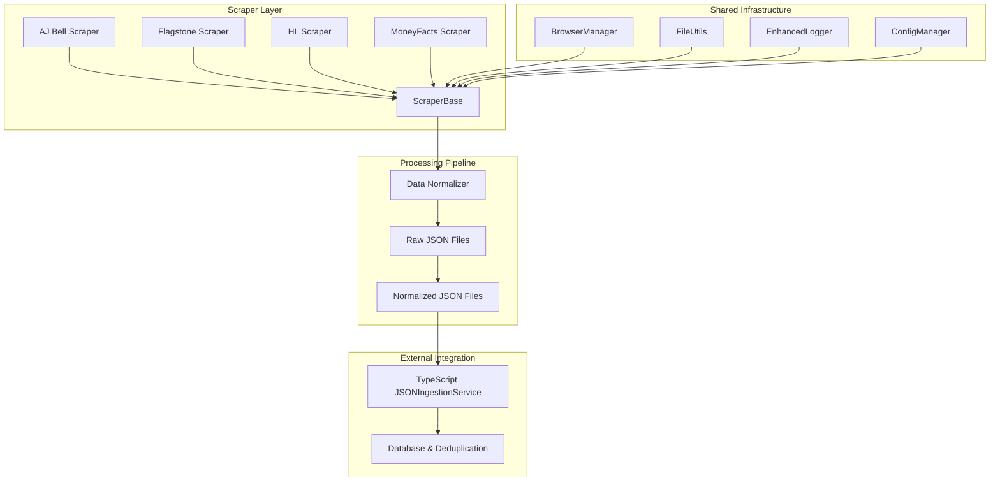
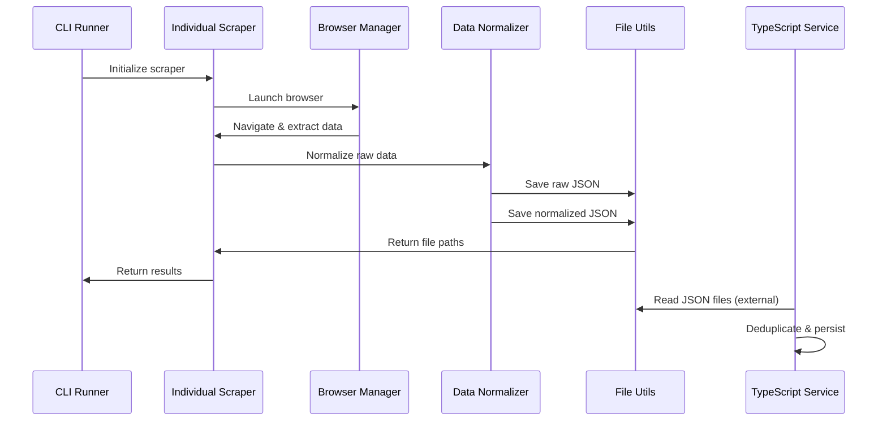
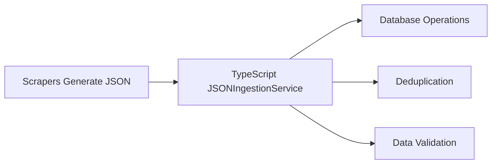

# Cash Management Scraper System ✅ **Enterprise-Grade JSON Pipeline**

An advanced web scraping solution with **JSON-first architecture**, **normalized data pipeline**, and **modular design** for comprehensive UK savings account rate monitoring.

## Quick Start

```bash
# Install dependencies
npm install

# All Platforms
npm run scrape                   # All platforms with JSON output
npm run scrape:all               # Same as above
npm run scrape:visible           # All platforms with visible browser

# Individual Platforms
npm run scrape:flagstone         # Flagstone (~150 products, 5-7 minutes)
npm run scrape:hl                # Hargreaves Lansdown (~80 products, 3-5 minutes)
npm run scrape:ajbell            # AJ Bell (~34 products, 2-3 minutes)
npm run scrape:moneyfacts        # MoneyFacts (~500+ products, 10-15 minutes)

# ✅ MoneyFacts Modular Processing
npm run scrape:moneyfacts:fixed-term      # Fixed term accounts only
npm run scrape:moneyfacts:notice          # Notice accounts only
npm run scrape:moneyfacts:easy-access     # Easy access accounts only
npm run scrape:moneyfacts:no-fixed        # All except fixed term

# Visible Browser Mode (Development)
npm run scrape:flagstone:visible          # Flagstone with visible browser
npm run scrape:hl:visible                 # HL with visible browser
npm run scrape:ajbell:visible             # AJ Bell with visible browser
npm run scrape:moneyfacts:visible         # MoneyFacts with visible browser
```

## Architecture Overview



## Data Flow



## Supported Platforms

| Platform | Products | Account Types | Status |
|----------|----------|---------------|--------|
| **Flagstone** | ~150 | Easy Access, Notice, Fixed Term | ✅ Active |
| **Hargreaves Lansdown** | ~80 | Easy Access, Limited Access, Fixed Term | ✅ Active |
| **AJ Bell** | ~34 | Fixed Term, Notice | ✅ Active |
| **MoneyFacts** | ~500+ | Easy Access, Notice, Fixed Term | ✅ Active |

## Features ✅ **Enterprise-Grade Capabilities**

### ✅ JSON-First Architecture
- 🎯 **Raw Data Preservation**: Complete audit trail of scraped data
- 📝 **Normalized Pipeline**: Consistent schema across all platforms
- 🔄 **External Processing**: Database operations handled by TypeScript service
- 📊 **Environment Separation**: Test/development/production configurations

### ✅ Sequential MoneyFacts Processing
- 🔄 **Automatic Sequential Mode**: When running without filters
- 🎯 **Complete Isolation**: Each account type runs as separate instance
- ⏱️ **Rate Limit Protection**: 15-second delays between account types
- 📊 **Aggregated Results**: Combined summary from all sequential runs
- 🔧 **Error Recovery**: Individual account type failure isolation

### ✅ Advanced Data Processing
- 🎯 **Four-Tier Pipeline**: Raw → Normalized → TypeScript → Database
- 🔄 **Cross-Platform Intelligence**: Unified data schema
- 📊 **Quality Controls**: Data validation and confidence scoring
- 🎛️ **Flexible Configuration**: Environment-based settings

### Core Infrastructure
- 🏢 **Modular Architecture**: Organized src/ directory structure
- 📝 **Enhanced Logging**: Categorized logging with file output, co-located with JSON data
- 🔄 **Browser Management**: Puppeteer lifecycle management
- 📉 **File Organization**: Platform-specific directories under `data/`
- 💾 **Multiple Formats**: JSON output with metadata and log files
- 🏦 **Data Validation**: Input validation and error handling

## Project Structure

```
scrapers/
├── README.md                   # This file
├── package.json                # Dependencies and npm scripts
├── package-lock.json           # Dependency lock file
├── src/                        # Source code
│   ├── scrapers/              # Individual scraper implementations
│   │   ├── ajbell.js          # AJ Bell scraper
│   │   ├── flagstone.js       # Flagstone scraper
│   │   ├── hargreaves-lansdown.js  # HL scraper
│   │   └── moneyfacts.js      # MoneyFacts scraper
│   ├── core/                  # Core infrastructure
│   │   ├── browser-manager.js # Puppeteer management
│   │   ├── enhanced-logger.js # Logging system
│   │   └── scraper-base.js    # Base scraper class
│   ├── utils/                 # Utility modules
│   │   ├── data-normalizer.js # Data normalization
│   │   ├── file-utils.js      # File operations
│   │   ├── frn-resolver.js    # FRN lookup utilities
│   │   └── platform-normalizer.js # Platform normalization
│   ├── parsers/               # Data parsing utilities
│   │   ├── common-parser.js   # Shared parsing functions
│   │   ├── ajbell-parser.js   # AJ Bell specific parsing
│   │   └── hl-parser.js       # HL specific parsing
│   └── runners/               # Command-line interfaces
│       ├── cli-runner.js      # Main CLI orchestrator
│       └── batch-runner.js    # Batch processing
├── config/                    # Configuration
│   └── environments.js        # Environment-based config
├── data/                      # Output directories
│   ├── ajbell/                # AJ Bell JSON files and logs
│   ├── flagstone/             # Flagstone JSON files and logs
│   ├── hargreaves-lansdown/   # HL JSON files and logs
│   └── moneyfacts/            # MoneyFacts JSON files and logs
└── node_modules/              # Installed dependencies
```

## Configuration

### Environment-Based Configuration

The system supports environment-specific configuration:

```javascript
// config/environments.js
const environments = {
  development: {
    outputDir: './data',
    logLevel: 'debug'
  },
  production: {
    outputDir: './data',
    logLevel: 'info'
  }
};
```

### Usage Examples

```bash
# Development mode (default)
npm run scrape:flagstone

# Production mode
NODE_ENV=production npm run scrape:flagstone
```

## Data Output

### JSON Files Structure

Each scraper generates two types of JSON files:

#### Raw Data Files
```json
{
  "platform": "flagstone",
  "timestamp": "2024-01-15T10:30:00Z",
  "products": [
    {
      "bankName": "Example Bank",
      "aer": "4.5%",
      "accountType": "fixed_term",
      "term": "12 months",
      "minDeposit": "£1,000",
      "scrapedAt": "2024-01-15T10:30:00Z"
    }
  ]
}
```

#### Normalized Data Files
```json
{
  "platform": "flagstone",
  "timestamp": "2024-01-15T10:30:00Z",
  "products": [
    {
      "platform": "flagstone",
      "bank_name": "Example Bank",
      "aer_rate": 4.5,
      "account_type": "fixed_term",
      "term_months": 12,
      "min_deposit": 1000,
      "scraped_at": "2024-01-15"
    }
  ]
}
```

### File Naming Convention

All files are saved within platform-specific directories under `data/`:

```
data/<platform>/<Platform>-raw-2024-01-15T10-30-00.json          # Raw scraped data
data/<platform>/<Platform>-normalized-2024-01-15T10-30-00.json   # Normalized data
data/<platform>/<platform>-2024-01-15T10-30-00.log              # Scraper log file
```

Example for Flagstone:
```
data/flagstone/Flagstone-raw-2024-01-15T10-30-00.json
data/flagstone/Flagstone-normalized-2024-01-15T10-30-00.json
data/flagstone/flagstone-2024-01-15T10-30-00.log
```

## Sample Output

```
============================================================
📊 SCRAPING SUMMARY
============================================================
⏱️  Duration: 15 minutes 30 seconds
🎯 Platforms: 4/4 successful
📈 Total rates found: 764
💾 JSON files created: 8

📁 Platform Results:
   ✅ Flagstone: 150 rates → data/flagstone/
   ✅ Hargreaves Lansdown: 80 rates → data/hargreaves-lansdown/
   ✅ AJ Bell: 34 rates → data/ajbell/
   ✅ MoneyFacts: 500 rates → data/moneyfacts/

📄 JSON files ready for TypeScript JSONIngestionService processing
============================================================
```

## Requirements

- Node.js 18+
- Chrome/Chromium (installed automatically)
- 2GB free disk space
- Internet connection

## Development

### Running Individual Scrapers

```bash
# Direct scraper execution
node src/scrapers/ajbell.js --help
node src/scrapers/flagstone.js --verbose
node src/scrapers/hargreaves-lansdown.js --visible

# Using CLI runner
node src/runners/cli-runner.js --platform flagstone --verbose
node src/runners/cli-runner.js --all --no-files
```

### Adding New Scrapers

1. Create new scraper file in `src/scrapers/`
2. Extend `ScraperBase` class
3. Implement required methods:
   - `getBaseUrl()`
   - `extractRateData()`
4. Add to CLI runner platform list
5. Update package.json scripts

## Integration with Main Application

The scrapers generate JSON files that are consumed by the TypeScript JSONIngestionService:



## Troubleshooting

### Common Issues

1. **Browser Launch Issues**
   - Ensure Chrome/Chromium is installed
   - Try visible mode: `--visible`

2. **Network Timeouts**
   - Increase timeout: modify `timeout` in scraper options
   - Check internet connection

3. **File Permission Issues**
   - Ensure write permissions to output directories
   - Check disk space availability

### Debug Mode

```bash
# Enable debug logging
npm run scrape:flagstone -- --verbose

# Show browser for debugging
npm run scrape:flagstone:visible
```

---

*This scraper system is part of the larger Cash Management application ecosystem*